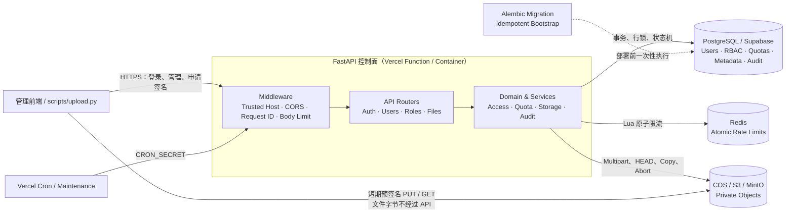
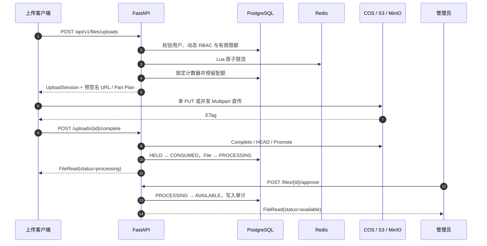

<div align="center">
  <h1>Enterprise Knowledge Base API</h1>
  <p><strong>面向 10 TB+ 文档数据的企业知识库后台控制面</strong></p>
  <p>动态 RBAC、分级配额、可恢复大文件直传、审计与 Serverless 部署能力。</p>
</div>

<p align="center">
  <a href="https://www.python.org/"></a>
  <a href="https://fastapi.tiangolo.com/"></a>
  <a href="https://www.postgresql.org/"></a>
  <a href="https://redis.io/"></a>
  <a href="https://docs.aws.amazon.com/AmazonS3/latest/userguide/Welcome.html"></a>
  <a href="https://www.docker.com/"></a>
  <a href="https://knowledgebases.vercel.app/docs"></a>
  <a href="https://github.com/SuperGokou/knowledgebases/commits/main"></a>
</p>
<p align="center">
  <a href="https://knowledgebases.vercel.app/docs"><strong>API Demo</strong></a>
  ·
  <a href="https://knowledgebases.vercel.app/openapi.json">OpenAPI</a>
  ·
  <a href="docs/ARCHITECTURE.zh-CN.md">架构设计</a>
  ·
  <a href="docs/OPERATIONS.zh-CN.md">运维手册</a>
  ·
  <a href="docs/VERCEL_DEPLOYMENT.zh-CN.md">Vercel 部署</a>
</p>

> [!IMPORTANT]
> 当前仓库交付的是知识库后台、权限与文件上传基础设施。恶意软件扫描、文档解析、全文/向量检索、RAG 和可视化管理前端是明确的扩展点，尚未冒充为已完成能力。

## 项目定位

这个项目把文件字节与业务元数据彻底分开：

- FastAPI 只处理认证、RBAC、配额、文件状态和预签名 URL，不代理大文件流量；
- PostgreSQL 是用户、角色、配额、上传状态与审计的事实源；
- Redis 保存可重建的短时限流状态；
- 腾讯 COS、AWS S3 或 MinIO 保存私有文件对象；
- 客户端通过短期预签名 URL 直接上传和下载。

因此，API 按控制面请求数扩容，文件吞吐由对象存储承担，适合从单机开发演进到 10 TB 以上的文件容量。

支持的文件扩展名：

```text
.txt  .doc  .docx  .xls  .xlsx  .csv  .pdf  .ppt  .pptx
```

## Demo

| 资源 | 地址 | 用途 |
|---|---|---|
| Swagger UI | [knowledgebases.vercel.app/docs](https://knowledgebases.vercel.app/docs) | 浏览并调用 API |
| OpenAPI Schema | [knowledgebases.vercel.app/openapi.json](https://knowledgebases.vercel.app/openapi.json) | 生成 SDK 或导入 API 工具 |
| Liveness | [knowledgebases.vercel.app/health/live](https://knowledgebases.vercel.app/health/live) | 检查应用进程是否可用 |
| Readiness | [knowledgebases.vercel.app/health/ready](https://knowledgebases.vercel.app/health/ready) | 检查 PostgreSQL 与 Redis |

> Demo 的真实可用状态以 `/health/ready` 为准；生产密钥只保存在 Vercel Sensitive Environment Variables 中，不进入仓库。

## 系统架构



### 上传与审批流程



## 核心能力

| 领域 | 已实现能力 |
|---|---|
| 身份认证 | OAuth2 密码登录、Argon2 哈希、短期 JWT、一次性 Refresh Token 轮换、`token_version` 撤销 |
| 动态 RBAC | 自定义角色、权限目录、角色优先级、角色分配、通配权限与最后一个超级管理员保护 |
| 分级限额 | 每分钟请求数、单文件大小、每日上传字节、总存储字节、每日下载凭证 |
| 大文件上传 | 单 PUT、S3 Multipart、最多 10,000 分片、分批签名、并发上传和客户端断点续传 |
| 并发安全 | PostgreSQL `used + reserved` 配额模型、行锁、唯一约束与幂等键 |
| 对象安全 | 私有 Bucket、短期预签名 URL、精确 `Content-Length`、staging/final key 隔离 |
| 恢复与维护 | 上传状态机、`FINALIZING` 对账、过期会话与 reservation 清理、Vercel Cron |
| 审计 | 用户、角色、上传、审批和下载凭证等安全事件持久化 |
| 部署 | Docker Compose 本地栈、Alembic、幂等 Bootstrap、Vercel Functions、腾讯 COS |

### 权限与限额语义

- 多角色权限取并集，支持精确权限、`resource:*` 和全局 `*`；
- 同一限额的有限值取最大值，SQL `NULL` 表示无限；
- 用户级 override 最后生效，可把有限改为无限，也可把无限收紧为有限；
- 数值 `0` 表示禁止，不表示无限；
- Redis 不可用时，受保护且需要限流的接口 fail closed，不会静默绕过策略。

| Limit key | 窗口 | 执行语义 |
|---|---|---|
| `requests_per_minute` | 固定分钟 | Redis Lua 原子计数 |
| `max_upload_bytes` | 单次请求 | 限制一个对象的声明大小 |
| `daily_upload_bytes` | UTC 日 | 发起上传时预留，完成后消费 |
| `storage_bytes` | 生命周期 | 防止并发上传穿透总存储额度 |
| `daily_downloads` | UTC 日 | 每签发一个短期下载 URL 计数一次 |

## 技术栈

| 层 | 技术 | 职责 |
|---|---|---|
| API | Python 3.12、FastAPI、Pydantic | 类型化接口、OpenAPI、校验和中间件 |
| 数据访问 | SQLAlchemy Async、Alembic | 事务、迁移、行锁和数据库约束 |
| 元数据 | PostgreSQL 17 / Supabase | RBAC、配额、文件状态、Refresh Token 和审计 |
| 短时状态 | Redis 8 + Lua | 登录与业务接口的分布式原子限流 |
| 对象存储 | 腾讯 COS、AWS S3、MinIO | 私有文件、Multipart 与预签名访问 |
| 本地编排 | Docker Compose | PostgreSQL、Redis、MinIO、迁移、Bootstrap 和 API |
| Serverless | Vercel Functions + Cron | 无状态控制面与周期维护 |
| 工程质量 | uv、pytest、Ruff、mypy strict | 可复现依赖、测试、Lint 与静态类型检查 |

## 快速开始

### 前置要求

- Docker Desktop；
- PowerShell 7 或 Windows PowerShell；
- Git。

### 启动完整本地栈

```powershell
git clone https://github.com/SuperGokou/knowledgebases.git
cd knowledgebases

Copy-Item .env.example .env.kb
# 编辑 .env.kb，至少替换 JWT、管理员、PostgreSQL、Redis 和 MinIO 密码

.\scripts\start.ps1 -EnvFile .env.kb
```

`start.ps1` 会按以下顺序完成启动：

`PostgreSQL / Redis / MinIO → Alembic migration → 幂等 Bootstrap → FastAPI`

已有最新镜像时可跳过构建：

```powershell
.\scripts\start.ps1 -EnvFile .env.kb -SkipBuild
```

### 本地入口

| 服务 | URL |
|---|---|
| Swagger UI | <http://localhost:8000/docs> |
| OpenAPI | <http://localhost:8000/openapi.json> |
| Liveness | <http://localhost:8000/health/live> |
| Readiness | <http://localhost:8000/health/ready> |
| MinIO Console | <http://localhost:9001> |

首次管理员由以下变量创建：

```text
KB_BOOTSTRAP_ADMIN_EMAIL
KB_BOOTSTRAP_ADMIN_PASSWORD
```

## 上传文件

内置 CLI 支持自动登录、单文件直传、并发分片、URL 刷新、SHA-256 计算和 checkpoint 断点续传：

```powershell
$env:KB_EMAIL = 'admin@example.com'
$env:KB_PASSWORD = '你在 .env.kb 中设置的管理员密码'

.\.venv\Scripts\python.exe scripts\upload.py `
  --password-env KB_PASSWORD `
  --calculate-sha256 `
  'C:\data\manual.pdf'
```

上传完成后文件进入 `processing`，不会自动开放下载。开发环境可由拥有 `file:approve` 权限的管理员批准：

```http
POST /api/v1/files/{file_id}/approve
Authorization: Bearer <access-token>
```

生产环境应由隔离的恶意软件扫描与内容解析 Worker 驱动审批，人工审批不能替代安全扫描。

## 核心 API

| 能力 | 接口 |
|---|---|
| 登录与刷新 | `POST /api/v1/auth/token` · `POST /api/v1/auth/refresh` |
| 用户管理 | `GET/POST /api/v1/users` · `PATCH /api/v1/users/{id}` · `PUT /api/v1/users/{id}/roles` |
| 动态角色 | `GET/POST /api/v1/roles` · `PATCH /api/v1/roles/{id}` |
| 角色策略 | `PUT /api/v1/roles/{id}/permissions` · `PUT /api/v1/roles/{id}/limits` |
| 策略目录 | `GET /api/v1/permissions` · `GET /api/v1/limits` |
| 文件列表 | `GET /api/v1/files` |
| 发起上传 | `POST /api/v1/files/uploads` |
| 分片签名 | `POST /api/v1/files/uploads/{id}/parts` |
| 完成或中止 | `POST /api/v1/files/uploads/{id}/complete` · `DELETE /api/v1/files/uploads/{id}` |
| 审批文件 | `POST /api/v1/files/{id}/approve` |
| 下载凭证 | `POST /api/v1/files/{id}/download` |

下载限额统计的是“成功签发下载 URL 的次数”，不是对象存储确认完成的下载次数。若需要按真实传输次数或字节计费，应增加下载网关或 CDN 边缘鉴权。

## 项目结构

```text
.
├── app/
│   ├── api/             # FastAPI 路由、中间件、依赖与错误契约
│   ├── core/            # 配置、密码与 JWT 安全
│   ├── db/              # SQLAlchemy 模型与会话
│   ├── domain/          # RBAC、配额和上传领域规则
│   ├── schemas/         # Pydantic 请求/响应模型
│   └── services/        # Access、Quota、Storage、Audit、Rate Limit
├── alembic/             # PostgreSQL Schema migration
├── docker/minio/        # Bucket、应用账号、CORS 与 Multipart 清理
├── docs/                # 架构、运维和 Vercel 部署文档
├── scripts/             # 本地启动与可恢复上传 CLI
├── tests/               # 单元、契约、集成与 Serverless 测试
├── docker-compose.yml   # 完整本地依赖栈
├── Dockerfile           # Python 3.12、uv、多阶段、非 root 镜像
└── vercel.json          # Vercel Cron 配置
```

## 开发与质量门禁

```powershell
uv sync --extra dev
.\.venv\Scripts\python.exe -m pytest --cov=app --cov-report=term-missing -q
.\.venv\Scripts\python.exe -m ruff check .
.\.venv\Scripts\python.exe -m mypy app scripts
```

项目配置了：

- pytest 严格 marker；
- 分支覆盖率门槛 `80%`；
- Ruff 的 `E/F/I/B/UP/SIM` 规则；
- mypy strict；
- Python 3.12 锁定依赖。

本 README 更新时的本地验收结果：**66 tests passed，Ruff clean，mypy strict passed**。

## 部署到 Vercel

Vercel 只运行无状态 API 控制面；文件继续由客户端直传对象存储。生产环境至少需要：

1. PostgreSQL / Supabase Transaction Pooler；
2. Redis 协议端点；
3. 腾讯 COS 或其他 S3-compatible 私有 Bucket；
4. 独立的 JWT 与 Cron Secret；
5. 部署前执行 Alembic migration 和一次性管理员 Bootstrap。

完整变量映射、腾讯 COS virtual-host addressing、Supabase、Cron 和迁移顺序见：

**[Vercel 部署手册](docs/VERCEL_DEPLOYMENT.zh-CN.md)**

> [!CAUTION]
> 不要把 `.env` 提交到 Git，也不要把 Supabase service-role key、COS 永久密钥或 Bootstrap 密码暴露给浏览器。Vercel 生产密钥应使用 Sensitive Environment Variables，并按 Production 范围隔离。

## 安全边界

已经实现：

- JWT issuer、audience、type 与固定算法校验；
- Argon2 密码哈希、短期 access token、一次性 Refresh Token 轮换；
- 登录 IP/账号双维度限流和用户级动态限流；
- 动态权限实时解析、角色优先级与权限提升防护；
- 请求体上限、Trusted Host、CORS、请求 ID 和安全错误响应；
- 私有对象、短期签名、精确大小校验、不可复用最终写 key；
- PostgreSQL 原子配额预留与持久审计。

正式对外前仍必须补齐：

- 恶意软件扫描、MIME/魔数验证与沙箱解析；
- PostgreSQL HA/PITR、Redis HA、对象版本化与恢复演练；
- 指标、Trace、集中日志和审计防篡改归档；
- 全量孤儿对象对账、文件保留/删除及法律保全流程；
- 企业 OIDC/MFA 与数据库最小权限身份。

## Roadmap

- [x] 用户、动态角色、权限目录与角色限额
- [x] JWT/Refresh Token、分布式限流与审计
- [x] 单 PUT / Multipart 直传、断点续传与状态恢复
- [x] Docker Compose 本地栈
- [x] Vercel Functions、Cron 与腾讯 COS
- [ ] 恶意软件扫描与隔离解析 Worker
- [ ] Office/PDF/CSV 文本抽取与版本化分块
- [ ] 全文检索、向量索引与 RAG
- [ ] 可视化管理后台
- [ ] 企业 OIDC、MFA 与集中可观测性

## 文档

- [架构设计](docs/ARCHITECTURE.zh-CN.md)：系统边界、数据库模式、RBAC、配额、状态机与 10 TB+ 拓扑；
- [运维手册](docs/OPERATIONS.zh-CN.md)：部署、备份、恢复、扩容、告警与排障；
- [Vercel 部署手册](docs/VERCEL_DEPLOYMENT.zh-CN.md)：Supabase、Redis、腾讯 COS、Cron 与生产变量。

---

<p align="center">
  <strong>Metadata in PostgreSQL. Ephemeral policy state in Redis. File bytes in object storage.</strong>
</p>
