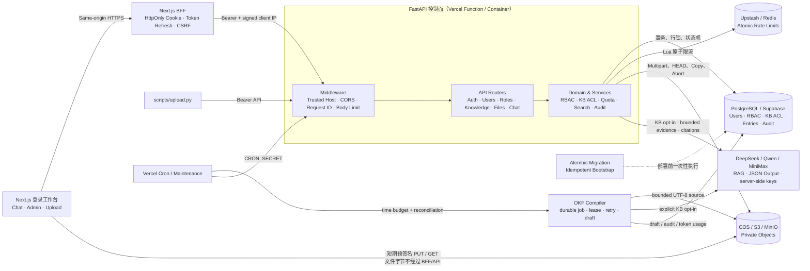
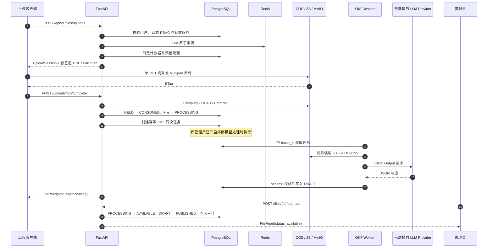

<div align="center">
  
  <h1>江苏和熠光显有限公司 · 企业知识中台</h1>
  <p><strong>面向 10 TB+ 文档数据的企业知识库与安全问答工作台</strong></p>
  <p>登录前端、动态 RBAC、知识库分级 ACL、可恢复直传、OKF 知识编译、强制来源问答与 Serverless 控制面。</p>
</div>

<p align="center">
  <a href="https://github.com/SuperGokou/knowledgebases/actions/workflows/ci.yml"></a>
  <a href="docs/COMMERCIAL_READINESS_REVIEW.zh-CN.md"></a>
  <a href="https://www.python.org/"></a>
  <a href="https://fastapi.tiangolo.com/"></a>
  <a href="https://nextjs.org/"></a>
  <a href="https://www.postgresql.org/"></a>
  <a href="https://redis.io/"></a>
  <a href="https://docs.aws.amazon.com/AmazonS3/latest/userguide/Welcome.html"></a>
  <a href="https://github.com/GoogleCloudPlatform/knowledge-catalog/blob/main/okf/SPEC.md"></a>
  <a href="https://api-docs.deepseek.com/"></a>
  <a href="https://www.docker.com/"></a>
  <a href="https://vercel.com/docs/regions"></a>
  <a href="https://knowledgebases.vercel.app"></a>
  <a href="https://github.com/SuperGokou/knowledgebases/commits/main"></a>
</p>
<p align="center">
  <a href="https://knowledgebases.vercel.app"><strong>Web Demo</strong></a>
  ·
  <a href="https://knowledgebases-api.vercel.app/docs">API Demo</a>
  ·
  <a href="https://knowledgebases-api.vercel.app/openapi.json">OpenAPI</a>
  ·
  <a href="docs/ARCHITECTURE.zh-CN.md">架构设计</a>
  ·
  <a href="docs/OPERATIONS.zh-CN.md">运维手册</a>
  ·
  <a href="docs/VERCEL_DEPLOYMENT.zh-CN.md">Vercel 部署</a>
  ·
  <a href="docs/API_AND_MODEL_MANAGEMENT.zh-CN.md">API 与模型管理</a>
  ·
  <a href="docs/COMMERCIAL_READINESS_REVIEW.zh-CN.md">商业版审计报告</a>
  ·
  <a href="SECURITY.md">安全报告策略</a>
</p>

> [!IMPORTANT]
> 当前仓库已经交付登录前端、管理控制台、知识库分级授权、文件直传、第一阶段 OKF 知识编译，以及基于授权文本检索的生成式问答。每个成功回答都返回服务端编号的结构化来源；模型漏引、越界引用或自行伪造来源区块时会丢弃模型文本并降级为确定性检索回答。自动转换目前仅处理管理员显式授权知识库中的 UTF-8 `.txt/.csv`，产物先进入草稿，源文件审批后才发布；Office/PDF 沙箱解析和混合向量检索仍属于后续阶段。

## 项目定位

这个项目把文件字节与业务元数据彻底分开：

- FastAPI 只处理认证、RBAC、配额、文件状态和预签名 URL，不代理大文件流量；
- PostgreSQL 是用户、角色、配额、上传状态与审计的事实源；
- PostgreSQL 同时保存知识库、角色级 `reader/editor/manager` 授权和派生知识条目；
- Redis 保存可重建的短时限流状态；
- 腾讯 COS、AWS S3 或 MinIO 保存私有文件对象；
- 客户端通过短期预签名 URL 直接上传和下载。

因此，API 按控制面请求数扩容，文件吞吐由对象存储承担，适合从单机开发演进到 10 TB 以上的文件容量。

支持的文件扩展名：

```text
.txt  .doc  .docx  .xls  .xlsx  .csv  .pdf  .ppt  .pptx
```

## Demo

| 资源 | 地址 | 用途 |
|---|---|---|
| Web 工作台 | [knowledgebases.vercel.app](https://knowledgebases.vercel.app) | 登录、聊天与后台管理入口 |
| Swagger UI | [knowledgebases-api.vercel.app/docs](https://knowledgebases-api.vercel.app/docs) | 浏览并调用 API |
| OpenAPI Schema | [knowledgebases-api.vercel.app/openapi.json](https://knowledgebases-api.vercel.app/openapi.json) | 生成 SDK 或导入 API 工具 |
| Liveness | [knowledgebases-api.vercel.app/health/live](https://knowledgebases-api.vercel.app/health/live) | 检查应用进程是否可用 |
| Readiness | [knowledgebases-api.vercel.app/health/ready](https://knowledgebases-api.vercel.app/health/ready) | 检查 PostgreSQL 与 Redis |

> Demo 的真实可用状态以 `/health/ready` 为准；生产密钥只保存在 Vercel Sensitive Environment Variables 中，不进入仓库。

> [!NOTE]
> Web 与 API 的 Vercel Functions 已固定到新加坡 `sin1`。继续使用 Vercel 时，PostgreSQL 与 Redis 也应部署在新加坡并通过迁移切换，避免控制面跨太平洋访问数据层；腾讯 COS 仍由浏览器直传，不经过 Vercel Function。

## 系统架构



### 上传与审批流程



## 核心能力

| 领域 | 已实现能力 |
|---|---|
| 身份认证 | OAuth2 密码登录、Argon2 哈希、短期 JWT、一次性 Refresh Token 轮换、`token_version` 撤销 |
| 统一登录工作台 | 单一登录入口、RSC 输出前 `/auth/me` 会话与权限守卫、管理员/编辑者/问答用户自动落地、HttpOnly Cookie BFF 与刷新 single-flight |
| 动态 RBAC | 自定义角色、权限目录、角色优先级、角色分配、通配权限与最后一个超级管理员保护 |
| 知识库 ACL | 知识库 Owner、角色级 Reader/Editor/Manager、动态撤权、隐藏未授权资源与审计 |
| OKF Phase 1 | 上传后持久任务、DeepSeek JSON Output、严格 schema 校验、租约防竞态、指数退避、草稿/发布门禁 |
| 数据外发策略 | 每个知识库单独显式 opt-in，默认关闭；审计只记录文档 ID、模型、策略版本与 token 用量，不记录正文 |
| 强制来源问答 | 授权检索与可选 RAG；每个成功回答带正文来源脚注、结构化 `citations` 与 `source_status`，无效模型引用自动降级 |
| 分级限额 | 每分钟请求数、单文件大小、每日上传字节、总存储字节、每日下载凭证 |
| 大文件上传 | 单 PUT、S3 Multipart、最多 10,000 分片、分批签名、并发上传和客户端断点续传 |
| 并发安全 | PostgreSQL `used + reserved` 配额模型、行锁、唯一约束与幂等键 |
| 对象安全 | 私有 Bucket、短期预签名 URL、精确 `Content-Length`、单 PUT SHA-256 强校验、staging/final key 隔离 |
| 恢复与维护 | 上传状态机、`FINALIZING` 对账、过期会话与 reservation 清理、Vercel Cron |
| 审计 | 用户、角色、上传、审批和下载凭证等安全事件持久化 |
| 部署 | Docker Compose 本地栈、Alembic、幂等 Bootstrap、Vercel Functions、腾讯 COS |

### 权限与限额语义

- 多角色权限取并集，支持精确权限、`resource:*` 和全局 `*`；
- 同一限额的有限值取最大值，SQL `NULL` 表示无限；
- 用户级 override 最后生效，可把有限改为无限，也可把无限收紧为有限；
- 数值 `0` 表示禁止，不表示无限；
- Redis 不可用时，受保护且需要限流的接口 fail closed，不会静默绕过策略。

| Limit key | 窗口 | 执行语义 |
|---|---|---|
| `requests_per_minute` | 固定分钟 | Redis Lua 原子计数 |
| `max_upload_bytes` | 单次请求 | 限制一个对象的声明大小 |
| `daily_upload_bytes` | UTC 日 | 发起上传时预留，完成后消费 |
| `storage_bytes` | 生命周期 | 防止并发上传穿透总存储额度 |
| `daily_downloads` | UTC 日 | 每签发一个短期下载 URL 计数一次 |

## 技术栈

| 层 | 技术 | 职责 |
|---|---|---|
| API | Python 3.12、FastAPI、Pydantic | 类型化接口、OpenAPI、校验和中间件 |
| Web | Next.js 16、React 19、TypeScript | 登录、聊天、知识库、账号、角色、权限与文件管理 |
| Web 安全边界 | Same-origin BFF、HttpOnly Cookie、HMAC Client IP | 隐藏 Token、刷新会话并保留真实终端限流维度 |
| 数据访问 | SQLAlchemy Async、Alembic | 事务、迁移、行锁和数据库约束 |
| 元数据 | PostgreSQL 17 / Supabase | RBAC、配额、文件状态、Refresh Token 和审计 |
| 短时状态 | Redis 8 + Lua | 登录与业务接口的分布式原子限流 |
| 对象存储 | 腾讯 COS、AWS S3、MinIO | 私有文件、Multipart 与预签名访问 |
| 本地编排 | Docker Compose | PostgreSQL、Redis、MinIO、迁移、Bootstrap 和 API |
| Serverless | Vercel Functions + Cron | 无状态控制面与周期维护 |
| 知识编译 | DeepSeek API、httpx、Pydantic | UTF-8 文本到 OKF v0.1 草稿、重试、审计与发布门禁 |
| 工程质量 | uv、pytest、Ruff、mypy strict | 可复现依赖、测试、Lint 与静态类型检查 |

## 快速开始

### 前置要求

- Docker Desktop；
- PowerShell 7 或 Windows PowerShell；
- Git。

### 启动完整本地栈

```powershell
git clone https://github.com/SuperGokou/knowledgebases.git
cd knowledgebases

Copy-Item .env.example .env.kb
# 编辑 .env.kb，至少替换 JWT、管理员、PostgreSQL、Redis 和 MinIO 密码

.\scripts\start.ps1 -EnvFile .env.kb
```

`start.ps1` 会按以下顺序完成启动：

`PostgreSQL / Redis / MinIO → Alembic migration → 幂等 Bootstrap → FastAPI`

已有最新镜像时可跳过构建：

```powershell
.\scripts\start.ps1 -EnvFile .env.kb -SkipBuild
```

### 本地入口

| 服务 | URL |
|---|---|
| Swagger UI | <http://localhost:8000/docs> |
| OpenAPI | <http://localhost:8000/openapi.json> |
| Liveness | <http://localhost:8000/health/live> |
| Readiness | <http://localhost:8000/health/ready> |
| MinIO Console | <http://localhost:9001> |

### 启动 Web 工作台

API 启动后，在第二个终端运行：

```powershell
cd web
Copy-Item .env.example .env.local
npm install
npm run dev
```

打开 <http://localhost:3000>。本地开发可不配置 BFF HMAC；生产环境必须让前端的 `FASTAPI_BFF_SHARED_SECRET` 与后端的 `KB_BFF_SHARED_SECRET` 使用同一条至少 32 字符的随机密钥。

首次管理员由以下变量创建：

```text
KB_BOOTSTRAP_ADMIN_EMAIL
KB_BOOTSTRAP_ADMIN_PASSWORD
```

### 配置 DeepSeek / Qwen / MiniMax

供应商密钥只配置在 FastAPI/Worker 服务端，或由管理员在“API 与模型”页面加密保存；不得使用 `NEXT_PUBLIC_` 前缀：

```text
KB_LLM_DEFAULT_PROVIDER=deepseek
KB_LLM_CREDENTIAL_ENCRYPTION_KEY=<独立随机主密钥>
KB_DEEPSEEK_API_KEY=<Vercel Sensitive Environment Variable>
KB_DEEPSEEK_BASE_URL=https://api.deepseek.com
KB_DEEPSEEK_MODEL=deepseek-v4-flash
KB_QWEN_API_KEY=<optional>
KB_QWEN_BASE_URL=https://dashscope.aliyuncs.com/compatible-mode/v1
KB_QWEN_MODEL=qwen-plus
KB_QWEN_ALLOWED_WORKSPACE_HOSTS=[]
KB_MINIMAX_API_KEY=<optional>
KB_MINIMAX_BASE_URL=https://api.minimax.io/v1
KB_MINIMAX_MODEL=MiniMax-M2.7
KB_OKF_SOURCE_MAX_BYTES=1000000
KB_OKF_CONVERSION_BATCH_SIZE=5
KB_OKF_CONVERSION_TIME_BUDGET_SECONDS=50
```

后台可在三家供应商间切换默认模型；新聊天和 OKF 转换任务会使用该选择。随后仍须由知识库 Manager 在“知识空间”中显式开启外部 LLM 处理，未授权的知识库不会把正文发送给第三方。第一阶段只读取不超过配置上限的 UTF-8 `.txt/.csv`；其他格式会安全标记为 `unsupported/parser_required`，等待后续隔离解析 Worker。任务使用数据库持久化、`lease_id` 所有权、有限重试与时间预算，转换成功只生成 `draft`，批准源文件后才发布。

如使用 Qwen 工作空间专属地址，必须把精确主机名加入 `KB_QWEN_ALLOWED_WORKSPACE_HOSTS` JSON 数组；通配符、协议、路径和端口都会被拒绝，防止供应商密钥被发送到非预期主机。

## 上传文件

内置 CLI 支持自动登录、单文件直传、并发分片、URL 刷新、SHA-256 计算和 checkpoint 断点续传：

```powershell
$env:KB_EMAIL = 'admin@example.com'
$env:KB_PASSWORD = '你在 .env.kb 中设置的管理员密码'

.\.venv\Scripts\python.exe scripts\upload.py `
  --password-env KB_PASSWORD `
  --calculate-sha256 `
  'C:\data\manual.pdf'
```

上传完成后文件进入 `processing`，不会自动开放下载。开发环境可由拥有 `file:approve` 权限的管理员批准：

```http
POST /api/v1/files/{file_id}/approve
Authorization: Bearer <access-token>
```

生产环境应由隔离的恶意软件扫描与内容解析 Worker 驱动审批，人工审批不能替代安全扫描。

## 核心 API

| 能力 | 接口 |
|---|---|
| 登录、刷新与退出 | `POST /api/v1/auth/token` · `POST /api/v1/auth/refresh` · `POST /api/v1/auth/logout` |
| 当前会话 | `GET /api/v1/auth/me` |
| 用户管理 | `GET/POST /api/v1/users` · `PATCH /api/v1/users/{id}` · `PUT /api/v1/users/{id}/roles` |
| 动态角色 | `GET/POST /api/v1/roles` · `PATCH /api/v1/roles/{id}` |
| 角色策略 | `PUT /api/v1/roles/{id}/policy`（原子更新）· 兼容 `/permissions` 与 `/limits` 分接口 |
| 策略目录 | `GET /api/v1/permissions` · `GET /api/v1/limits` |
| 文件列表 | `GET /api/v1/files` |
| 发起上传 | `POST /api/v1/files/uploads` |
| 分片签名 | `POST /api/v1/files/uploads/{id}/parts` |
| 完成或中止 | `POST /api/v1/files/uploads/{id}/complete` · `DELETE /api/v1/files/uploads/{id}` |
| 审批文件 | `POST /api/v1/files/{id}/approve` |
| OKF 转换状态 | `GET /api/v1/files/{id}/okf-conversion` · `POST .../okf-conversion/retry` |
| 下载凭证 | `POST /api/v1/files/{id}/download` |
| 知识库 | `GET/POST /api/v1/knowledge-bases` · `GET/PATCH /api/v1/knowledge-bases/{id}` |
| 知识授权 | `GET/PUT /api/v1/knowledge-bases/{id}/role-grants` |
| 知识条目 | `GET/POST /api/v1/knowledge-bases/{id}/entries` · `GET/PATCH .../entries/{entry_id}` |
| 检索与聊天 | `POST /api/v1/knowledge-bases/{id}/search` · `POST /api/v1/chat/query` |
| API Key 管理 | `GET/POST /api/v1/api-keys` · `DELETE /api/v1/api-keys/{id}` |
| 模型供应商 | `GET /api/v1/llm/providers` · `PATCH /api/v1/llm/providers/{provider}` |
| 外部知识 API | `POST /api/v1/public/chat/query` · `POST /api/v1/public/knowledge-bases/{id}/search` |

下载限额统计的是“成功签发下载 URL 的次数”，不是对象存储确认完成的下载次数。若需要按真实传输次数或字节计费，应增加下载网关或 CDN 边缘鉴权。

## 项目结构

```text
.
├── app/
│   ├── api/             # FastAPI 路由、中间件、依赖与错误契约
│   ├── core/            # 配置、密码与 JWT 安全
│   ├── db/              # SQLAlchemy 模型与会话
│   ├── domain/          # RBAC、配额和上传领域规则
│   ├── schemas/         # Pydantic 请求/响应模型
│   └── services/        # Access、Quota、Storage、Audit、Rate Limit
├── alembic/             # PostgreSQL Schema migration
├── docker/minio/        # Bucket、应用账号、CORS 与 Multipart 清理
├── docs/                # 架构、运维和 Vercel 部署文档
├── scripts/             # 本地启动与可恢复上传 CLI
├── tests/               # 单元、契约、集成与 Serverless 测试
├── web/                 # Next.js 登录、聊天与管理控制台（独立 Vercel Project）
├── docker-compose.yml   # 完整本地依赖栈
├── Dockerfile           # Python 3.12、uv、多阶段、非 root 镜像
└── vercel.json          # Vercel Cron 配置
```

## 开发与质量门禁

```powershell
uv sync --extra dev
.\.venv\Scripts\python.exe -m pytest --cov=app --cov-report=term-missing -q
.\.venv\Scripts\python.exe -m ruff check .
.\.venv\Scripts\python.exe -m mypy app scripts
cd web
npm test
npm run lint
npm run build
```

项目配置了：

- pytest 严格 marker；
- 分支覆盖率门槛 `80%`；
- Ruff 的 `E/F/I/B/UP/SIM` 规则；
- mypy strict；
- Python 3.12 锁定依赖。
- Dependabot 覆盖 uv、npm 与 GitHub Actions 依赖更新。

本 README 更新时的本地验收结果：**130 backend tests + 142 frontend tests passed，branch coverage 84.47%，Ruff clean，mypy strict passed，npm audit 0 vulnerabilities，TypeScript/ESLint/Next.js production build passed**。同一组门禁已写入 GitHub Actions，并额外在 PostgreSQL 17 与 Redis 8 service 上验证 Alembic 能升级到唯一 head。

## 部署到 Vercel

生产使用同一 Git 仓库的两个 Vercel Project，避免框架检测、根路由和 BFF 回源发生冲突：

- API Project `knowledgebases-api`：Root Directory 为仓库根目录，运行 FastAPI 与 Cron；
- Web Project `knowledgebases`：Root Directory 为 `web/`，运行 Next.js，`FASTAPI_URL` 指向 `https://knowledgebases-api.vercel.app`。
- 两个 Project 的 Functions 均由仓库配置固定到新加坡 `sin1`，并在 Vercel Project Settings 中使用相同默认区域。

文件继续由浏览器直传对象存储。生产环境至少需要：

1. PostgreSQL / Supabase Transaction Pooler；
2. Redis 协议端点；
3. 腾讯 COS 或其他 S3-compatible 私有 Bucket；
4. 独立的 JWT 与 Cron Secret；
5. 部署前执行 Alembic migration 和一次性管理员 Bootstrap。

当前 Vercel 项目使用 Hobby 兼容的每日 Cron 做 OKF 漏单对账。若要求上传后近实时转换，应升级 Pro/Enterprise 后使用每分钟 Cron，或用 Upstash QStash、Vercel Queue、独立 Worker 承担即时消费。

> [!WARNING]
> `sin1` 是新加坡海外节点，不是中国大陆节点，也不提供中国大陆 ICP 备案能力。它适合当前演示和海外 Serverless 架构；若系统要作为中国大陆公司正式生产服务，应同时评估大陆云部署、ICP 备案、数据跨境与等保要求。Vercel Hobby 仅适合非商业用途，公司正式生产需要使用合适的付费计划。

完整变量映射、腾讯 COS virtual-host addressing、Supabase、Cron 和迁移顺序见：

**[Vercel 部署手册](docs/VERCEL_DEPLOYMENT.zh-CN.md)**

> [!CAUTION]
> 不要把 `.env` 提交到 Git，也不要把 Supabase service-role key、COS 永久密钥或 Bootstrap 密码暴露给浏览器。Vercel 生产密钥应使用 Sensitive Environment Variables，并按 Production 范围隔离。

## 安全边界

已经实现：

- JWT issuer、audience、type 与固定算法校验；
- Argon2 密码哈希、短期 access token、一次性 Refresh Token 轮换；
- 登录 IP/账号双维度限流和用户级动态限流；
- 动态权限实时解析、角色优先级与权限提升防护；
- 请求体上限、Trusted Host、CORS、请求 ID 和安全错误响应；
- 私有对象、短期签名、精确大小校验、不可复用最终写 key；
- 单 PUT SHA-256 绑定签名并恒定时间校验，摘要不匹配时删除对象并释放配额；
- OKF 草稿/发布门禁、知识库级外部模型 opt-in 与转换租约所有权；
- PostgreSQL 原子配额预留与持久审计。

正式对外前仍必须补齐：

- 恶意软件扫描、MIME/魔数验证与沙箱解析；
- PostgreSQL HA/PITR、Redis HA、对象版本化与恢复演练；
- 指标、Trace、集中日志和审计防篡改归档；
- 全量孤儿对象对账、文件保留/删除及法律保全流程；
- 企业 OIDC/MFA 与数据库最小权限身份。

## Roadmap

- [x] 用户、动态角色、权限目录与角色限额
- [x] JWT/Refresh Token、分布式限流与审计
- [x] 单 PUT / Multipart 直传、断点续传与状态恢复
- [x] Docker Compose 本地栈
- [x] Vercel Functions、Cron 与腾讯 COS
- [x] 登录、聊天、知识库、账号、角色、权限与限额管理前端
- [x] 知识库 Reader/Editor/Manager 动态 ACL 与撤权回归
- [x] OKF v0.1 兼容字段与原始来源/派生知识分层
- [x] DeepSeek 自动编译 UTF-8 TXT/CSV、持久任务、租约、重试、草稿审批发布
- [x] PostgreSQL `pg_trgm` GIN 多语言检索索引与数据库侧有界摘要
- [ ] 恶意软件扫描与隔离解析 Worker
- [ ] Office/PDF/CSV 文本抽取与版本化分块
- [x] 授权全文检索、可选生成式 RAG、强制来源协议与确定性降级
- [ ] 混合向量索引、重排与引用语义蕴含评估
- [ ] OKF Bundle 导入/导出、校验器与知识图谱视图
- [ ] LLM-Wiki 多文档引用审阅、矛盾检测与增量重编译
- [ ] 企业 OIDC、MFA 与集中可观测性

## 文档

- [架构设计](docs/ARCHITECTURE.zh-CN.md)：系统边界、数据库模式、RBAC、配额、状态机与 10 TB+ 拓扑；
- [运维手册](docs/OPERATIONS.zh-CN.md)：部署、备份、恢复、扩容、告警与排障；
- [Vercel 部署手册](docs/VERCEL_DEPLOYMENT.zh-CN.md)：Supabase、Redis、腾讯 COS、Cron 与生产变量。
- [API 与模型管理](docs/API_AND_MODEL_MANAGEMENT.zh-CN.md)：API Key 生命周期、外部调用示例、模型切换与密钥安全。
- [知识编译、OKF 与聊天架构](docs/KNOWLEDGE_PIPELINE.zh-CN.md)：原始来源、派生知识、OKF v0.1、LLM-Wiki 与聊天 ACL。
- [OKF 第一阶段与 DeepSeek](docs/OKF_DEEPSEEK_PHASE1.zh-CN.md)：外部处理策略、持久任务、租约、重试、草稿发布与运维配置。
- [商业版代码审计与交付报告](docs/COMMERCIAL_READINESS_REVIEW.zh-CN.md)：发布判定、已关闭问题、P1 商用门槛与验收标准。
- [安全策略](SECURITY.md)：漏洞私密报告渠道、响应目标、安全港边界与凭据处理要求。

---

<p align="center">
  <strong>Metadata in PostgreSQL. Ephemeral policy state in Redis. File bytes in object storage.</strong>
</p>
