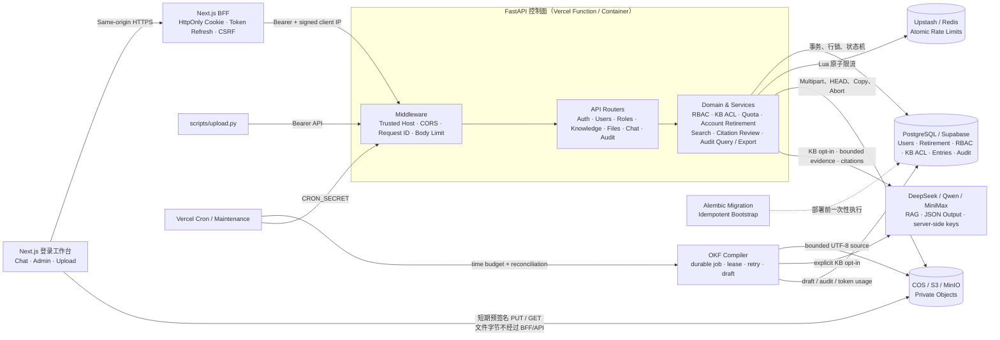
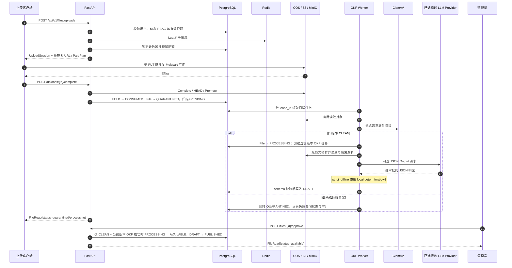
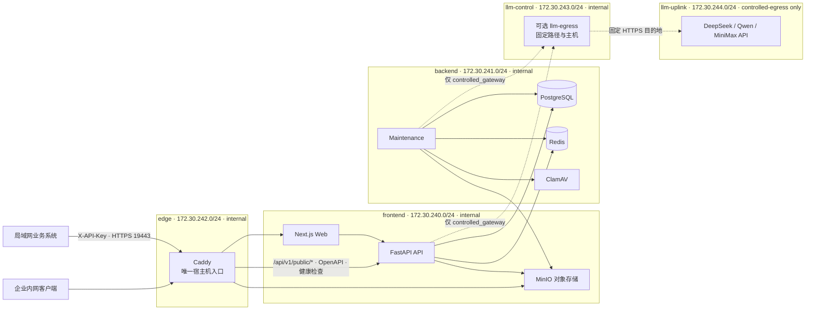

<div align="center">
  
  <h1>江苏和熠光显有限公司 · 企业知识中台</h1>
  <p><strong>面向 10 TB+ 扩展目标的企业知识库与安全问答工作台</strong></p>
  <p>登录前端、动态 RBAC、知识库分级 ACL、可恢复直传、OKF 知识编译、强制来源问答与可离线容器化控制面。</p>
</div>

<p align="center">
  <a href="https://github.com/SuperGokou/knowledgebases/actions/workflows/ci.yml"></a>
  <a href="docs/ENTERPRISE_FINAL_ACCEPTANCE_STANDARD.zh-CN.md"></a>
  <a href="docs/DEPENDENCY_LICENSE_AUDIT.zh-CN.md"></a>
  <a href="pyproject.toml"></a>
  <a href="app/db/schema_version.py"></a>
  <a href="https://www.python.org/"></a>
  <a href="https://fastapi.tiangolo.com/"></a>
  <a href="https://nextjs.org/"></a>
  <a href="https://www.postgresql.org/"></a>
  <a href="https://redis.io/"></a>
  <a href="https://docs.aws.amazon.com/AmazonS3/latest/userguide/Welcome.html"></a>
  <a href="https://github.com/GoogleCloudPlatform/knowledge-catalog/blob/main/okf/SPEC.md"></a>
  <a href="docs/API_AND_MODEL_MANAGEMENT.zh-CN.md"></a>
  <a href="https://www.docker.com/"></a>
  <a href="https://vercel.com/docs/regions"></a>
  <a href="https://knowledgebases.vercel.app"></a>
  <a href="https://github.com/SuperGokou/knowledgebases/commits/main"></a>
</p>
<p align="center">
  <a href="https://knowledgebases.vercel.app"><strong>Web Demo</strong></a>
  ·
  <a href="https://knowledgebases-api.vercel.app/docs">API Demo</a>
  ·
  <a href="https://knowledgebases-api.vercel.app/openapi.json">OpenAPI</a>
  ·
  <a href="docs/ARCHITECTURE.zh-CN.md">架构设计</a>
  ·
  <a href="docs/OPERATIONS.zh-CN.md">运维手册</a>
  ·
  <a href="docs/VERCEL_DEPLOYMENT.zh-CN.md">Vercel 部署</a>
  ·
  <a href="docs/TENCENT_SHARED_HOST_DEPLOYMENT_BASELINE.zh-CN.md">其他云共享部署基线</a>
  ·
  <a href="docs/TENCENT_OFFLINE_ENTERPRISE_DEPLOYMENT.zh-CN.md">其他云 Linux 离线部署</a>
  ·
  <a href="docs/OFFLINE_RUNTIME_ACCEPTANCE.zh-CN.md">断网冷启动验收</a>
  ·
  <a href="docs/API_AND_MODEL_MANAGEMENT.zh-CN.md">API 与模型管理</a>
  ·
  <a href="docs/README.zh-CN.md">企业文档中心</a>
  ·
  <a href="docs/ENTERPRISE_FINAL_ACCEPTANCE_STANDARD.zh-CN.md">企业终验标准</a>
  ·
  <a href="docs/COMMERCIAL_READINESS_REVIEW.zh-CN.md">历史审计快照</a>
  ·
  <a href="SECURITY.md">安全报告策略</a>
</p>

> [!IMPORTANT]
> 当前仓库已经交付登录前端、管理控制台、知识库分级授权、文件直传、九类文档的失败关闭解析链、OKF 知识编译，以及基于授权文本检索的生成式问答。TXT、CSV、DOCX、XLSX、PPTX 使用内建有界解析；PDF 与 DOC/XLS/PPT 必须在包含固定版本 Poppler、LibreOffice、bubblewrap 与 `prlimit` 的 Linux 镜像中通过 `--require-all` 门禁。任一外部工具或沙箱能力缺失时均为 `BLOCKED`，不得声称全格式可用。每个成功回答都返回结构化来源并经过引用完整性与生成后语义审核；失败时丢弃模型文本并降级为确定性检索回答。

> [!WARNING]
> 国内云 Linux 隔离部署默认使用 `KB_LLM_EGRESS_MODE=strict_offline`，不会实例化模型出口；只有完成数据外发审批后才可切换为 `controlled_gateway`，且网关 URL 必须精确为 `http://llm-egress:8080`、供应商白名单只能是 DeepSeek、Qwen、MiniMax 的规范子集。`direct` 模式在 `isolated` Profile 中被禁止。单台 Linux 8 核 / 16 GB / 300 GB SSD 仅是当前控制面与受水位保护数据面的部署基线，尚无证据证明它能承载“每日 50 亿 token”。正式性能结论必须以目标机上预先批准的吞吐、延迟、错误率与磁盘阈值，以及可复核的压测证据为准；在这些材料齐备前，性能验收状态为 `BLOCKED`。

> [!CAUTION]
> 当前技术候选版本不等于商业发行批准。仓库尚未取得项目许可证、全部第三方依赖/资产的签署授权和最终第三方声明；目标服务器也尚需提供数据库、对象、WAL、快照及备份静态加密的可复核证据。上述任一项缺失时，商业发布和敏感数据正式交付均为 `NO-GO`，不得宣称“零版权风险”或“全部企业验收通过”。

> [!NOTE]
> 局域网离线 Profile 的运行时只依赖服务器已加载的固定镜像，以及本机 PostgreSQL、Redis、MinIO、ClamAV、FastAPI、Next.js 与 Caddy。GitHub、Vercel、COS、公共 CDN 和公共镜像仓库均不是运行、重启或冷恢复前置条件；COS 只可作为首次制品传输加速通道，不承载运行期数据。服务器必须长期保留带 SHA-256 的完整发布包和 9 类镜像制品清单。

## 项目定位

这个项目把文件字节与业务元数据彻底分开：

- FastAPI 只处理认证、RBAC、配额、文件状态和预签名 URL，不代理大文件流量；
- PostgreSQL 是用户、角色、配额、上传状态与审计的事实源；
- PostgreSQL 同时保存知识库、角色级 `reader/editor/manager` 授权和派生知识条目；
- Redis 保存可重建的短时限流状态；
- 腾讯 COS、AWS S3 或 MinIO 保存私有文件对象；
- 客户端通过短期预签名 URL 直接上传和下载。

因此，API 按控制面请求数扩容，文件吞吐由对象存储承担，并为从单机基线演进到独立对象存储集群提供架构路径。当前 300 GB 单节点不构成 10 TB 容量、高可用或恢复认证；相关结论仍须以目标拓扑的签名实测证据为准。

支持的文件扩展名：

```text
.txt  .doc  .docx  .xls  .xlsx  .csv  .pdf  .ppt  .pptx
```

## 部署入口与 Demo

| 资源 | 地址 | 用途 |
|---|---|---|
| 局域网工作台 | `https://<KB_PUBLIC_HOST>:<KB_HTTPS_PORT>/login` | 企业内网登录、聊天与管理；默认正式交付入口 |
| 局域网公共 API | `https://<KB_PUBLIC_HOST>:<KB_HTTPS_PORT>/api/v1/public/*` | 业务系统使用 `X-API-Key` 调用，不依赖浏览器 Cookie |
| 局域网 OpenAPI | `https://<KB_PUBLIC_HOST>:<KB_HTTPS_PORT>/openapi.json` | 无公共 CDN 的原始契约；仅限 VPN/可信网段 |
| Web 工作台 | [knowledgebases.vercel.app](https://knowledgebases.vercel.app) | 登录、聊天与后台管理入口 |
| Swagger UI | [knowledgebases-api.vercel.app/docs](https://knowledgebases-api.vercel.app/docs) | 浏览并调用 API |
| OpenAPI Schema | [knowledgebases-api.vercel.app/openapi.json](https://knowledgebases-api.vercel.app/openapi.json) | 生成 SDK 或导入 API 工具 |
| Liveness | [knowledgebases-api.vercel.app/health/live](https://knowledgebases-api.vercel.app/health/live) | 检查应用进程是否可用 |
| Readiness | [knowledgebases-api.vercel.app/health/ready](https://knowledgebases-api.vercel.app/health/ready) | 检查 PostgreSQL 与 Redis |

> Vercel 条目仅为可选托管演示，不参与局域网离线运行；本 README 与 badge 不构成实时可用性证明。访问前应即时检查 `/health/live`、`/health/ready` 与登录页，并以同一时间窗口的结果为准。生产密钥只保存在对应部署的服务端密钥存储中，不进入仓库。

> [!NOTE]
> Web 与 API 的 Vercel Functions 已固定到美国东部（华盛顿特区）`iad1`。静态资源仍由 Vercel 全球 CDN 就近分发；为避免跨区域访问，PostgreSQL 与 Redis 宜部署在美国东部或邻近区域。对象存储仍由浏览器直传，不经过 Vercel Function；此 Vercel 区域设置不会修改或重启“其他云 Linux 8C16G300G”离线部署。

## 系统架构



### 上传与审批流程



## 核心能力

| 领域 | 已实现能力 |
|---|---|
| 身份认证 | OAuth2 密码登录、Argon2 哈希、短期 JWT、一次性 Refresh Token 轮换、`token_version` 撤销 |
| 统一登录工作台 | 单一登录入口、RSC 输出前 `/auth/me` 会话与权限守卫、管理员/编辑者/问答用户自动落地、HttpOnly Cookie BFF 与刷新 single-flight |
| 动态 RBAC | 自定义角色、权限目录、角色优先级、角色分配、通配权限与最后一个超级管理员保护 |
| 账号生命周期 | 修改密码、管理员重置、启停与不可逆账号退休；邮箱二次确认、自退休/最后活跃超级管理员保护、知识库所有权原子交接、凭据撤销和审计历史保留 |
| 知识库 ACL | 知识库 Owner、角色级 Reader/Editor/Manager、动态撤权、隐藏未授权资源与审计 |
| 文档解析与 OKF | TXT/CSV/OOXML 内建解析；PDF/旧版 Office 断网沙箱；来源定位、持久任务、严格 schema、租约、草稿/发布门禁 |
| 数据外发策略 | 每个知识库单独显式 opt-in，默认关闭；外发审计与用量事实只记录文档/主体标识、模型、策略版本、结果与 token，不记录提示词、模型输出或知识正文 |
| 强制来源与回答审核 | 授权检索与可选 RAG；正文来源脚注、结构化 `citations`、`source_status` 与 `answer_review`；生成与审核使用独立客户端，引用或语义审核失败时丢弃模型文本并确定性降级 |
| 分级限额 | 每分钟请求数、单文件大小、每日上传字节、生命周期累计存储写入量、每日下载凭证 |
| 大文件上传 | 单 PUT、S3 Multipart、最多 10,000 分片、分批签名、并发上传和客户端断点续传 |
| 并发安全 | PostgreSQL `used + reserved` 配额模型、行锁、唯一约束与幂等键 |
| 对象安全 | 私有 Bucket、短期预签名 URL、精确 `Content-Length`、单 PUT SHA-256 强校验、staging/final key 隔离 |
| 恢复与维护 | 上传状态机、`FINALIZING` 对账、过期会话与 reservation 清理、Vercel Cron |
| 审计 | `/admin/audit` 权限化控制台、动作/主体/资源/结果/时间过滤、游标分页、8 字段脱敏投影与最多 5,000 行的安全 CSV 导出；离线运行时数据库角色仅可查询和追加审计 |
| 部署 | Docker Compose 本地栈、Alembic、幂等 Bootstrap、Vercel Functions、S3-compatible 对象存储、其他云 Linux 离线单机 |

### 权限与限额语义

- 多角色权限取并集，支持精确权限、`resource:*` 和全局 `*`；
- 同一限额的有限值取最大值，SQL `NULL` 表示角色级无限；无限仍持续计量，并受平台文件、知识条目容量与磁盘水位等硬上限约束；
- 用户级 override 最后生效，可把有限改为无限，也可把无限收紧为有限；
- 数值 `0` 表示禁止，不表示无限；
- Redis 不可用时，受保护且需要限流的接口 fail closed，不会静默绕过策略。

| Limit key | 窗口 | 执行语义 |
|---|---|---|
| `requests_per_minute` | 固定分钟 | Redis Lua 原子计数 |
| `max_upload_bytes` | 单次请求 | 限制一个对象的声明大小 |
| `daily_upload_bytes` | UTC 日 | 发起上传时预留，完成后消费 |
| `storage_bytes` | 生命周期 | 文件成功上传计入全部字节；手工知识正文仅计入 UTF-8 字节正增长。同长度替换、缩小及删除均不返还额度 |
| `daily_downloads` | UTC 日 | 每签发一个短期下载 URL 计数一次 |

## 技术栈

| 层 | 技术 | 职责 |
|---|---|---|
| API | Python 3.12、FastAPI、Pydantic | 类型化接口、OpenAPI、校验和中间件 |
| Web | Next.js 16、React 19、TypeScript | 登录、聊天、知识库、账号、角色、权限与文件管理 |
| Web 安全边界 | Same-origin BFF、HttpOnly Cookie、HMAC Client IP | 隐藏 Token、刷新会话并保留真实终端限流维度 |
| 数据访问 | SQLAlchemy Async、Alembic | 事务、迁移、行锁和数据库约束 |
| 元数据 | PostgreSQL 17（离线默认）/ Supabase（托管可选） | RBAC、配额、文件状态、Refresh Token 和审计 |
| 短时状态 | Redis 8 + Lua（离线默认）/ Upstash（托管可选） | 登录与业务接口的分布式原子限流 |
| 对象存储 | MinIO（离线默认）/ 腾讯 COS、AWS S3（托管可选） | 私有文件、Multipart 与预签名访问 |
| 本地编排 | Docker Compose | PostgreSQL、Redis、MinIO、ClamAV、Migration、Bootstrap、FastAPI API/Maintenance、Next.js Web 与 Caddy |
| 可选托管演示 | Vercel Functions + Cron | 无状态控制面与周期维护；不是内网运行依赖 |
| 文档与知识编译 | defusedxml、Poppler、LibreOffice、bubblewrap、DeepSeek/Qwen/MiniMax | 九类文档有界解析、来源定位、OKF 草稿、重试、审计与发布门禁 |
| 工程质量 | uv、pytest、Ruff、mypy strict | 可复现依赖、测试、Lint 与静态类型检查 |

## 快速开始

### 前置要求

- Docker Desktop；
- PowerShell 7 或 Windows PowerShell；
- Git。

### 启动完整本地栈

```powershell
git clone https://github.com/SuperGokou/knowledgebases.git
cd knowledgebases

Copy-Item .env.example .env.kb
# 编辑 .env.kb，至少替换 JWT、管理员、PostgreSQL、Redis 和 MinIO 密码

.\scripts\start.ps1 -EnvFile .env.kb
```

`start.ps1` 会按以下顺序完成启动：

`PostgreSQL / Redis / MinIO → Alembic migration → 幂等 Bootstrap → FastAPI`

已有最新镜像时可跳过构建：

```powershell
.\scripts\start.ps1 -EnvFile .env.kb -SkipBuild
```

### 本地入口

| 服务 | URL |
|---|---|
| Swagger UI | <http://localhost:8000/docs> |
| OpenAPI | <http://localhost:8000/openapi.json> |
| Liveness | <http://localhost:8000/health/live> |
| Readiness | <http://localhost:8000/health/ready> |
| MinIO Console | <http://localhost:9001> |

### 启动 Web 工作台

API 启动后，在第二个终端运行：

```powershell
cd web
Copy-Item .env.example .env.local
npm install
npm run dev
```

打开 <http://localhost:3000>。本地开发可不配置 BFF HMAC；生产环境必须让前端的 `FASTAPI_BFF_SHARED_SECRET` 与后端的 `KB_BFF_SHARED_SECRET` 使用同一条至少 32 字符的随机密钥。

首次管理员由以下变量创建：

```text
KB_BOOTSTRAP_ADMIN_EMAIL
KB_BOOTSTRAP_ADMIN_PASSWORD
```

### 配置 DeepSeek / Qwen / MiniMax

供应商密钥只配置在 FastAPI/Worker 服务端，或由管理员在“API 与模型”页面加密保存；不得使用 `NEXT_PUBLIC_` 前缀：

```text
KB_LLM_DEFAULT_PROVIDER=deepseek
KB_LLM_CREDENTIAL_ENCRYPTION_KEY=<独立随机主密钥>
KB_DEEPSEEK_API_KEY=<Vercel Sensitive Environment Variable>
KB_DEEPSEEK_BASE_URL=https://api.deepseek.com
KB_DEEPSEEK_MODEL=deepseek-v4-flash
KB_QWEN_API_KEY=<optional>
KB_QWEN_BASE_URL=https://dashscope.aliyuncs.com/compatible-mode/v1
KB_QWEN_MODEL=qwen-plus
KB_QWEN_ALLOWED_WORKSPACE_HOSTS=[]
KB_MINIMAX_API_KEY=<optional>
KB_MINIMAX_BASE_URL=https://api.minimax.io/v1
KB_MINIMAX_MODEL=MiniMax-M2.7
KB_OKF_SOURCE_MAX_BYTES=1000000
KB_OKF_CONVERSION_BATCH_SIZE=5
KB_OKF_CONVERSION_TIME_BUDGET_SECONDS=50
```

后台可在三家供应商间切换默认模型；新聊天和 OKF 转换任务会使用该选择。随后仍须由知识库 Manager 在“知识空间”中显式开启外部 LLM 处理，未授权的知识库不会把正文发送给第三方。转换链支持 `.txt/.doc/.docx/.xls/.xlsx/.csv/.pdf/.ppt/.pptx`；其中 PDF 与旧版 Office 依赖 Linux 隔离工具，能力缺失时安全标记为 `parser_required`，不会伪装成功。任务使用数据库持久化、`lease_id` 所有权、有限重试与时间预算，转换成功只生成 `draft`，批准源文件后才发布。

如使用 Qwen 工作空间专属地址，必须把精确主机名加入 `KB_QWEN_ALLOWED_WORKSPACE_HOSTS` JSON 数组；通配符、协议、路径和端口都会被拒绝，防止供应商密钥被发送到非预期主机。

## 上传文件

内置 CLI 支持自动登录、单文件直传、并发分片、URL 刷新、SHA-256 计算和 checkpoint 断点续传：

```powershell
$env:KB_EMAIL = 'admin@example.com'
$env:KB_PASSWORD = '你在 .env.kb 中设置的管理员密码'

.\.venv\Scripts\python.exe scripts\upload.py `
  --password-env KB_PASSWORD `
  --calculate-sha256 `
  'C:\data\manual.pdf'
```

上传完成后文件先进入 `quarantined` 并等待 ClamAV；扫描为 `CLEAN` 后进入 `processing` 并执行当前版本 OKF 转换，不会自动开放下载。拥有 `file:approve` 权限的管理员只能批准扫描通过且 OKF 成功的文件：

```http
POST /api/v1/files/{file_id}/approve
Authorization: Bearer <access-token>
```

扫描感染、扫描异常、解析器缺失或当前版本 OKF 未完成都会失败关闭；人工审批不能替代安全扫描或转换门禁。

## 核心 API

| 能力 | 接口 |
|---|---|
| 登录、刷新与退出 | `POST /api/v1/auth/token` · `POST /api/v1/auth/refresh` · `POST /api/v1/auth/logout` |
| 当前会话 | `GET /api/v1/auth/me` |
| 用户管理 | `GET/POST /api/v1/users` · `PATCH /api/v1/users/{id}` · `PUT /api/v1/users/{id}/roles` · `DELETE /api/v1/users/{id}`（不可逆退休） |
| 密码生命周期 | `PUT /api/v1/users/me/password` · `PUT /api/v1/users/{id}/password` |
| 动态角色 | `GET/POST /api/v1/roles` · `PATCH /api/v1/roles/{id}` · `DELETE /api/v1/roles/{id}?expected_version=N` |
| 角色策略 | `PUT /api/v1/roles/{id}/policy`（原子更新）· 兼容 `/permissions` 与 `/limits` 分接口 |
| 策略目录 | `GET /api/v1/permissions` · `GET /api/v1/limits` |
| 文件列表 | `GET /api/v1/files` |
| 发起上传 | `POST /api/v1/files/uploads` |
| 分片签名 | `POST /api/v1/files/uploads/{id}/parts` |
| 完成或中止 | `POST /api/v1/files/uploads/{id}/complete` · `DELETE /api/v1/files/uploads/{id}` |
| 审批文件 | `POST /api/v1/files/{id}/approve` |
| OKF 转换状态 | `GET /api/v1/files/{id}/okf-conversion` · `POST .../okf-conversion/retry` |
| 下载凭证 | `POST /api/v1/files/{id}/download` |
| 知识库 | `GET/POST /api/v1/knowledge-bases` · `GET/PATCH /api/v1/knowledge-bases/{id}` |
| 知识授权 | `GET/PUT /api/v1/knowledge-bases/{id}/role-grants` |
| 知识条目 | `GET/POST /api/v1/knowledge-bases/{id}/entries` · `GET/PATCH .../entries/{entry_id}` |
| 检索与聊天 | `POST /api/v1/knowledge-bases/{id}/search` · `POST /api/v1/chat/query` |
| API Key 管理 | `GET/POST /api/v1/api-keys` · `POST /api/v1/api-keys/{id}/rotate` · `DELETE /api/v1/api-keys/{id}` |
| 模型供应商 | `GET /api/v1/llm/providers` · `PATCH /api/v1/llm/providers/{provider}` |
| 外部知识 API | `POST /api/v1/public/chat/query` · `POST /api/v1/public/knowledge-bases/{id}/search` |
| 审计查询与导出 | `GET /api/v1/audit-logs` · `GET /api/v1/audit-logs/export` |

用户角色替换采用严格 CAS，客户端必须提交最近一次 `UserRead.role_assignment_version`，避免并发管理员用旧快照恢复已撤销权限：

```http
PUT /api/v1/users/{user_id}/roles
Authorization: Bearer <access-token>
Content-Type: application/json

{
  "expected_version": 7,
  "role_ids": ["<role-id>"]
}
```

成功变更后 `role_assignment_version` 单调递增，并使该用户已有 token 失效；相同角色集合是无副作用操作。旧版本请求返回 `409 stale_role_assignment`，响应详情仅包含当前版本，客户端必须重新读取用户后再决策。

角色自身的名称、描述、优先级、权限与限额也使用统一的严格 CAS。客户端先从 `RoleRead.policy_version` 保存编辑快照，再在 `PATCH /roles/{id}`、`PUT /roles/{id}/permissions`、`PUT /roles/{id}/limits` 或 `PUT /roles/{id}/policy` 中提交同值的 `expected_version`。实际变更令版本单调递增；完全相同的提交不写审计、不触发撤权检查且不递增版本。旧快照返回 `409 stale_role_policy`，管理端会立即关闭旧草稿并刷新，禁止自动重放整组权限或限额。删除角色也必须提交 `expected_version`；系统角色及高优先级越权操作被拒绝，存在用户分配或知识库授权引用时返回 `409 role_in_use` 和脱敏引用计数，成功删除写入 `role.deleted` 审计事件。

用户自助改密必须提交当前密码，并经过限流；管理员重置他人密码仅允许仍有效的超级管理员执行。两条路径都使用统一强密码策略，并原子提升 `token_version`、撤销现有 refresh token，旧访问令牌与旧密码随即失效。

`DELETE /api/v1/users/{user_id}` 执行的是不可逆、非物理删除的账号退休。请求体必须提交与目标账号完全一致的 `confirmation_email`，可附带最长 1,000 字符的 `reason`；目标账号仍拥有知识库时，还必须提交处于正常状态的 `replacement_owner_id`，由同一事务完成全部所有权交接。系统禁止退休当前登录账号和最后一个活跃超级管理员，并在目标账号或其知识库仍有活动外部模型请求时失败关闭。成功后账号进入已退休状态，refresh token 与 API Key 被撤销、角色被移除、`token_version` 提升，既有业务与审计历史继续保留；已退休账号不能重新启用、修改密码、分配角色或再次登录。

知识库角色授权替换使用同样的严格 CAS：先从知识库响应读取 `role_grant_version`，再将它作为 `expected_version` 提交。成功变更后版本单调递增；旧版本返回 `409 stale_knowledge_grants`，客户端必须重新读取知识库和授权集合，禁止自动重放旧的整组授权。

`POST /api/v1/chat/query` 与 `POST /api/v1/public/chat/query` 必须携带 1–160 位、日志安全的 `Idempotency-Key`。同一次逻辑问答的网络重试复用同一个 Key；新问题必须生成新 Key。服务端不再使用请求 ID 静默替代幂等键。

聊天幂等是 PostgreSQL 持久语义，不是仅校验请求头：同一主体、同一 Key、同一规范化请求会在 24 小时保留期内原样重放最终 `ChatQueryResponse`，不会再次检索、调用模型或计费；请求内容不同返回 `409 idempotency_conflict`，原请求仍在执行返回 `409 idempotency_in_progress`，执行结果无法安全确认返回 `409 idempotency_outcome_unknown`，知识库内容版本变化返回 `409 idempotency_resource_changed` 并清空旧响应。公开 API 以稳定 `credential_family_id` 隔离命名空间，原子轮换前后的 Key 可安全重放且不能绕过限流；审计与用量仍保留实际 Key ID。数据库只保存主体、Key 与请求的 SHA-256，以及默认最多 128 KiB（硬上限 512 KiB）的 AES-256-GCM 有界加密响应，不保存问题正文；密钥保存在数据库之外并支持版本轮换，篡改或缺失旧密钥时安全转为 `OUTCOME_UNKNOWN` 且不会再次调用模型。maintenance worker 以独立批次处理超时 claim 和过期终态，密钥生成与轮换步骤见 [聊天幂等回放加密运维](./docs/CHAT_REPLAY_ENCRYPTION.zh-CN.md)。

> [!WARNING]
> 聊天重放体先有界压缩，再以 AES-256-GCM 加密；数据库保存密钥版本、12 字节随机 nonce、密文和原始大小，密钥环位于数据库与备份之外。迁移 `20260714_0020` 不可逆：历史 `zlib-json-v1` 的 `COMPLETED` 记录会转为 `OUTCOME_UNKNOWN` 并清除正文。AEAD 仅保护重放字段，不能替代 PostgreSQL 数据卷、WAL、快照和备份的静态加密；缺少这些证据时敏感数据交付仍为 `NO-GO`。

下载限额统计的是“成功签发下载 URL 的次数”，不是对象存储确认完成的下载次数。若需要按真实传输次数或字节计费，应增加下载网关或 CDN 边缘鉴权。

## 项目结构

```text
.
├── app/
│   ├── api/             # FastAPI 路由、中间件、依赖与错误契约
│   ├── core/            # 配置、密码与 JWT 安全
│   ├── db/              # SQLAlchemy 模型与会话
│   ├── domain/          # RBAC、配额和上传领域规则
│   ├── schemas/         # Pydantic 请求/响应模型
│   └── services/        # Access、Quota、Storage、Audit、Rate Limit
├── alembic/             # PostgreSQL Schema migration
├── deploy/tencent/      # 其他云 Linux 离线编排、预检、Caddy 与环境变量模板（历史目录名）
├── docker/clamav/       # ClamAV 配置、离线病毒库预检与最小权限边界
├── docker/minio/        # Bucket、应用账号、CORS 与 Multipart 清理
├── docs/                # 架构、运维和 Vercel 部署文档
├── scripts/             # 本地启动与可恢复上传 CLI
├── tests/               # 单元、契约、集成与 Serverless 测试
├── web/                 # Next.js 登录、聊天与管理控制台（独立 Vercel Project）
├── docker-compose.yml   # 完整本地依赖栈
├── Dockerfile           # Python 3.12、uv、多阶段、非 root 镜像
└── vercel.json          # Vercel Cron 配置
```

## 开发与质量门禁

```powershell
uv sync --extra dev
.\.venv\Scripts\python.exe -m pytest --cov=app --cov-report=term-missing -q
.\.venv\Scripts\python.exe -m ruff check .
.\.venv\Scripts\python.exe -m mypy app scripts
.\.venv\Scripts\python.exe -m app.document_parser_preflight --require-all
cd web
npm test
npm run lint
npm run typecheck
npm run build
npm run test:e2e  # 本地 smoke；正式企业档案见 web/e2e/README.md
```

项目配置了：

- pytest 严格 marker；
- 分支覆盖率门槛 `80%`；
- Ruff 的 `E/F/I/B/UP/SIM` 规则；
- mypy strict；
- Python 3.12 锁定依赖。
- Dependabot 覆盖 uv、npm 与 GitHub Actions 依赖更新。

测试数量由最终冻结候选版本动态收集，不在代码仍变动时写死。pytest、PostgreSQL 集成测试、Vitest 与 Playwright 的“已收集”仅表示发现范围，不等于通过、覆盖率或目标机能力证明；Ruff、mypy、ESLint、TypeScript、production build、真实浏览器和目标 Linux 运行结论都必须来自绑定同一 Git 身份、内容指纹与目标环境的签名 Gate 产物。默认 `npm run test:e2e` 只是本地 smoke，企业档案、证据检查 ID 与正式执行方式以[浏览器企业验收套件](web/e2e/README.md)和[企业终验标准](docs/ENTERPRISE_FINAL_ACCEPTANCE_STANDARD.zh-CN.md)为准。

> [!CAUTION]
> 功能测试通过不等于容量认证通过。目标机性能门禁还需要项目方批准的验收阈值和同机压测产物；仓库当前不把单机 8C16G300G、1,000 人并发或每日 50 亿 token 写成已验证能力。

## 可选 Vercel 托管演示

生产使用同一 Git 仓库的两个 Vercel Project，避免框架检测、根路由和 BFF 回源发生冲突：

- API Project `knowledgebases-api`：Root Directory 为仓库根目录，运行 FastAPI 与 Cron；
- Web Project `knowledgebases`：Root Directory 为 `web/`，运行 Next.js，`FASTAPI_URL` 指向 `https://knowledgebases-api.vercel.app`。
- 两个 Project 的 Functions 均由仓库配置固定到美国东部 `iad1`，并在 Vercel Project Settings 中使用相同默认区域。

文件继续由浏览器直传对象存储。生产环境至少需要：

1. PostgreSQL / Supabase Transaction Pooler；
2. Redis 协议端点；
3. 腾讯 COS 或其他 S3-compatible 私有 Bucket；
4. 独立的 JWT 与 Cron Secret；
5. 部署前执行 Alembic migration 和一次性管理员 Bootstrap。

当前 Vercel 项目使用 Hobby 兼容的每日 Cron 做 OKF 漏单对账。若要求上传后近实时转换，应升级 Pro/Enterprise 后使用每分钟 Cron，或用 Upstash QStash、Vercel Queue、独立 Worker 承担即时消费。

> [!WARNING]
> `iad1` 是美国华盛顿特区节点，不是中国大陆节点，也不提供中国大陆 ICP 备案能力。它适合当前演示和海外 Serverless 架构；若系统要作为中国大陆公司正式生产服务，应使用独立的其他云 Linux 境内部署，并评估 ICP 备案、数据跨境与等保要求。Vercel Hobby 仅适合非商业用途，公司正式生产需要使用合适的付费计划。

完整变量映射、腾讯 COS virtual-host addressing、Supabase、Cron 和迁移顺序见：

**[Vercel 部署手册](docs/VERCEL_DEPLOYMENT.zh-CN.md)**

> [!CAUTION]
> 不要把 `.env` 提交到 Git，也不要把 Supabase service-role key、COS 永久密钥或 Bootstrap 密码暴露给浏览器。Vercel 生产密钥应使用 Sensitive Environment Variables，并按 Production 范围隔离。

## 其他云 Linux 离线企业部署

离线配置面向国内任意云厂商或自建机房的 Linux 单机环境，不绑定腾讯云。历史目录名 `deploy/tencent/` 仅为兼容路径，内部制品和脚本均按供应商中立的 Docker/Linux 边界设计。所有业务依赖都由项目专属 Docker Compose 编排：PostgreSQL 保存事实数据，Redis 执行限流，MinIO 保存私有对象，ClamAV 执行恶意文件扫描，FastAPI API 提供控制面，Maintenance 持续处理扫描、转换与对账，Next.js Web 提供统一工作台，Caddy 负责 TLS 入口和对象访问。Migration、Bootstrap、MinIO 初始化与病毒库预检均为部署期任务，不作为常驻业务服务。



| 隔离层 | 连接范围 | 强制约束 |
|---|---|---|
| `edge` | 仅 Caddy 接入 | Docker `internal` 网络；宿主机发布端口仍可接收入站流量，但入口容器没有公网默认出口 |
| `frontend` | Caddy、Web、API、MinIO | Docker `internal` 网络；支持 BFF 回源与对象反向代理，业务容器不直接发布宿主机端口 |
| `backend` | API、Maintenance、PostgreSQL、Redis、MinIO、ClamAV 及部署期任务 | Docker `internal` 网络；数据库、缓存、扫描服务和 MinIO 原生端口均不对宿主机开放 |
| `llm-control` | API、Maintenance、可选 `llm-egress` | Docker `internal` 网络；业务进程只能访问固定模型网关，不能加入公网 uplink |
| `llm-uplink` | 仅 `llm-egress` | 只在 `controlled-egress` Profile 创建；无宿主端口，不能连接 API、Maintenance、数据库或对象存储 |

关键失败关闭条件：

- `KB_TRUSTED_HOSTS` 必须严格等于 `["<KB_PUBLIC_HOST>","api"]`：公共 Host 用于浏览器和健康检查，内部 `api` Host 仅用于 Next.js BFF 回源；多余 Host 或漏掉 `api` 都会被预检拒绝；
- API 健康检查连接 `127.0.0.1:8000/health/ready`，同时显式发送公共 `Host`，避免绕过 Trusted Host，也避免把合法探针误判为 `400`；
- Redis 官方入口在重启时需要检查已归 Redis 用户所有的 `0700` 数据目录，因此仅在入口降权阶段补回 `CHOWN`、`DAC_READ_SEARCH`、`SETGID`、`SETPCAP`、`SETUID`，明确不使用权限面更大的 `DAC_OVERRIDE`；`SETPCAP` 只用于降权时清空 bounding set，常驻 Redis 的五组 capability 均为 0，并保持 `no-new-privileges`；
- ClamAV 病毒库以只读方式挂载，部署前验证 root 所有权、daemon 可读、时效性与引擎兼容性；`clamd` 先 `cap_drop: ALL`，仅补回切换到 `User clamav` 所需的 `SETGID`、`SETUID`，并启用 `no-new-privileges`；
- 离线镜像使用固定 digest 且 `pull_policy: never`。默认 `strict_offline` 不创建出口；受控出口只允许 `controlled_gateway`，隔离部署禁止 `direct`。任何镜像、病毒库、网络 CIDR、解析器、出口策略或主机容量门禁失败都必须停止上线。
- 服务器保留源码包、9 类镜像制品清单、ClamAV 病毒库及各自 SHA-256；COS 只可加速首次制品传输。制品落盘验签后，运行、重启、回滚和冷恢复不访问 GitHub、Vercel、COS、公共 CDN、npm/PyPI 或公共镜像仓库。

完整的准备、预检、迁移、启动、验收与回滚流程见 [其他云 Linux 8C16G 离线部署手册](docs/TENCENT_OFFLINE_ENTERPRISE_DEPLOYMENT.zh-CN.md)。

### TLS 与静态加密边界

离线入口由 Caddy 在 `19443/19444` 提供 HTTPS，可采用 Caddy 内部 CA 或经审批的企业 PKI。客户端必须先核对并安装受控分发的公开根证书，严格验证证书链、实际访问 IP/DNS 的 SAN、协议与有效期；禁止 `curl -k`、`--insecure`、`verify=False`、`NODE_TLS_REJECT_UNAUTHORIZED=0`、`ignoreHTTPSErrors` 或点击浏览器警告继续访问。Caddy 会自动续期短生命周期叶证书，但这不替代证据：正式验收仍要求工作台/API 与对象入口的证书链可信、SAN 精确匹配、仅协商 TLS 1.2/1.3，叶证书当前有效且剩余时间不少于 1 小时，并由持久 CA 存储、自动证书管理配置和可核验的成功续期事件共同证明连续性。代码和企业 E2E 已定义上述检查，目标服务器仍须生成绑定当前发布的可复核证据。

聊天幂等重放字段使用 AES-256-GCM，不代表 PostgreSQL、MinIO、WAL、快照、备份或整盘已经静态加密。宿主卷加密、密钥托管、备份恢复和销毁证明属于目标环境前置条件；缺少任一证据时，敏感数据正式交付保持 `NO-GO`。操作步骤与证据边界见[内网 TLS 与 Caddy 内部 CA 运维](docs/TLS_INTERNAL_CA_OPERATIONS.zh-CN.md)、[主机与存储验收](docs/HOST_STORAGE_ACCEPTANCE.zh-CN.md)和[聊天幂等回放加密运维](docs/CHAT_REPLAY_ENCRYPTION.zh-CN.md)。

## 安全边界

已经实现：

- JWT issuer、audience、type 与固定算法校验；
- Argon2 密码哈希、短期 access token、一次性 Refresh Token 轮换；
- 登录 IP/账号双维度限流和用户级动态限流；
- 动态权限实时解析、角色优先级与权限提升防护；
- 不可逆账号退休、最后活跃超级管理员保护、知识库所有权原子交接与全部凭据撤销；
- 请求体上限、Trusted Host、CORS、请求 ID 和安全错误响应；
- 私有对象、短期签名、精确大小校验、不可复用最终写 key；
- 单 PUT SHA-256 绑定签名并恒定时间校验，摘要不匹配时删除对象并释放配额；
- OKF 草稿/发布门禁、知识库级外部模型 opt-in 与转换租约所有权；
- 九类文档解析能力矩阵、OOXML 主动内容/Zip Bomb 拒绝，以及 PDF/旧版 Office 断网沙箱与资源上限；
- 离线部署四个 `internal` 网络与一个可选模型 uplink、固定 Trusted Host/健康检查 Host、固定镜像 digest，以及 ClamAV 只读病毒库和最小进程权限；
- PostgreSQL 原子配额预留、权限化审计查询/有界脱敏导出，以及离线运行时角色对审计表仅 `SELECT/INSERT` 的追加边界。

正式对外前仍必须补齐：

- 真实目标机恶意软件全链路、MIME/魔数黄金集与解析沙箱运行证据；
- PostgreSQL HA/PITR、Redis HA、对象版本化与恢复演练；
- PostgreSQL、对象存储、WAL、快照和备份静态加密的目标机证据；
- 指标、Trace、集中日志和审计防篡改归档；
- 全量孤儿对象对账、文件保留/删除及法律保全流程；
- 企业 OIDC/MFA 与数据库最小权限身份；
- 项目许可证、第三方依赖与品牌资产的签署授权，以及经法务批准的 Third-Party Notices；
- 目标机容量阈值审批，以及吞吐、延迟、错误率、磁盘性能和长稳压测证据；单机 8C16G300G 与每日 50 亿 token 不属于当前已认证能力。

## Roadmap

- [x] 用户、动态角色、权限目录与角色限额
- [x] JWT/Refresh Token、分布式限流与审计
- [x] 单 PUT / Multipart 直传、断点续传与状态恢复
- [x] Docker Compose 本地栈
- [x] Vercel Functions、Cron 与腾讯 COS
- [x] 登录、聊天、知识库、账号、角色、权限与限额管理前端
- [x] 不可逆账号退休、知识库所有权原子交接与凭据撤销
- [x] 权限化审计控制台、游标查询与有界脱敏 CSV 导出
- [x] 知识库 Reader/Editor/Manager 动态 ACL 与撤权回归
- [x] OKF v0.1 兼容字段与原始来源/派生知识分层
- [x] 九类文档失败关闭解析、来源定位、持久任务、租约、重试、草稿审批发布
- [x] PostgreSQL `pg_trgm` GIN 多语言检索索引与数据库侧有界摘要
- [x] ClamAV 隔离扫描状态机与 Office/PDF 隔离解析代码路径
- [ ] 在真实其他云 Linux 8C16G300G 目标机完成九类格式、ClamAV 与沙箱运行证据
- [x] 授权全文检索、可选生成式 RAG、强制来源协议、生成后语义审核与确定性降级
- [ ] 混合向量索引、重排，以及目标环境离线引用蕴含评测证据
- [ ] OKF Bundle 导入/导出、校验器与知识图谱视图
- [ ] LLM-Wiki 多文档引用审阅、矛盾检测与增量重编译
- [ ] 企业 OIDC、MFA 与集中可观测性

## 文档

- [企业文档中心](docs/README.zh-CN.md)：按架构、部署、运维、安全、验收、容量与法律交付分类的权威索引；新增或更名文档必须同步维护该目录。
- [架构设计](docs/ARCHITECTURE.zh-CN.md)：系统边界、数据库模式、RBAC、配额、状态机与 10 TB+ 拓扑；
- [运维手册](docs/OPERATIONS.zh-CN.md)：部署、备份、恢复、扩容、告警与排障；
- [Vercel 部署手册](docs/VERCEL_DEPLOYMENT.zh-CN.md)：Supabase、Redis、腾讯 COS、Cron 与生产变量。
- [其他云共享服务器应用部署基线（历史文件名）](docs/TENCENT_SHARED_HOST_DEPLOYMENT_BASELINE.zh-CN.md)：跨应用隔离、端口登记、国内构建、最小权限、上线检查与回滚。
- [其他云 Linux 8C16G 离线部署（历史文件名）](docs/TENCENT_OFFLINE_ENTERPRISE_DEPLOYMENT.zh-CN.md)：本地 PostgreSQL、Redis、MinIO、镜像清单、格式门禁与目标机验收。
- [离线运行时与断网冷启动验收](docs/OFFLINE_RUNTIME_ACCEPTANCE.zh-CN.md)：本地制品冷加载、断网闭环、socket 证据与失败关闭判定。
- [文档解析能力与安全边界](docs/DOCUMENT_PARSER_SECURITY.zh-CN.md)：九类格式矩阵、来源定位、隔离工具和失败关闭语义。
- [API 与模型管理](docs/API_AND_MODEL_MANAGEMENT.zh-CN.md)：API Key 生命周期、外部调用示例、模型切换与密钥安全。
- [内网 TLS 与 Caddy 内部 CA 运维](docs/TLS_INTERNAL_CA_OPERATIONS.zh-CN.md)：根证书分发、严格 SAN 校验、短生命周期证书续期与换根边界。
- [主机与存储验收](docs/HOST_STORAGE_ACCEPTANCE.zh-CN.md)：8C16G/300GB、SSD、fio、磁盘水位与目标机证据。
- [性能与容量模型](docs/PERFORMANCE_CAPACITY_MODEL.zh-CN.md)：1,000 用户、每日 50 亿 token 与未来 10 TB 的建模和未验证边界。
- [功能验收标准](docs/FUNCTIONAL_ACCEPTANCE_STANDARD.zh-CN.md)与[证据信任模型](docs/FUNCTIONAL_ACCEPTANCE_TRUST.zh-CN.md)：业务闭环、签名 challenge 与重放防护。
- [终验证据格式](docs/ACCEPTANCE_EVIDENCE_FORMAT.zh-CN.md)：目标主机、浏览器、离线运行、容量与灾备的机器可读证据。
- [聊天幂等回放加密运维](docs/CHAT_REPLAY_ENCRYPTION.zh-CN.md)：AES-256-GCM 密钥环、轮换与整库加密边界。
- [发布供应链证据](docs/RELEASE_SUPPLY_CHAIN_EVIDENCE.zh-CN.md)：九镜像 SBOM、摘要清单、签名边界与法律批准的失败关闭规则。
- [依赖许可证审计](docs/DEPENDENCY_LICENSE_AUDIT.zh-CN.md)、[资产来源与授权](docs/ASSET_PROVENANCE.zh-CN.md)与[第三方声明草案](docs/THIRD-PARTY-NOTICES.md)：商业发行的法律阻断项与待签署材料。
- [知识编译、OKF 与聊天架构](docs/KNOWLEDGE_PIPELINE.zh-CN.md)：原始来源、派生知识、OKF v0.1、LLM-Wiki 与聊天 ACL。
- [OKF 第一阶段与 DeepSeek](docs/OKF_DEEPSEEK_PHASE1.zh-CN.md)：外部处理策略、持久任务、租约、重试、草稿发布与运维配置。
- [商业版代码审计与交付报告（历史快照）](docs/COMMERCIAL_READINESS_REVIEW.zh-CN.md)：2026-07-11 时点证据，不代表当前候选版本状态。
- [安全策略](SECURITY.md)：漏洞私密报告渠道、响应目标、安全港边界与凭据处理要求。

---

<p align="center">
  <strong>Metadata in PostgreSQL. Ephemeral policy state in Redis. File bytes in object storage.</strong>
</p>
