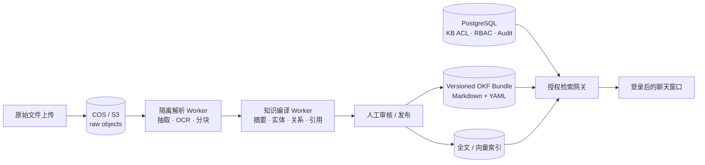

# 知识编译、OKF 与聊天架构

本文定义原始文件、派生知识、检索索引和聊天服务之间的边界。目标是在保持企业权限、审计和 10 TB+ 对象存储能力的同时，支持 Open Knowledge Format（OKF）与 LLM‑Wiki 风格的持续知识整理。

## 设计结论

- PostgreSQL 继续作为用户、角色、知识库、授权关系、文件状态和审计日志的事实源。
- COS / S3 保存不可变原始文件，以及可重新生成的解析产物和 OKF Bundle。
- OKF 是导入、导出和 Agent 消费格式，不是权限数据库，也不直接承担在线检索。
- LLM‑Wiki 是异步知识编译模式：从原始来源生成可审阅、可引用、可版本化的知识条目。
- 聊天服务只能检索调用者有权访问的知识库；检索前过滤和结果后二次校验都必须在服务端执行。

## 分层模型

### 1. 原始来源层

原始文件上传后保持不可变。新版本创建新对象和新元数据记录，不覆盖旧对象。该层是可追溯的证据来源，LLM 不能修改。

### 2. 解析层

解析 Worker 在隔离环境处理 PDF、Office、CSV 和文本文件，输出标准化文本、页码/工作表/幻灯片位置、内容哈希和解析器版本。解析失败不能自动批准文件。

### 3. 派生知识层

知识编译 Worker 根据已批准的解析产物生成概念页面、索引、交叉链接、引用和变更日志。所有产物必须记录来源文件版本与生成模型/提示版本，并经过发布状态控制。

### 4. 在线检索层

全文和向量索引都是可重建投影。索引条目必须携带 `knowledge_base_id`、文档版本和安全标签。查询时先计算调用者可访问的知识库集合，再把集合下推到检索过滤器；返回上下文前再次核对数据库授权。

## OKF v0.1 的使用方式

OKF Bundle 使用目录化 Markdown、YAML frontmatter、普通 Markdown 链接，以及可选的 `index.md` 和 `log.md`。本项目采用以下映射：

| OKF 概念 | 本项目映射 |
|---|---|
| Knowledge Bundle | 一个已发布的知识库版本 |
| Concept ID | Bundle 内稳定路径，不作为数据库主键 |
| `type` | 必填的知识类型，例如 `Document Summary`、`Policy`、`Entity` |
| `title` / `description` / `tags` | 可搜索的派生元数据 |
| `resource` | 指向内部文件或资源的稳定 URI，不放预签名 URL |
| `timestamp` | 该知识概念最后一次有意义的更新时间 |
| `index.md` | 渐进式目录，由发布流程生成 |
| `log.md` | Bundle 变更记录，不替代安全审计日志 |

兼容策略：

- 导入时要求每个非保留 Markdown 文件具有可解析 frontmatter 和非空 `type`。
- 未知字段原样保留，避免破坏其他生产者生成的 Bundle。
- 允许未知类型和断链，但生成诊断报告供管理员修复。
- Bundle 版本与数据库授权分离；导出包本身不应被视为包含安全策略。
- 首期以 `okf_version: "0.1"` 作为能力标记，升级时使用独立转换器。

## LLM‑Wiki 的采用边界

项目采用 LLM‑Wiki 的三层思想：不可变原始来源、LLM 维护的派生 Wiki、约束生成行为的 Schema/Policy；同时增加企业所需的审核、版本、ACL 和审计。

不会直接复制第三方 `llm_wiki` 应用代码。不同同名项目的许可证、桌面运行方式和单用户假设并不一定适合 SaaS 后端。本项目复用的是公开模式与开放格式，并以可替换 Worker 实现自己的流水线。

## 聊天权限不变量

1. 浏览器只提交知识库 ID 和消息，不能提交“我拥有某权限”的声明。
2. 后端从 JWT 用户重新解析动态角色与知识库授权。
3. 检索查询必须包含允许访问的 `knowledge_base_id` 过滤条件。
4. 引用只返回调用者可读的文件；下载仍通过短期预签名 URL 单独授权。
5. 角色或知识库授权变更后，新请求立即生效；缓存必须以用户策略版本为键或主动失效。
6. 提示词、模型输出和引用文件版本进入审计事件，但敏感正文不得写入普通应用日志。

## 分阶段交付

- Phase 1：登录前端、聊天工作区、知识库/用户/角色/权限管理，以及服务端授权骨架。
- Phase 2：安全解析 Worker、发布状态、全文检索与带来源引用的聊天。
- Phase 3：OKF v0.1 导入/导出、Bundle 版本、校验报告和图谱视图。
- Phase 4：LLM 自动编译、交叉链接、矛盾检测、人工审阅和增量重建。

## 参考

- [Google Cloud：Introducing the Open Knowledge Format](https://cloud.google.com/blog/products/data-analytics/how-the-open-knowledge-format-can-improve-data-sharing)
- [GoogleCloudPlatform/knowledge-catalog：OKF v0.1 Specification](https://github.com/GoogleCloudPlatform/knowledge-catalog/blob/main/okf/SPEC.md)
- [Andrej Karpathy：LLM Wiki pattern](https://gist.github.com/karpathy/442a6bf555914893e9891c11519de94f)
