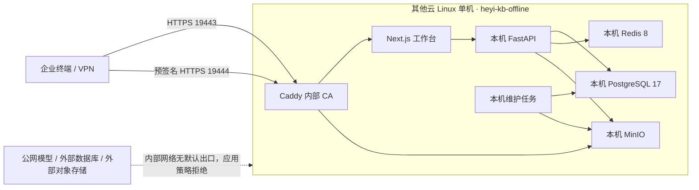

# Linux 8 核 16G 离线企业部署

本方案把一台 **Linux amd64/x86_64、8 vCPU、16 GB RAM、300 GB SSD** 服务器定义为当前企业内网知识库的正式单机部署基线。PostgreSQL、Redis、MinIO、FastAPI、Next.js 与 Caddy 全部运行在同一台主机的独立 Docker Compose 项目中；数据库、缓存和文件对象不连接 Supabase、Upstash、腾讯 COS 或其他公网托管服务。

> [!IMPORTANT]
> 300 GB SSD 是当前交付环境的正式单机存储基线。部署前目标文件系统必须至少有 240 GB 可用空间，对象数据建议在 180 GB 停止增长，并执行 70%/80%/90% 水位策略。10 TB 是未来独立企业内网存储集群扩展目标，不是当前单机 P0；单盘上的副本仍然不是备份。

## 隔离拓扑



Compose 使用三个固定网段：`edge`（`172.30.242.0/24`）仅连接 Caddy 并负责宿主机端口发布；`frontend`（`172.30.240.0/24`）和 `backend`（`172.30.241.0/24`）均为 `internal: true`。Web、API、MinIO 与数据服务不连接 `edge`，因此不会因入口网络获得默认公网出口。PostgreSQL、Redis、MinIO 控制台和 FastAPI 均不发布宿主机端口；宿主机只发布工作台 `19443/tcp` 与对象直传 `19444/tcp`。边缘网络的宿主机出站仍必须由云安全组或主机防火墙按企业策略约束。即使管理员在数据库中误存 DeepSeek、Qwen 或 MiniMax 密钥，`KB_EXTERNAL_LLM_ENABLED=false` 仍会让模型客户端失败关闭。

工作台入口同时承载登录界面和经过 API Key 鉴权的公共 API。Caddy 只把 `/api/v1/public/*` 转发到 FastAPI，其余控制面请求仍由 Next.js BFF 处理；PostgreSQL、Redis、MinIO 控制台和 FastAPI 端口不得直接暴露给宿主机或 VPN 客户端。

## 与现有应用的隔离

| 资源 | 离线目标环境 | 同机其他应用 |
|---|---|---|
| Compose 项目 | `heyi-kb-offline` | `heyi-kb-prod` 及其他项目 |
| 发布目录 | `/srv/heyi-knowledgebases-offline` | 不修改 |
| 工作台端口 | `19443/tcp` | `18443/tcp` 不修改 |
| 对象端口 | `19444/tcp` | 不占用 |
| 数据目录 | `/srv/heyi-knowledgebases-offline/data` | 不复用任何现有卷 |
| 停止/删除范围 | 只允许显式指定 `heyi-kb-offline` | 禁止操作其他项目 |

严禁执行全局 `docker system prune`、未指定项目名的 `docker compose down`，以及任何 `down -v`。离线环境使用 bind mount，删除 Compose 项目不会自动删除数据目录，但仍必须先做备份和路径核验。

部署前后必须分别保存其他 Compose 项目的容器 ID、启动时间、健康状态、端口、网络和卷指纹。只要任一非 `heyi-kb-offline` 资源发生变化，本次发布立即判定失败并停止；不得通过重启 Docker daemon、覆盖共享反向代理或刷新整机防火墙来“修复”本项目。

## 资源规划

| 服务 | CPU 上限 | 内存上限 | 说明 |
|---|---:|---:|---|
| PostgreSQL | 1.00 | 2,048 MiB | `shared_buffers=512MB`，80 连接上限 |
| Redis | 0.25 | 768 MiB | AOF，每秒刷盘，512 MiB `noeviction` |
| MinIO | 0.75 | 1,280 MiB | 本机私有对象存储 |
| Multipart GC | 0.05 | 128 MiB | 定期清理未完成分片 |
| ClamAV | 0.50 | 1,792 MiB | 使用离线签名库，失败关闭 |
| FastAPI | 1.25 | 1,536 MiB | API、检索、签名与 RBAC |
| Maintenance | 0.25 | 512 MiB | 扫描、解析与 OKF 后台任务 |
| Next.js | 0.60 | 768 MiB | 登录、聊天与管理后台 |
| Caddy | 0.15 | 128 MiB | 工作台/API 与对象 TLS 入口 |
| **稳态合计** | **4.80** | **8,960 MiB（8.75 GiB）** | 不含一次性迁移、初始化与预检容器 |

共享 8C16G 主机的静态硬上限因此为 **4.80 vCPU / 8.75 GiB**，理论上为宿主机和其他应用保留 3.20 vCPU / 7.25 GiB。该余量不是共存证明：上线前仍须根据其他应用至少 15 分钟的 CPU、RSS 与 IO 峰值重新计算；若操作系统、Docker、备份临时空间与其他应用无法共同落入保留预算，必须阻断部署，不得提高本项目限额抢占资源。迁移、`bootstrap`、病毒库预检、备份和批量导入不得并发执行。

建议磁盘告警阈值：70% 预警、80% 停止批量上传、90% 自动拒绝新上传。300 GB 系统盘至少预留 60 GB 给系统、Docker 镜像、日志和升级回滚；对象数据建议在 180 GB 前停止扩容测试，剩余空间留给 PostgreSQL、临时 Multipart、WAL 与维护操作。

## 文件与变量

- 编排：[compose.offline.yml](../deploy/tencent/compose.offline.yml)
- TLS 反向代理：[Caddyfile.offline](../deploy/tencent/Caddyfile.offline)
- 环境变量模板：[offline.env.example](../deploy/tencent/offline.env.example)
- 上线前检查：[preflight-offline.sh](../deploy/tencent/preflight-offline.sh)

生产环境变量必须放在发布目录以外，例如：

```text
/srv/heyi-knowledgebases-offline/
├── releases/<git-sha>/
├── shared/offline.env        # root:root 0600
└── data/
    ├── postgres/
    ├── redis/
    ├── minio/
    ├── capacity-probe/
    ├── clamav-db/
    ├── caddy-data/
    └── caddy-config/
```

预检以 `999:999 / 0700` 创建 PostgreSQL bind 根目录，该 UID/GID 与当前固定的 PostgreSQL 17.5 amd64 镜像摘要绑定。不得把该目录改回 `root:root`、放宽为 `0777`，或在更换镜像摘要后跳过镜像内 `postgres` 用户 UID/GID 复核。

密码使用 URL-safe 随机字符串，避免数据库 URL 编码错误。不得把 `.env`、数据库地址、访问密钥或管理员密码提交到 Git、聊天记录或工单截图。

## 镜像离线准备

严格断网后无法执行 `docker pull`、`npm ci` 或 `uv sync`。应在受控构建机完成构建和漏洞扫描。镜像清单必须由实际 Compose 配置生成，禁止手工维护一份可能漏项的清单。离线 Compose 面向固定的 `linux/amd64` 交付环境，基础镜像必须固定到导出包内的平台清单摘要，不能使用只在联网仓库解析时有效的多架构索引摘要：

```bash
export BUILD_ENV=/secure/path/offline-build.env
sh deploy/tencent/verify-offline-images.sh generate \
  "$BUILD_ENV" heyi-kb-offline-images.txt

# 清单必须包含扫描引擎镜像：
grep -Fx 'clamav/clamav:1.4.3@sha256:d39ad368e587cc204f71675c3982adbc6717b8c4cb309a7ee9a3213f7e684c50' \
  heyi-kb-offline-images.txt

# `docker save` 直接接收 digest 引用时会生成 RepoTags=null，断网载入后
# 无法再用 repository@sha256 查找。先把已验证的平台摘要绑定回固定标签，
# 再按标签导出，确保目标机 `docker load` 后仍保留可验证的 RepoDigest。
while IFS= read -r pinned_image; do
  image_ref=${pinned_image%@sha256:*}
  image_digest=sha256:${pinned_image##*@sha256:}
  docker image inspect "$image_digest" >/dev/null
  docker tag "$image_digest" "$image_ref"
done < heyi-kb-offline-images.txt

docker save $(sed 's/@sha256:.*//' heyi-kb-offline-images.txt) \
  -o heyi-kb-offline-images.tar
sha256sum heyi-kb-offline-images.tar > heyi-kb-offline-images.tar.sha256

# 在允许联网的受控构建机更新病毒库；交付后以只读方式挂载。
install -d -m 0755 clamav-db
docker run --rm --entrypoint freshclam \
  -v "$PWD/clamav-db:/var/lib/clamav" \
  'clamav/clamav:1.4.3@sha256:d39ad368e587cc204f71675c3982adbc6717b8c4cb309a7ee9a3213f7e684c50' \
  --datadir=/var/lib/clamav
chmod 0644 clamav-db/main.* clamav-db/daily.*
tar -C clamav-db -czf clamav-db.tar.gz .
sha256sum clamav-db.tar.gz > clamav-db.tar.gz.sha256
```

通过企业批准的介质或内网制品库传输，在服务器验证 SHA-256 后执行 `docker load`。将 `heyi-kb-offline-images.txt` 放到 `$ENV_FILE.images`，将已验证的病毒库解压到 `${KB_DATA_ROOT}/clamav-db`。离线预检会重新执行 `docker compose config --images`，拒绝任何可变标签，并逐个比对本地 `RepoDigest`；任何清单、镜像或摘要差异都会阻断启动。`KB_API_IMAGE` 与 `KB_WEB_IMAGE` 必须使用 `<repository>@sha256:<64 位小写十六进制>` 形式；Git SHA 标签只能用于可读性，不是内容完整性边界。

API 镜像还必须包含固定版本的 `bubblewrap`、LibreOffice、Poppler 与 `procps/prlimit`。构建完成后，以最终镜像 digest 而不是包仓库标签作为离线交付身份；预检会在已核验的 API 镜像内执行 `python -m app.document_parser_preflight --require-all`。九类格式任一能力缺失时返回码 2，部署立即停止，不允许把“可上传”误报为“可进入知识问答”。

## 首次模拟部署

以下命令只操作 `heyi-kb-offline`：

```bash
export RELEASE=/srv/heyi-knowledgebases-offline/releases/<git-sha>
export ENV_FILE=/srv/heyi-knowledgebases-offline/shared/offline.env
export COMPOSE_FILE=$RELEASE/deploy/tencent/compose.offline.yml

set -o pipefail
(cd "$RELEASE" && python3 -m scripts.host_preflight \
  --disk-path /srv \
  --io-evidence "$RELEASE/artifacts/host-io.json" \
  | tee "$RELEASE/host-preflight.json")

sudo chown root:root "$ENV_FILE"
sudo chmod 0600 "$ENV_FILE"
sudo sh "$RELEASE/deploy/tencent/preflight-offline.sh" "$ENV_FILE"

(cd "$RELEASE" && python3 -m scripts.storage_watermark_preflight \
  --disk-path /srv \
  --object-root /srv/heyi-knowledgebases-offline/data/minio \
  --chain-evidence "$RELEASE/artifacts/watermark-chain.json" \
  | tee "$RELEASE/storage-watermark-preflight.json")

sudo docker compose \
  --project-name heyi-kb-offline \
  --env-file "$ENV_FILE" \
  --file "$COMPOSE_FILE" \
  --profile ops run --rm --pull never migrate

sudo docker compose \
  --project-name heyi-kb-offline \
  --env-file "$ENV_FILE" \
  --file "$COMPOSE_FILE" \
  --profile ops run --rm --pull never bootstrap

sudo docker compose \
  --project-name heyi-kb-offline \
  --env-file "$ENV_FILE" \
  --file "$COMPOSE_FILE" \
  up -d --pull never --no-build \
  postgres redis minio minio-init minio-multipart-gc clamd api maintenance web proxy
```

`--pull never` 是一次性 `docker compose run` 与常驻服务 `docker compose up` 共用的严格离线拉取门禁；`--no-build` 只适用于 `docker compose up`，不能把它误写成 `run` 的参数。`migrate`、`bootstrap` 等一次性服务在 Compose 中没有 `build` 定义且设置了 `pull_policy: never`，因此配合 `run --pull never` 后既没有构建路径，也没有拉取路径；常驻服务则使用 `up -d --pull never --no-build` 同时禁止拉取和构建。目标机只允许运行已通过清单、SHA-256、RepoDigest、SBOM 和漏洞扫描校验的预装镜像；任何需要 `docker pull`、`docker build`、`npm ci` 或 `uv sync` 才能继续的发布都必须停止。

离线环境文件必须位于受控目录中，是 root 所有的普通文件，且不能是符号链接；权限只接受 `0600` 或只读的 `0400`。预检不会 `source` 或执行其中的任何内容，而是逐行按固定键白名单解析；未知键、重复键、不平衡引号、命令替换和 Shell 元字符均会阻断。当前离线基线只允许 `KB_PUBLIC_HOST` 使用 RFC 1918、回环或链路本地 IPv4（以及 `localhost`），`KB_PUBLIC_ORIGIN` 必须精确等于 `https://<KB_PUBLIC_HOST>:<KB_HTTPS_PORT>`，`KB_TRUSTED_HOSTS` 必须精确包含该主机和内部 BFF 使用的 `api` 服务名，`KB_CORS_ORIGINS` 必须为空数组。若企业需要其他内部 DNS 名称，应先通过代码评审把明确的内部命名边界加入允许列表，不能临时放宽为任意域名或通配符。

`host_preflight.py` 是只读门禁，不访问 `.env`、网络地址或凭据。它仅接受 Linux amd64/x86_64，要求至少 8 个可见逻辑 CPU、15 GiB 可见内存、`--disk-path` 所在物理文件系统至少 300 GB（十进制）总量且部署前至少 240 GB 可用；同时必须核验目标挂载/块设备、SSD 身份和四类有界 fio 结果。退出码 0 表示通过，1 表示目标 Linux 规格或实测不符，2 表示证据不可用而被阻断；只有退出码 0 才能继续部署。`--disk-path` 必须指向实际承载 `data` 目录的同一文件系统，不能用另一块大盘替代目标数据盘取得通过结果。`storage_watermark_preflight.py` 必须核验专用可销毁卷上的 25 个真实 API 水位场景及其哈希原始产物；证据不可用时退出码为 2 并标记 blocked，不允许用开发机结果或纯函数测试代替。完整操作和证据契约见 `docs/HOST_STORAGE_ACCEPTANCE.zh-CN.md`。

管理员创建成功后，立即从 `offline.env` 清空 `KB_BOOTSTRAP_ADMIN_PASSWORD`；以后正常重启不运行 `bootstrap`。升级时先备份，再使用新版本镜像执行一次带 `--pull never` 的 `migrate`，最后只对本项目执行带 `--pull never --no-build` 的 `up -d`。

MinIO 的编排健康门禁使用 `/minio/health/ready`，而不是只证明进程存活的 `/minio/health/live`。`minio-init` 与 `minio-multipart-gc` 把 `MC_CONFIG_DIR` 固定到 `/tmp/.mc`，并仅使用临时可写的 `/tmp`；别名初始化失败时应检查 readiness、内部 DNS、凭据与客户端配置目录，不得绕过 `service_healthy`。ClamAV 根文件系统和病毒库保持只读，只为启动阶段降权保留 `SETGID`、`SETUID`，进程切换到 `clamav` 后不持有有效 capability；不得额外加入 `CHOWN`、`NET_RAW` 或 `SYS_ADMIN`。

FastAPI 只接受 `KB_PUBLIC_HOST` 与内部 BFF 服务名 `api`。容器内 readiness 仍访问回环地址，但必须显式发送获批的 Host，例如：

```bash
docker compose --project-name heyi-kb-offline --env-file "$ENV_FILE" \
  --file "$COMPOSE_FILE" exec -T api python -c \
  "import urllib.request; r=urllib.request.Request('http://127.0.0.1:8000/health/ready',headers={'Host':'${KB_PUBLIC_HOST}'}); urllib.request.urlopen(r,timeout=4)"
```

## 公共 API 入口

公共 API 与工作台共用企业内网 TLS 入口：

```text
https://<KB_PUBLIC_HOST>:<KB_HTTPS_PORT>/api/v1/public/chat/query
https://<KB_PUBLIC_HOST>:<KB_HTTPS_PORT>/api/v1/public/knowledge-bases/<id>/search
```

客户端必须使用 `X-API-Key`，并信任企业内部 CA；不要把 API Key 放进 URL、浏览器代码、日志或截图。Caddy 的 `/api/v1/public/*` 匹配器必须位于 Web fallback 之前，并在边缘删除客户端伪造的 BFF 签名头、重写来源 IP。API 只信任固定的内部 `172.30.240.0/24` 代理网段；预检必须同时证明 `172.30.240.0/24`、`172.30.241.0/24` 与 `172.30.242.0/24` 均不与目标宿主路由或既有 Docker 网络重叠。`/api/v1/auth/*`、用户、角色、模型配置等控制面接口不得从该入口直接公开。完整请求体、权限交集、轮换和撤销语义见 [API 与模型管理](./API_AND_MODEL_MANAGEMENT.zh-CN.md)。

```bash
curl --fail --cacert /etc/heyi/pki/root-ca.pem \
  --request POST \
  "https://${KB_PUBLIC_HOST}:${KB_HTTPS_PORT}/api/v1/public/knowledge-bases/${KNOWLEDGE_BASE_ID}/search" \
  --header "X-API-Key: ${KNOWLEDGEBASES_API_KEY}" \
  --header 'Content-Type: application/json' \
  --data '{"query":"验收令牌","limit":5}'
```

## 离线 AI 降级语义

当前交付不包含 Ollama、vLLM、llama.cpp、模型权重或获批的内网 GPU 推理节点，并固定 `KB_EXTERNAL_LLM_ENABLED=false`。因此 DeepSeek、Qwen、MiniMax 的生成式回答、模型语义审核和 LLM 自动 OKF 增强均不属于本机离线验收能力；不得把 0 token/日的离线控制面宣传为 50 亿 token/日推理节点。

离线问答的正确结果是授权全文检索与确定性来源回答：有命中时返回真实 `citations`、`source_status.strategy=retrieval`、`source_status.reason=external_processing_disabled`，并将 `answer_review` 标记为检索降级；无命中时明确返回 `no_results`，不得编造答案或来源。结构化表格只能从已检索且已授权的来源确定性生成。OKF 仍可使用 `local-deterministic-v1` 做本地无损编译，但这不等同于模型摘要、实体抽取或语义重写。

若未来接入本地模型，必须新增受白名单约束的本地 Provider，把“允许内网推理”与“允许公网外发”拆分为两个独立开关，并配置不同故障域的生成与审核模型；模型制品必须完成许可证、版权、SHA-256、SBOM、供应链和性能验收。在这些条件全部满足前，任何 `semantic_verified` 或声称使用 DeepSeek/Qwen/MiniMax 的离线响应都应判定失败。

## 验收

```bash
sudo docker compose \
  --project-name heyi-kb-offline \
  --env-file "$ENV_FILE" \
  --file "$COMPOSE_FILE" ps

curl --fail --insecure "https://${KB_PUBLIC_HOST}:19443/login"

# API 容器应无法建立公网连接；失败是正确结果。
sudo docker compose \
  --project-name heyi-kb-offline \
  --env-file "$ENV_FILE" \
  --file "$COMPOSE_FILE" \
  exec api python -c "import socket; socket.create_connection(('1.1.1.1', 443), 3)"
```

验收还必须包括：登录、角色权限、知识库 ACL、上传、审批、对象下载、来源引用、服务重启后数据仍存在、PostgreSQL 逻辑备份恢复、MinIO 文件恢复，以及断网状态下聊天不会调用公网模型。另需保留病毒库 `main`/`daily` 文件的 SHA-256、更新时间、权限和 `sigtool --info` 兼容性输出，以及 `STORAGE-WATERMARK-P0-001` 的目标主机 JSON 证据。

公共 API 验收必须覆盖：有效 Key 返回 2xx、跨知识库访问不可枚举、超限返回 429、撤销后立即返回 401；同时确认控制面路由没有被 Caddy 直接暴露。离线问答验收必须验证公网模型连接为零、引用指向已审批条目、无结果时不生成内容，以及检索降级状态在前后端均可识别。

最终签署前从干净 Git 工作树运行严格 Profile；开发机的 `docker compose config` 只能作为 Smoke：

```bash
python3 scripts/acceptance.py \
  --profile final \
  --host-disk-path /srv \
  --host-io-evidence /srv/heyi-knowledgebases-offline/evidence/host-io.json \
  --storage-chain-evidence /srv/heyi-knowledgebases-offline/evidence/watermark-chain.json \
  --offline-env-file "$ENV_FILE" \
  --offline-image-manifest /srv/heyi-knowledgebases-offline/evidence/offline-images.txt \
  --offline-runtime-evidence /srv/heyi-knowledgebases-offline/evidence/offline-runtime/offline-runtime-evidence.json \
  --e2e-evidence /srv/heyi-knowledgebases-offline/evidence/browser-e2e.json \
  --functional-trust-store /etc/heyi-acceptance/functional-trust.json \
  --functional-challenge-store /var/lib/heyi-acceptance/challenges \
  --e2e-signing-key-path /etc/heyi-acceptance/browser-e2e-ed25519.key \
  --e2e-signing-key-id browser-e2e-ed25519 \
  --malware-evidence /srv/heyi-knowledgebases-offline/evidence/malware.json \
  --security-scan-evidence /srv/heyi-knowledgebases-offline/evidence/security-scan.json \
  --report-dir artifacts/acceptance/final
```

`OFFLINE-P0-001` 先以 root 执行环境、权限、目录、网络与病毒库预检，`OFFLINE-IMAGES-P0-001` 再验证显式镜像清单与 Compose 集合并逐个执行本地 RepoDigest 检查，`OFFLINE-RUNTIME-P0-001` 最后只读验签真实断网冷启动与业务恢复证据；任一步缺失都不能通过。fake/test-only、非 `passed`、主机/Git/内容指纹不匹配或原始工件被修改均为 `blocked`。`E2E-P0-001` 强制使用 enterprise Profile，且 Playwright 退出 0 后仍须以仓库外 root 保护的 trust store 和一次性 challenge 对 `EXT-BROWSER-E2E-001` 做 Ed25519 验签并消费 challenge；默认 Smoke、SHA-only、自签名和 replay 均不计入终验。私钥和 challenge 路径只注入 E2E 子进程，不读取项目 `.env` 或记录私钥。所有证据路径必须在 CLI 显式给出；缺失、符号链接、非普通文件或非目标运行证据统一 `blocked`。`FORMAT-P0-001` 随后在同一 API 镜像中验证 TXT、DOC、DOCX、XLS、XLSX、CSV、PDF、PPT、PPTX 的完整解析能力；缺少沙箱或外部工具时同样为 `blocked`。恶意文件与安全扫描证据必须匹配当前 Git HEAD 和工作树内容指纹，格式见 [终验正式证据格式](./ACCEPTANCE_EVIDENCE_FORMAT.zh-CN.md)。

## 升级与回滚

发布目录必须按内容指纹只读保存，并至少保留当前与上一版本的 Compose、环境变量键集合、镜像清单和镜像摘要。数据库迁移只允许 expand/contract 兼容方式；应用回滚不得盲目执行 Alembic downgrade，也不得覆盖当前 PostgreSQL 或 MinIO 数据。

回滚时不执行 `down`，不删除网络、卷或 bind mount，只使用上一发布目录与上一组不可变镜像摘要重新收敛本项目：

```bash
export PREVIOUS_RELEASE=/srv/heyi-knowledgebases-offline/releases/<previous-content-sha>
export PREVIOUS_COMPOSE_FILE=$PREVIOUS_RELEASE/deploy/tencent/compose.offline.yml

sudo docker compose \
  --project-name heyi-kb-offline \
  --env-file "$ENV_FILE" \
  --file "$PREVIOUS_COMPOSE_FILE" \
  config --quiet

sudo docker compose \
  --project-name heyi-kb-offline \
  --env-file "$ENV_FILE" \
  --file "$PREVIOUS_COMPOSE_FILE" \
  up -d --pull never --no-build \
  postgres redis minio minio-multipart-gc clamd api maintenance web proxy
```

回滚后必须重新验证 readiness、登录、检索、下载、公共 API 与数据摘要，并对比其他应用的变更前指纹。若涉及数据损坏，只能在审批后从独立介质恢复；单盘副本不构成恢复点。禁止 `docker compose down -v`、`docker system prune`、Docker daemon 重启、覆盖整机防火墙或操作任何其他 Compose 项目。

## 网络与主机控制

- 其他云厂商的安全组或云防火墙只允许企业固定出口/VPN 网段访问 `19443`、`19444`；SSH 只允许堡垒机或管理网段。
- 镜像预装完成后，安全组与主机防火墙默认拒绝公网出站；只放行企业内网 DNS、NTP、日志和备份目的地。
- Docker `internal` 网络是应用层第二道防线，不能替代安全组、主机防火墙和云账号权限控制。
- Caddy 当前使用内部 CA。企业终端必须通过受控方式安装根证书；正式域名证书应由企业内部 PKI 签发，不依赖公网 ACME。
- 服务器启用磁盘加密、自动安全更新窗口、审计日志和最小权限 SSH；Docker 组等同 root 权限，不授予普通业务用户。
