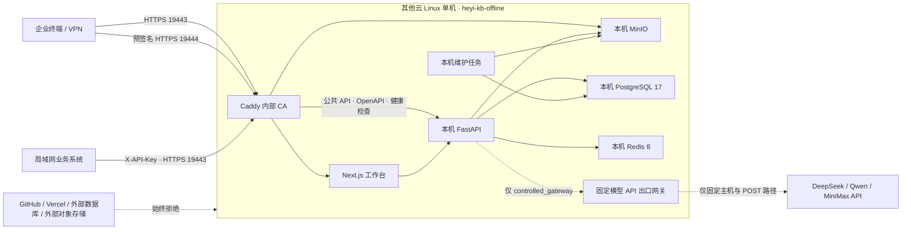

# Linux 8 核 16G 离线企业部署

本方案把一台 **Linux amd64/x86_64、8 vCPU、16 GB RAM、300 GB SSD** 服务器定义为当前企业内网知识库的正式单机部署基线。PostgreSQL、Redis、MinIO、FastAPI、Next.js 与 Caddy 全部运行在同一台主机的独立 Docker Compose 项目中；数据库、缓存和文件对象不连接 Supabase、Upstash、腾讯 COS 或其他公网托管服务。

> [!NOTE]
> 本文与 `deploy/tencent/` 目录保留的是历史兼容文件名，部署资产本身面向国内任意云厂商或自建机房的通用 Linux/Docker 环境，不要求腾讯云账号、腾讯云 API 或腾讯云专有服务。COS 只能作为首次发布制品的可选传输加速通道；制品验签落盘后，运行、重启、升级、回滚、数据存储与冷恢复均不得依赖 COS。

> [!IMPORTANT]
> 300 GB SSD 是当前交付环境的正式单机存储基线。部署前目标文件系统必须至少有 240 GB 可用空间，对象数据建议在 180 GB 停止增长，并执行 70%/80%/90% 水位策略。10 TB 是未来独立企业内网存储集群扩展目标，不是当前单机 P0；单盘上的副本仍然不是备份。

> [!WARNING]
> 本文提供可执行部署契约，不替代环境批准。磁盘静态加密或正式风险例外、15 分钟共享主机资源证据、PostgreSQL/MinIO/CA 真实恢复演练、VPN/安全组与签名终验任一缺失时，企业交付结论必须保持 **FAIL / NO-GO**。

## 隔离拓扑



Compose 预留五个不重叠网段：`edge`（`172.30.242.0/24`）仅连接入口 Caddy；`frontend`（`172.30.240.0/24`）、`backend`（`172.30.241.0/24`）、`edge` 与 `llm-control`（`172.30.243.0/24`）均为 `internal: true`。宿主机发布端口仍可把入站流量送入 `edge`，但入口容器自身没有通往公网的默认出口。`llm-uplink`（`172.30.244.0/24`）只属于可选的 `controlled-egress` Profile，且唯一可加入的服务是无宿主端口的 `llm-egress`。API 只连接内部 `llm-control`，绝不连接 `llm-uplink`；严格离线模式不会创建出口服务或 uplink 网络。PostgreSQL、Redis、MinIO 控制台和 FastAPI 均不发布宿主机端口；宿主机只发布工作台 `19443/tcp` 与对象直传 `19444/tcp`。五个 CIDR 都必须通过宿主路由与既有 Docker 网络冲突检查。

工作台入口同时承载登录界面和经过 API Key 鉴权的公共 API。Caddy 仅把
`/api/v1/public/*`、`/openapi.json`、`/health/live` 与 `/health/ready` 直接转发到
FastAPI，其余控制面请求仍由 Next.js BFF 处理；PostgreSQL、Redis、MinIO 控制台
和 FastAPI 端口不得直接暴露给宿主机或 VPN 客户端。

## 与现有应用的隔离

| 资源 | 离线目标环境 | 同机其他应用 |
|---|---|---|
| Compose 项目 | `heyi-kb-offline` | `heyi-kb-prod` 及其他项目 |
| 发布目录 | `/srv/heyi-knowledgebases-offline` | 不修改 |
| 工作台端口 | `19443/tcp` | `18443/tcp` 不修改 |
| 对象端口 | `19444/tcp` | 不占用 |
| 数据目录 | `/srv/heyi-knowledgebases-offline/data` | 不复用任何现有卷 |
| 停止/删除范围 | 只允许显式指定 `heyi-kb-offline` | 禁止操作其他项目 |

严禁执行全局 `docker system prune`、未指定项目名的 `docker compose down`，以及任何 `down -v`。离线环境使用 bind mount，删除 Compose 项目不会自动删除数据目录，但仍必须先做备份和路径核验。

部署前后必须分别保存其他 Compose 项目的容器 ID、启动时间、健康状态、端口、网络和卷指纹。只要任一非 `heyi-kb-offline` 资源发生变化，本次发布立即判定失败并停止；不得通过重启 Docker daemon、覆盖共享反向代理或刷新整机防火墙来“修复”本项目。

## 资源规划

| 服务 | CPU 上限 | 内存上限 | 说明 |
|---|---:|---:|---|
| PostgreSQL | 1.00 | 2,048 MiB | `shared_buffers=512MB`，80 连接上限 |
| Redis | 0.25 | 768 MiB | AOF，每秒刷盘，512 MiB `noeviction` |
| MinIO | 0.75 | 1,280 MiB | 本机私有对象存储 |
| Multipart GC | 0.05 | 128 MiB | 定期清理未完成分片 |
| ClamAV | 0.50 | 1,792 MiB | 使用离线签名库，失败关闭 |
| FastAPI | 1.25 | 1,536 MiB | API、检索、签名与 RBAC |
| Maintenance | 0.25 | 512 MiB | 扫描、解析与 OKF 后台任务 |
| Next.js | 0.60 | 768 MiB | 登录、聊天与管理后台 |
| Caddy | 0.15 | 128 MiB | 工作台/API 与对象 TLS 入口 |
| **稳态合计** | **4.80** | **8,960 MiB（8.75 GiB）** | 不含一次性迁移、初始化与预检容器 |

启用 `controlled-egress` 时额外增加模型出口 Caddy 0.15 vCPU / 128 MiB，受控出口稳态上限为 4.95 vCPU / 8.875 GiB；严格离线基线仍是上表的 4.80 vCPU / 8.75 GiB。

共享 8C16G 主机的静态硬上限因此为 **4.80 vCPU / 8.75 GiB**，理论上为宿主机和其他应用保留 3.20 vCPU / 7.25 GiB。该余量不是共存证明：上线前仍须根据其他应用至少 15 分钟的 CPU、RSS 与 IO 峰值重新计算；若操作系统、Docker、备份临时空间与其他应用无法共同落入保留预算，必须阻断部署，不得提高本项目限额抢占资源。迁移、`bootstrap`、病毒库预检、备份和批量导入不得并发执行。

建议磁盘告警阈值：70% 预警、80% 停止批量上传、90% 自动拒绝新上传。300 GB 系统盘至少预留 60 GB 给系统、Docker 镜像、日志和升级回滚；预检还要求 Docker 实际 `DockerRootDir` 保持至少 40 GiB 可用空间，并同时保有不少于总量 10% 且绝对不少于 100,000 个空闲 inode。对象数据建议在 180 GB 前停止扩容测试，剩余空间留给 PostgreSQL、临时 Multipart、WAL 与维护操作。

## 文件与变量

- 编排：[compose.offline.yml](../deploy/tencent/compose.offline.yml)
- TLS 反向代理：[Caddyfile.offline](../deploy/tencent/Caddyfile.offline)
- 维护入口：[Caddyfile.maintenance](../deploy/tencent/Caddyfile.maintenance)
- 受控模型出口：[Caddyfile.llm-egress](../deploy/tencent/Caddyfile.llm-egress)
- 共享运行变量模板：[offline.env.example](../deploy/tencent/offline.env.example)
- 发布镜像变量模板：[release.env.example](../deploy/tencent/release.env.example)
- 上线前检查：[preflight-offline.sh](../deploy/tencent/preflight-offline.sh)
- 旧栈闭合接管入口：[adopt-offline.sh](../deploy/tencent/adopt-offline.sh)
- 旧栈备份、恢复与退役工具：[legacy_offline_adoption.py](../scripts/legacy_offline_adoption.py)
- 旧栈接管手册：[旧版离线栈安全接管与恢复证明](./LEGACY_OFFLINE_ADOPTION.zh-CN.md)

生产环境变量必须放在发布目录以外，例如：

```text
/srv/heyi-knowledgebases-offline/
├── releases/<content-sha>/
│   ├── release.env           # 无秘密，root:root 0444
│   └── release.env.images    # 由 Compose 生成的精确镜像清单
├── shared/runtime.env        # 含秘密，root:root 0600
└── data/
    ├── postgres/
    ├── redis/
    ├── minio/
    ├── capacity-probe/
    ├── clamav-db/
    ├── caddy-data/
    └── caddy-config/
```

在该固定布局下，Caddy `/data` 对应主机 `${KB_DATA_ROOT}/caddy-data`，因此内部 CA 的唯一主机目录是 `/srv/heyi-knowledgebases-offline/data/caddy-data/caddy/pki/authorities/local`。不得省略 `caddy-data` 层级，也不得把另一个数据根子目录作为 CA 备份源。

预检以 `999:999 / 0700` 创建 PostgreSQL bind 根目录，该 UID/GID 与当前固定的 PostgreSQL 17.5 amd64 镜像摘要绑定。不得把该目录改回 `root:root`、放宽为 `0777`，或在更换镜像摘要后跳过镜像内 `postgres` 用户 UID/GID 复核。接管旧栈时还必须由在线 `SHOW server_version_num` 证明 PostgreSQL major 为 `17`，且旧 PostgreSQL 容器直接把 `/srv/heyi-knowledgebases-offline/data/postgres` 挂载到 `/var/lib/postgresql/data`；其他 major、命名卷或路径替换都不能直接复用。

密码使用 URL-safe 随机字符串，避免数据库 URL 编码错误。不得把 `.env`、数据库地址、访问密钥或管理员密码提交到 Git、聊天记录或工单截图。

## 镜像离线准备

严格断网后无法访问公共 Registry、npm、PyPI 或 GitHub。所有应用镜像、基础镜像、病毒库、源码和签名材料必须在受控构建区完成构建、SBOM、漏洞扫描与签署。

> **禁止把 classic `docker save` / `docker load` 当成 RepoDigest 传递协议。** 传统 Docker 归档只保存 `RepoTags`，不会保存 `RepoDigests`；即使按标签加载成功，也不能证明目标机上的 `repository@sha256` 关联与签署清单一致。COS ETag、同目录 SHA 文件或可变标签也不能替代独立签名。

本项目采用临时回环 Registry 导入协议：

1. 构建区把每个 `linux/amd64` 平台 manifest 原样镜像到 `127.0.0.1:5000/heyi-mirror/...` 或 `127.0.0.1:5000/heyi-release/...` 命名空间。
2. `compose.offline.yml` 与 `release.env` 只引用该回环命名空间的精确 `@sha256`，运行时绝不解析公网仓库。
3. 交付的是 Registry 内容目录、发布环境、四列镜像清单、逐文件 SHA-256 和独立签名，不是依赖 RepoDigest 恢复假设的普通镜像 tar。
4. 目标机使用预置公钥验签后，临时启动只绑定 `127.0.0.1:5000` 的只读 Registry，逐个执行 `docker pull --platform linux/amd64`。该 pull 只访问本机回环；导入完成并验证 RepoDigest、config image ID、OS、architecture 后立即删除精确标记的导入容器。

`release.env.images` 是唯一镜像清单，固定为四个 Tab 分隔字段：

```text
<127.0.0.1:5000/repository@sha256:platform-manifest>  <sha256:config-id>  linux  amd64
```

清单只能由实际 Compose 渲染生成，路径必须精确为 `<release.env>.images`：

```bash
export BUILD_RUNTIME_ENV=/secure/path/runtime.env
export BUILD_RELEASE_ENV=/secure/path/release.env
sudo sh deploy/tencent/verify-offline-images.sh generate \
  "$BUILD_RUNTIME_ENV" "$BUILD_RELEASE_ENV"
```

签名 Registry bundle 的固定结构如下：

```text
offline-registry-bundle/
├── bundle.control
├── release.env
├── release.env.images
├── release/                  # 与 canonical contract 完全一致的发布控制面资产
├── registry/                 # distribution v2 只读内容目录
├── SHA256SUMS                # 精确覆盖 control、两个 env 及 release/registry 下全部普通文件
└── SHA256SUMS.sig            # 对 SHA256SUMS 的企业发布私钥签名
```

`release/` 必须逐文件包含 canonical contract 声明的全部发布资产，不能缺失、增加或替换文件；导入时还会把每个资产与目标机受保护发布目录逐字节比较。当前 `offline_contract_files` 共有 39 个固定条目：3 个环境/镜像清单和 36 个 `release/` 发布控制面资产；构建器在冻结 Git HEAD 后运行时解析该清单，不维护第二份手写资产表。`SHA256SUMS` 是 bundle 的精确文件清单：必须且只能列出 `bundle.control`、`release.env`、`release.env.images`，以及 `release/`、`registry/` 下的每一个普通文件；由于 `registry/` 文件数取决于本次镜像内容，`SHA256SUMS` 总行数必须由构建器按最终目录动态枚举，不能写死。不列目录、`SHA256SUMS` 自身或 `SHA256SUMS.sig`。每行固定为 64 位小写 SHA-256、两个空格和无路径穿越的相对路径。任一漏项、额外项、重复项、符号链接或摘要不符都会阻断导入。

`bundle.control` 只允许下面八个字段且不得重复。Bootstrap Registry 镜像的运输 tar **不在本 bundle 内，也不由导入脚本验签**；它是建立回环 Registry 之前的独立信任前置。安全管理员必须先在隔离流程中核验 tar 的独立签名与 SHA-256，再将其载入本地 Docker。导入脚本随后只按已签署的 config image ID 运行该引导镜像，并二次核验 `linux/amd64`；可变标签不构成信任依据。必须保留 tar 验签记录，并由发布方签署以下完整控制身份与构建侧实测容量上界（尖括号占位符必须替换为真实值）：

```dotenv
REGISTRY_BOOTSTRAP_IMAGE=heyi-bootstrap/registry:2.8.3-amd64-<config-prefix>
REGISTRY_BOOTSTRAP_IMAGE_ID=sha256:<64-hex-config-id>
RELEASE_SEQUENCE=<strictly-increasing-positive-integer>
RELEASE_ID=<letters-digits-dot-underscore-hyphen>
RELEASE_GIT_SHA=<40-lowercase-hex-git-sha>
RELEASE_SCHEMA_HEAD=20260715_0021
REGISTRY_UNPACKED_BYTES=<deduplicated-unpacked-image-bytes>
REGISTRY_UNPACKED_INODES=<deduplicated-unpacked-image-inodes>
```

`RELEASE_SEQUENCE` 是发布方管理的单调递增正整数，当前协议最多 18 位；每次正式发布必须大于目标机 `/srv/heyi-knowledgebases-offline/state/highest-release.json` 中已接受的序号，不能复用。`RELEASE_ID` 只允许字母、数字、点、下划线和连字符；`RELEASE_GIT_SHA` 必须是 40 位小写十六进制 Git SHA；当前部署器只接受 `RELEASE_SCHEMA_HEAD=20260715_0021`。`REGISTRY_UNPACKED_BYTES` 与 `REGISTRY_UNPACKED_INODES` 必须由发布构建机按最终 digest 集合完成去重解包后实测，不能用压缩 blob、Registry 目录大小或经验倍数代替；导入前目标机必须同时保留该签名上界、40 GiB 回滚空间，以及不少于总 inode 10% 且至少 100,000 的回滚 inode。目标机的 `highest-release.json` 必须保持 root 所有、`0400`、非符号链接且单硬链接；成功接受发布后，导入器原子推进该状态，并把同一发布序号、发布身份、Git SHA、Schema head、镜像清单摘要和发布资产摘要写入 Registry 导入收据。序号小于或等于最高已接受值属于重放或降级并被阻断；不得通过删除或编辑 `highest-release.json` 强制回退。

目标机先把企业发布公钥安装为 root 所有的 `0400/0444` 普通文件，再执行：

```bash
export RELEASE=/srv/heyi-knowledgebases-offline/releases/<git-sha>
export RELEASE_ENV=$RELEASE/release.env
sudo sh deploy/tencent/import-offline-registry-bundle.sh \
  /srv/heyi-knowledgebases-offline/artifacts/offline-registry-bundle \
  /etc/heyi-release/trusted-release-public.pem \
  "$RELEASE_ENV"
```

导入脚本拒绝符号链接、非绝对路径、非 root 所有路径、组/其他用户可写祖先、路径穿越、签名或逐文件摘要不符、发布文件不一致、发布重放/降级、端口被占用、非 `linux/amd64`、config ID 不符和 RepoDigest 不符；清理时只删除具有本项目 owner/purpose 标签且 ID 完全一致的临时容器。全部镜像验证完成后，它把发布序号与身份、发布资产、镜像清单、签名集合与受信公钥摘要写入 `/srv/heyi-knowledgebases-offline/state/registry-import-<manifest-sha256>.json`，并同步推进 `/srv/heyi-knowledgebases-offline/state/highest-release.json`，以 root-only 原子状态绑定后续预检；缺失、不安全、不是最高已接受发布或与目标发布不一致的收据会阻断安装/升级。它不会执行 `compose down`、不会清理其他镜像，也不会访问公网。

将已验证的病毒库解压到 `${KB_DATA_ROOT}/clamav-db`。离线入口会在 root-only `/run/heyi-kb-offline/contracts/contract.*` 中一次性快照 `runtime.env`、`release.env`、`release.env.images` 和发布资产；源文件复制前后与快照哈希必须一致。后续环境与镜像只从同一 contract 读取；每次 Compose 调用都先重新核验 contract SHA，并把受保护发布目录中的资产与快照逐字节比对。为保持相对 bind mount 在主机重启后仍可用，常驻容器从 root 所有、非 root 不可写、不可删除的不可变发布目录执行 Compose；任一资产或路径权限变化都立即阻断。`KB_API_IMAGE`、`KB_MIGRATION_IMAGE` 与 `KB_WEB_IMAGE` 必须分别使用回环 Registry 的精确摘要；迁移镜像不可由 API 镜像隐式替代。

服务器必须保留一套可独立冷恢复的本地制品，不能只保留 COS、GitHub 或镜像仓库
地址：

- 发布源码包、发布清单及各自 SHA-256；
- 完整只读 Registry bundle、不可变镜像清单、逐文件 SHA-256 与独立签名；
- ClamAV 病毒库归档、版本信息及 SHA-256；
- 企业内部 CA 链与受控恢复说明；
- 独立保存、定期验证的 PostgreSQL 与 MinIO 恢复材料。

COS、移动介质或内网制品库仅负责交付传输。制品落盘并完成摘要验证后，运行、重启、
升级回滚与冷加载均不得依赖 GitHub、Vercel、COS、公共 npm/PyPI 或公共镜像仓库。

API 镜像还必须包含固定版本的 `bubblewrap`、LibreOffice、Poppler 与 `procps/prlimit`。构建完成后，以最终镜像 digest 而不是包仓库标签作为离线交付身份；预检会使用专用 `api-preflight` 一次性容器执行 `python -m app.document_parser_preflight --require-all`。该容器不注入生产密钥、使用 `network_mode: none`，也不连接 PostgreSQL、Redis 或 MinIO；九类格式任一能力缺失时返回码 2，部署立即停止，不允许把“可上传”误报为“可进入知识问答”。

## 首次部署与旧栈接管边界

`install-offline.sh` 只用于 Compose 项目身份、安装状态和目标数据根均未被使用的空环境。服务器上若已经存在 `heyi-kb-offline`，即使旧容器已经停止，也不得手工删除容器、网络、命名卷或安装收据来制造“首次安装”条件；必须使用下文的预测性预检与 `adopt-offline.sh` 闭合接管事务。

### 空项目首次安装

以下命令只操作 `heyi-kb-offline`：

```bash
export RELEASE=/srv/heyi-knowledgebases-offline/releases/<git-sha>
export RUNTIME_ENV=/srv/heyi-knowledgebases-offline/shared/runtime.env
export RELEASE_ENV=$RELEASE/release.env

set -o pipefail
(cd "$RELEASE" && python3 -m scripts.host_preflight \
  --disk-path /srv \
  --io-evidence "$RELEASE/artifacts/host-io.json" \
  | tee "$RELEASE/host-preflight.json")

sudo chown -R root:root "$RELEASE"
sudo chmod -R go-w "$RELEASE"
sudo chown root:root "$RUNTIME_ENV" "$RELEASE_ENV" "$RELEASE_ENV.images"
sudo chmod 0600 "$RUNTIME_ENV"
sudo chmod 0444 "$RELEASE_ENV" "$RELEASE_ENV.images"

(cd "$RELEASE" && python3 -m scripts.storage_watermark_preflight \
  --disk-path /srv \
  --object-root /srv/heyi-knowledgebases-offline/data/minio \
  --chain-evidence "$RELEASE/artifacts/watermark-chain.json" \
  | tee "$RELEASE/storage-watermark-preflight.json")

sudo sh "$RELEASE/deploy/tencent/install-offline.sh" \
  "$RUNTIME_ENV" "$RELEASE_ENV"
```

`install-offline.sh` 是唯一首次安装入口：它在同一 root-only flock 中完成 canonical contract、安装模式预检、迁移、管理员初始化、内部服务健康检查和最终 TLS 切流。安装前两个端口必须均未占用；任一阶段失败都停止本项目的 proxy/API/Web/后台写入服务，保持入口关闭，不会操作其他 Compose 项目。它只接受未使用的项目身份；已存在的部署必须走升级入口。

首次安装状态保存在 root-only 的 `/srv/heyi-knowledgebases-offline/state/install-in-progress.json`。进程中断后，操作员必须使用**完全相同**的 `runtime.env`、`release.env` 和镜像清单重新执行同一命令；入口会核对 contract、三个输入摘要以及现有容器/网络的精确所有权，再以 `--resume-install` 模式恢复。状态不匹配、权限异常或出现未知资源时一律阻断，不得删除状态文件强行重装。成功后状态会原子转为 `installed-<contract-sha256>.json` 安装收据；活动发布目录及其 bind-mount 资产是运行时依赖，至少保留当前和上一发布，禁止被临时目录清理器删除。

`--pull never` 是一次性 `docker compose run` 与常驻服务 `docker compose up` 共用的严格离线拉取门禁；`--no-build` 只适用于 `docker compose up`，不能把它误写成 `run` 的参数。`migrate` 使用发布清单中独立的 `KB_MIGRATION_IMAGE`；`bootstrap`、API 与后台任务使用 `KB_API_IMAGE`。这些一次性服务没有 `build` 定义且设置了 `pull_policy: never`，因此配合 `run --pull never` 后既没有构建路径，也没有拉取路径；常驻服务则使用 `up -d --pull never --no-build` 同时禁止拉取和构建。除验签后的导入脚本对 `127.0.0.1:5000` 执行精确摘要 pull 外，任何公共、非回环或可变标签的 `docker pull`，以及任何 `docker build`、`npm ci` 或 `uv sync`，都必须阻断发布。

两个环境文件都必须位于受控目录中，是 root 所有的普通文件，且不能是符号链接。共享 `runtime.env` 含秘密，权限只接受 `0600` 或 `0400`；每个发布自己的 `release.env` 不含秘密，但必须只读，权限只接受 `0444` 或 `0400`。预检不会 `source` 或执行任何内容，而是分别按固定键白名单解析：运行文件不得出现镜像键，发布文件只能出现三个镜像键；未知键、重复键、不平衡引号、命令替换、Shell 元字符、可变标签、零摘要占位符均会阻断。所有 Compose 命令都必须先传 `runtime.env`、再传目标发布的 `release.env`。当前离线基线只允许 `KB_PUBLIC_HOST` 使用 RFC 1918、回环或链路本地 IPv4（以及 `localhost`），`KB_PUBLIC_ORIGIN` 必须精确等于 `https://<KB_PUBLIC_HOST>:<KB_HTTPS_PORT>`，`KB_TRUSTED_HOSTS` 必须精确包含该主机和内部 BFF 使用的 `api` 服务名，`KB_CORS_ORIGINS` 必须为空数组。若企业需要其他内部 DNS 名称，应先通过代码评审把明确的内部命名边界加入允许列表，不能临时放宽为任意域名或通配符。

`host_preflight.py` 是只读门禁，不访问 `.env`、网络地址或凭据。它仅接受 Linux amd64/x86_64，要求至少 8 个可见逻辑 CPU、15 GiB 可见内存、`--disk-path` 所在物理文件系统至少 300 GB（十进制）总量且部署前至少 240 GB 可用；同时必须核验目标挂载/块设备、SSD 身份和四类有界 fio 结果。退出码 0 表示通过，1 表示目标 Linux 规格或实测不符，2 表示证据不可用而被阻断；只有退出码 0 才能继续部署。`--disk-path` 必须指向实际承载 `data` 目录的同一文件系统，不能用另一块大盘替代目标数据盘取得通过结果。`storage_watermark_preflight.py` 必须核验专用可销毁卷上的 25 个真实 API 水位场景及其哈希原始产物；证据不可用时退出码为 2 并标记 blocked，不允许用开发机结果或纯函数测试代替。完整操作和证据契约见 `docs/HOST_STORAGE_ACCEPTANCE.zh-CN.md`。

### 已有 `heyi-kb-offline` 的接管

已有同名旧栈不能运行 `install-offline.sh`。先按[旧版离线栈安全接管与恢复证明](./LEGACY_OFFLINE_ADOPTION.zh-CN.md)完成计划、备份、CA 离线恢复与 PostgreSQL/MinIO 全量恢复演练，再调用目标发布的 `deploy/tencent/adopt-offline.sh`。不带 `--execute` 的调用是完整预测性预检：它验证目标环境、签名 Registry/备份证据、镜像、Compose、主机零漂移和旧栈 `retire` dry-run，但不停止旧栈。

预测性预检通过并经双人复核后，使用完全相同的参数追加 `--execute`。闭合入口在同一项目锁中完成“预测预检 → 精确退役 → 退役收据验签 → 主机复核 → 旧收据归档 → 目标安装 → 完成收据”，不得绕过为裸 `retire` + `install-offline.sh`。目标安装会在调用迁移命令前持久化 `migration_invoked`；在该边界前失败时，入口先调用签名发布中的 `offline-pre-migration-abort.py`，仅精确回收与本事务绑定的预检容器和 owner marker、恢复 reconcile 的未安装基线、归档未提交安装状态/切换意图，并证明未删除 bind 数据或命名卷。

只有状态为 `aborted_pre_migration` 的中止收据通过企业公钥验签，且其事务日志、计划、退役收据、目标合同、资源清零、reconcile 基线和主机零漂移均被入口独立复核后，才可恢复归档收据并调用 `legacy_offline_adoption.py reactivate --confirm-restore-boundary PRE_MIGRATION_ONLY`；`reactivate` 还必须接收同一事务的 `--target-abort-receipt`、`--target-abort-signature` 与 `--adoption-transaction`，成功状态必须为 `reactivated-pre-migration-only`。没有签名中止收据、出现 `migration_invoked`、已提交目标发布、证据/签名缺失、精确清理失败或状态不明时统一进入 `POST_MIGRATION_FORWARD_FIX_ONLY`，禁止恢复旧 API、禁止数据库 downgrade。外部磁盘、恢复演练、VPN/安全组和正式签名终验证据仍是独立上线门禁；缺失时企业交付结论仍为 **FAIL / NO-GO**。

管理员创建成功后，立即从共享 `runtime.env` 清空 `KB_BOOTSTRAP_ADMIN_PASSWORD`；以后正常重启不运行 `bootstrap`。升级时先完成下面的签名备份与恢复演练门禁，再调用目标发布的 `deploy-offline.sh`；由该入口在同一 root-only flock 与同一 canonical contract 内进入维护模式、停止写入者、运行独立迁移镜像、协调服务并完成严格 TLS 切流。不得拆开执行裸 `docker compose run/up`。

### 升级前签名备份与恢复演练门禁

首次安装时下面三个键保持为空；每次升级前，必须在共享 `runtime.env` 中把它们设置为目标机上的绝对规范路径：

```dotenv
KB_UPGRADE_BACKUP_EVIDENCE_PATH=/srv/heyi-knowledgebases-offline/backups/<upgrade-id>/upgrade-backup-evidence.json
KB_UPGRADE_BACKUP_SIGNATURE_PATH=/srv/heyi-knowledgebases-offline/backups/<upgrade-id>/upgrade-backup-evidence.json.sig
KB_UPGRADE_BACKUP_PUBLIC_KEY_PATH=/etc/heyi-release/upgrade-backup-public.pem
```

三个路径必须指向 root 所有、非符号链接、单硬链接的普通文件，权限只能为 `0400`、`0440` 或 `0444`；所有祖先目录也必须由 root 所有且组/其他用户不可写。证据 JSON 最大 64 KiB、签名最大 16 KiB、公钥最大 64 KiB。签名私钥只能保留在受控签发环境，不能复制到目标服务器；证据使用 SHA-256 签名，目标机由固定的 `/usr/bin/openssl` 验证。

证据 JSON 顶层必须且只能包含 `schema_version`、`kind`、`project`、`issued_at`、`expires_at`、`target_manifest_sha256`、`database_backup`、`object_manifest`、`restore_evidence` 和 `restore_drill`，其中固定值为 `schema_version=1`、`kind=offline-upgrade-backup`、`project=heyi-kb-offline`。`target_manifest_sha256` 必须等于目标发布 `release.env.images` 的 SHA-256。前三个制品对象都必须且只能包含绝对 `path`、64 位小写 `sha256` 和正整数 `size_bytes`；制品必须位于 `/srv/heyi-knowledgebases-offline/backups` 下，并满足相同的 root-only 路径保护，实文件大小与摘要必须完全一致。`restore_drill` 必须且只能包含 `status=passed`、UTC `tested_at` 和形如 `YYYYMMDD_NNNN` 的 `source_schema_head`。

`issued_at`、`expires_at` 和 `tested_at` 必须为 RFC3339 UTC 时间。签发时间只能位于当前时间之前 24 小时至之后 5 分钟之间；证据必须尚未过期，且 `expires_at` 不得晚于 `issued_at` 后 24 小时；恢复演练时间只能位于当前时间之前 30 天至之后 5 分钟之间。升级前可在目标机执行与预检相同的只读验证：

```bash
export TARGET_RELEASE=/srv/heyi-knowledgebases-offline/releases/<content-sha>
export TARGET_RELEASE_ENV=$TARGET_RELEASE/release.env
export BACKUP_EVIDENCE=/srv/heyi-knowledgebases-offline/backups/<upgrade-id>/upgrade-backup-evidence.json
export BACKUP_SIGNATURE=$BACKUP_EVIDENCE.sig
export BACKUP_PUBLIC_KEY=/etc/heyi-release/upgrade-backup-public.pem

sudo /usr/bin/python3 -I "$TARGET_RELEASE/deploy/tencent/verify-upgrade-backup.py" \
  --evidence "$BACKUP_EVIDENCE" \
  --signature "$BACKUP_SIGNATURE" \
  --public-key "$BACKUP_PUBLIC_KEY" \
  --expected-manifest-sha256 "$(sha256sum "$TARGET_RELEASE_ENV.images" | awk '{print $1}')"
```

`deploy-offline.sh` 的升级预检会使用 canonical contract 中同一份目标镜像清单摘要再次执行该验证；三个路径为空、签名无效、证据过期、恢复演练超期、Schema 不合法、制品越界或摘要/大小不一致时，都会在进入维护模式和迁移之前失败关闭。只证明“备份命令返回成功”不能替代独立介质上的数据库备份、对象清单和真实恢复演练证据。

Redis 使用官方入口脚本在每次容器启动时检查 `/data` 所有权。由于首次启动后数据目录为 Redis 用户所有且权限为 `0700`，入口阶段除 `CHOWN`、`SETGID`、`SETUID` 外还必须临时具备只读遍历所需的 `DAC_READ_SEARCH`，否则项目级重启会在 `find /data` 阶段失败；不得用权限面更大的 `DAC_OVERRIDE` 代替。额外的 `SETPCAP` 仅供官方入口在降权时清空 capability bounding set；常驻 Redis 的 `CapInh`、`CapPrm`、`CapEff`、`CapBnd`、`CapAmb` 必须全部为 0，并保持 `no-new-privileges`。MinIO 的编排健康门禁使用 `/minio/health/ready`，而不是只证明进程存活的 `/minio/health/live`。`minio-init` 与 `minio-multipart-gc` 把 `MC_CONFIG_DIR` 固定到 `/tmp/.mc`，并仅使用临时可写的 `/tmp`；别名初始化失败时应检查 readiness、内部 DNS、凭据与客户端配置目录，不得绕过 `service_healthy`。ClamAV 根文件系统和病毒库保持只读，只为启动阶段降权保留 `SETGID`、`SETUID`，进程切换到 `clamav` 后不持有有效 capability；不得额外加入 `CHOWN`、`NET_RAW` 或 `SYS_ADMIN`。

FastAPI 只接受 `KB_PUBLIC_HOST` 与内部 BFF 服务名 `api`。发布入口已经在不可变 Compose 中固定容器内 readiness 的 Host；操作员不直接读取原始 env 执行容器命令，而是从受信入口验证：

```bash
curl --fail --cacert /etc/heyi/pki/root-ca.pem \
  "https://<KB_PUBLIC_HOST>:<KB_HTTPS_PORT>/health/ready"
```

## 公共 API 入口

公共 API 与工作台共用企业内网 TLS 入口：

```text
https://<KB_PUBLIC_HOST>:<KB_HTTPS_PORT>/api/v1/public/chat/query
https://<KB_PUBLIC_HOST>:<KB_HTTPS_PORT>/api/v1/public/knowledge-bases/<id>/search
https://<KB_PUBLIC_HOST>:<KB_HTTPS_PORT>/openapi.json
https://<KB_PUBLIC_HOST>:<KB_HTTPS_PORT>/health/live
https://<KB_PUBLIC_HOST>:<KB_HTTPS_PORT>/health/ready
```

客户端必须使用 `X-API-Key`，知识问答还必须携带合法 `Idempotency-Key`；同一逻辑请求重试时复用原键，新问题必须换新键。客户端还必须信任企业内部 CA；不要把 API Key 放进 URL、浏览器代码、日志或截图。Caddy 的 `/api/v1/public/*` 匹配器必须位于 Web fallback 之前，并在边缘删除客户端伪造的 BFF 签名头、重写来源 IP。API 只信任固定的内部 `172.30.240.0/24` 代理网段；预检必须证明 `172.30.240.0/24` 至 `172.30.244.0/24` 这五个明确网段均不与目标宿主路由或既有 Docker 网络重叠。`/api/v1/auth/*`、用户、角色、模型配置等控制面接口不得从该入口直接公开。完整请求体、权限交集、轮换和撤销语义见 [API 与模型管理](./API_AND_MODEL_MANAGEMENT.zh-CN.md)。

`/openapi.json` 是无需公网资源的原始 OpenAPI 契约，可直接导入企业内部的
Postman、Apifox 或 SDK 生成工具。该文件包含完整控制面契约，但局域网边缘仍只
允许直接调用 `/api/v1/public/*`；用户、角色、文件与模型管理继续通过登录后的
Next.js BFF 执行。离线入口不发布 FastAPI 默认的 `/docs` 与
`/redoc`，因为它们默认从公共 CDN 加载 Swagger/ReDoc 脚本和字体；人类可读的
使用说明统一由登录后的 `/admin/api-models` 页面提供。离线 Caddy 还覆盖浏览器
`Content-Security-Policy`，将 `connect-src` 严格限制为工作台同源和同一内网主机的
对象直传端口，防止管理页面向公网 Origin 发起请求，同时保持 Multipart 上传可用。

> [!WARNING]
> `/openapi.json` 包含完整控制面接口结构，只允许在 VPN 或企业可信网段内发布，不得映射到公网。局域网边缘仍只允许业务系统直接调用 `/api/v1/public/*`；Schema 中的控制面操作不能绕过登录、BFF 与 RBAC。

```bash
curl --fail --cacert /etc/heyi/pki/root-ca.pem \
  --request POST \
  "https://${KB_PUBLIC_HOST}:${KB_HTTPS_PORT}/api/v1/public/knowledge-bases/${KNOWLEDGE_BASE_ID}/search" \
  --header "X-API-Key: ${KNOWLEDGEBASES_API_KEY}" \
  --header 'Content-Type: application/json' \
  --data '{"query":"验收令牌","limit":5}'
```

## AI 出口与严格离线降级语义

默认 `KB_LLM_EGRESS_MODE=strict_offline` 且网关 URL 为空；该模式不会实例化 `llm-egress` 或公网 uplink，DeepSeek、Qwen、MiniMax 的生成式回答、模型语义审核与 LLM 自动 OKF 增强全部失败关闭。当前交付也不包含 Ollama、vLLM、llama.cpp、模型权重或内网 GPU 推理节点，因此不得把严格离线控制面宣传为 50 亿 token/日推理节点。

离线问答的正确结果是授权全文检索与确定性来源回答：有命中时返回真实 `citations`、`source_status.strategy=retrieval`、`source_status.reason=external_processing_disabled`，并将 `answer_review` 标记为检索降级；无命中时明确返回 `no_results`，不得编造答案或来源。结构化表格只能从已检索且已授权的来源确定性生成。OKF 仍可使用 `local-deterministic-v1` 做本地无损编译，但这不等同于模型摘要、实体抽取或语义重写。

只有在变更单明确批准数据出境范围、供应商、固定目的地主机、凭据托管、费用/配额上限、日志脱敏和 L3/L4 出口规则后，才可把模式改为 `controlled_gateway`，并把 URL 精确设置为 `http://llm-egress:8080`。审批证据未落盘或目的地清单不完整时必须继续使用 `strict_offline`，不得为了让聊天生成内容而临时放宽。发布入口会自动启用 `controlled-egress` Profile；网关只接受 DeepSeek、Qwen、MiniMax 三组固定 POST 路径并转发到固定 HTTPS 主机，拒绝其他方法/路径，不发布宿主端口、不记录请求或响应。API 和维护进程没有直接 uplink，GitHub、Vercel、公共 Registry、npm/PyPI、外部数据库和对象存储仍不在允许范围。主机防火墙或企业出口代理还必须按获批模型目的地做独立 L3/L4 控制；Compose 的固定路由是应用层控制，不能替代网络边界。

受控公网 API 模式不是本地离线推理，也不自动证明 50 亿 token/日的供应商额度、成本、吞吐或数据合规。启用前必须完成数据出境/隐私审批、供应商配额和费用上限、生成与审核模型故障域隔离、token 计量、审计与压测。若未来接入本地模型，还必须完成模型许可证、版权、SHA-256、SBOM、供应链与性能验收。

## 验收

```bash
sudo docker ps \
  --filter label=com.docker.compose.project=heyi-kb-offline \
  --format 'table {{.ID}}\t{{.Label "com.docker.compose.service"}}\t{{.Status}}'

curl --fail --cacert /etc/heyi/pki/root-ca.pem \
  "https://<KB_PUBLIC_HOST>:19443/login"
```

网络隔离结论必须来自签名的目标机运行证据：严格离线模式要求无 `llm-egress` 运行容器和无 uplink 网络；受控出口模式要求 uplink 仅连接 `llm-egress`，API 不直接联网，固定允许路径成功且 GitHub/Vercel/任意地址探测失败。不得在共享宿主机上临时覆盖全局防火墙来制造通过结果。

验收还必须包括：登录、角色权限、知识库 ACL、上传、审批、对象下载、来源引用、服务重启后数据仍存在、PostgreSQL 逻辑备份恢复、MinIO 文件恢复，以及断网状态下聊天不会调用公网模型。另需保留病毒库 `main`/`daily` 文件的 SHA-256、更新时间、权限和 `sigtool --info` 兼容性输出，以及 `STORAGE-WATERMARK-P0-001` 的目标主机 JSON 证据。

公共 API 验收必须覆盖：有效 Key 返回 2xx、跨知识库访问不可枚举、超限返回 429、撤销后立即返回 401；同时确认控制面路由没有被 Caddy 直接暴露。离线问答验收必须验证公网模型连接为零、引用指向已审批条目、无结果时不生成内容，以及检索降级状态在前后端均可识别。

边缘契约还必须实测：`/openapi.json` 返回 `200` 且为 JSON，`/health/live` 与
`/health/ready` 返回 `200`，`/docs` 与 `/redoc` 保持 `404`，无 Key 调用两个公共
API 均返回 `401`，响应 CSP 的 `connect-src` 只包含工作台同源与本机对象端口。浏览器和 API 客户端必须
信任企业内部 CA，验收不得使用 `--insecure` 或关闭 TLS 校验。

最终签署前从干净 Git 工作树运行严格 Profile；开发机的 `docker compose config` 只能作为 Smoke：

```bash
sudo -H bash <<'ROOT'
set -euo pipefail
umask 077

RELEASE='/srv/heyi-knowledgebases-offline/releases/REPLACE_WITH_CONTENT_SHA'
RUNTIME_ENV='/srv/heyi-knowledgebases-offline/shared/runtime.env'
RELEASE_ENV="$RELEASE/release.env"
EVIDENCE_ROOT='/srv/heyi-knowledgebases-offline/evidence'
TRUST_ROOT='/etc/heyi-acceptance'
RELEASE_ID='REPLACE_WITH_IMMUTABLE_RELEASE_ID'
NODE_EXECUTABLE='/usr/local/lib/heyi-acceptance/node'

test -d "$RELEASE/.git" || test -f "$RELEASE/.git"
test "$RELEASE_ID" != 'REPLACE_WITH_IMMUTABLE_RELEASE_ID'
cd -- "$RELEASE"

install -d -o root -g root -m 0755 /usr/local/lib/heyi-acceptance
install -o root -g root -m 0755 "$(command -v node)" "$NODE_EXECUTABLE"

PYTHONPATH="$RELEASE" /usr/bin/python3 scripts/acceptance.py \
  --profile final \
  --host-disk-path /srv \
  --host-io-evidence "$EVIDENCE_ROOT/host-io.json" \
  --storage-chain-evidence "$EVIDENCE_ROOT/watermark-chain.json" \
  --offline-runtime-env-file "$RUNTIME_ENV" \
  --offline-release-env-file "$RELEASE_ENV" \
  --offline-runtime-evidence "$EVIDENCE_ROOT/offline-runtime/offline-runtime-evidence.json" \
  --e2e-evidence "$EVIDENCE_ROOT/browser-e2e.json" \
  --functional-trust-store "$TRUST_ROOT/functional-trust.json" \
  --functional-challenge-store /var/lib/heyi-acceptance/challenges \
  --e2e-signing-key-path "$TRUST_ROOT/browser-e2e-ed25519.key" \
  --e2e-signing-key-id browser-e2e-ed25519 \
  --malware-evidence "$EVIDENCE_ROOT/malware.json" \
  --security-scan-evidence "$EVIDENCE_ROOT/security-scan.json" \
  --release-id "$RELEASE_ID" \
  --capacity-evidence "$EVIDENCE_ROOT/capacity/enterprise-capacity.json" \
  --capacity-evidence-signature "$EVIDENCE_ROOT/capacity/enterprise-capacity.sig" \
  --capacity-evidence-public-key "$TRUST_ROOT/operational-ed25519.pub" \
  --disaster-recovery-evidence "$EVIDENCE_ROOT/dr/enterprise-disaster-recovery.json" \
  --disaster-recovery-evidence-signature "$EVIDENCE_ROOT/dr/enterprise-disaster-recovery.sig" \
  --disaster-recovery-evidence-public-key "$TRUST_ROOT/operational-ed25519.pub" \
  --supply-chain-attestation "$TRUST_ROOT/release-rights-attestation.json" \
  --supply-chain-artifact-root "$EVIDENCE_ROOT/supply-chain" \
  --node-executable "$NODE_EXECUTABLE" \
  --report-dir "$RELEASE/artifacts/acceptance/final"
ROOT
```

该命令与 `scripts/acceptance.py --help` 的当前 `final` 契约同步。镜像清单固定从 `"$RELEASE_ENV.images"` 派生，不维护第二个手工路径；兼容参数 `--offline-image-manifest` 若显式使用也只能等于该路径。供应链权利声明、镜像 SBOM 根、容量和全量灾备签名证据、可信 Node 任一缺失或不可信时，最终结果保持 `blocked/FAIL`。

`OFFLINE-P0-001` 先以 root 执行环境、权限、目录、网络与病毒库预检，`OFFLINE-IMAGES-P0-001` 再验证显式镜像清单与 Compose 集合并逐个执行本地 RepoDigest 检查，`OFFLINE-RUNTIME-P0-001` 最后只读验签真实断网冷启动与业务恢复证据；任一步缺失都不能通过。fake/test-only、非 `passed`、主机/Git/内容指纹不匹配或原始工件被修改均为 `blocked`。`E2E-P0-001` 强制使用 enterprise Profile，且 Playwright 退出 0 后仍须以仓库外 root 保护的 trust store 和一次性 challenge 对 `EXT-BROWSER-E2E-001` 做 Ed25519 验签并消费 challenge；默认 Smoke、SHA-only、自签名和 replay 均不计入终验。私钥和 challenge 路径只注入 E2E 子进程，不读取项目 `.env` 或记录私钥。所有证据路径必须在 CLI 显式给出；缺失、符号链接、非普通文件或非目标运行证据统一 `blocked`。`FORMAT-P0-001` 随后在同一 API 镜像中验证 TXT、DOC、DOCX、XLS、XLSX、CSV、PDF、PPT、PPTX 的完整解析能力；缺少沙箱或外部工具时同样为 `blocked`。恶意文件与安全扫描证据必须匹配当前 Git HEAD 和工作树内容指纹，格式见 [终验正式证据格式](./ACCEPTANCE_EVIDENCE_FORMAT.zh-CN.md)。

## 升级与回滚

发布目录必须按内容指纹只读保存，并至少保留当前与上一版本的 Compose、`release.env`、镜像清单和镜像摘要；共享 `runtime.env` 只保存运行设置与秘密。任何发布或回滚命令都必须先加载共享 `runtime.env`，再加载目标发布自己的 `release.env`。禁止把当前发布的镜像变量写回共享文件，也禁止用同一份合并环境文件在两个版本之间切换。

数据库迁移只允许 expand/contract 和 forward-only（只向前修复）方式。回滚时不执行 `down`。迁移成功后，旧 API 声明的 schema head 通常已经过期；原 `20260712_0013` API 或其他未验证旧镜像不得重新接入流量，不得执行 Alembic downgrade，也不得覆盖当前 PostgreSQL 或 MinIO 数据。默认故障处理是保持独立维护入口，构建并发布 forward-fix：

正常升级只能使用目标发布入口：

```bash
export TARGET_RELEASE=/srv/heyi-knowledgebases-offline/releases/<target-content-sha>
export RUNTIME_ENV=/srv/heyi-knowledgebases-offline/shared/runtime.env
export TARGET_RELEASE_ENV=$TARGET_RELEASE/release.env

sudo sh "$TARGET_RELEASE/deploy/tencent/deploy-offline.sh" \
  "$RUNTIME_ENV" "$TARGET_RELEASE_ENV"
```

`deploy-offline.sh` 是升级事务编排器。下面的维护命令只用于已经失败关闭或需要紧急冻结业务的场景，不替代正常升级入口。

```bash
export CURRENT_RELEASE=/srv/heyi-knowledgebases-offline/releases/<current-content-sha>
export RUNTIME_ENV=/srv/heyi-knowledgebases-offline/shared/runtime.env
export CURRENT_RELEASE_ENV=$CURRENT_RELEASE/release.env

sudo sh "$CURRENT_RELEASE/deploy/tencent/enter-maintenance-offline.sh" \
  "$RUNTIME_ENV" "$CURRENT_RELEASE_ENV"
```

该脚本先取得项目级锁，创建 root-only canonical contract，再执行**只渲染 Compose、不启动任何应用/数据库容器**的维护专用预检。它先持久化切换意图，再按精确项目、服务、所有者和栈标签停止 API、后台维护、Web、模型出口、Multipart GC 以及遗留的迁移/初始化一次性容器，复核写入者已经静默后才切换边缘入口。容器内健康检查只用 BusyBox `nc` 验证 `127.0.0.1:8443` listener；宿主机随后使用企业 CA 严格验证 SAN、`/maintenance/ready=200` 以及全部业务样本 `=503`。只有在维护页可用、业务不可达且全部写入者已停止后，脚本才将 `maintenance_ready_writers_quiesced` 证据同步到持久化状态目录并提交维护事务。持久化意图建立后的任何失败都保持失败关闭，不会自动恢复未验证的业务流量。

### 断电、SIGKILL 与开机恢复契约

安装、升级和独立维护操作在修改容器之前，将不可预测的事务标识、canonical contract 摘要、运行环境摘要、发布环境摘要、镜像清单摘要、Compose Profile 与标准化 Compose 配置摘要原子写入 `/srv/heyi-knowledgebases-offline/state/cutover-intent.json`。完整合同副本保存在 `/srv/heyi-knowledgebases-offline/contracts/<contract-sha256>/`；目录仅 root 可访问，合同文件为只读，并对文件、替换和父目录执行持久化同步。合同包含运行密钥，必须按生产密钥材料保护，不得复制到 Git、普通用户目录或日志。

`active-release.json` 是恢复业务的提交点。它必须与当前意图使用同一事务标识和上述全部摘要，并额外绑定当前项目容器清单摘要；仅当该收据已经持久化且与意图完全匹配时，恢复器才允许业务服务运行。进程在提交点前被 `SIGKILL`、Docker 重启或主机断电时，系统选择切换意图并保持失败关闭；在提交点后中断时，系统选择已提交发布并按收据复核。独立维护转正式部署通过单次原子替换意图完成，不存在先删除维护意图、再创建部署意图的无保护窗口。

安装入口会部署 `heyi-kb-offline-reconcile.service` 和独立 timer。timer 在开机后 5 秒触发，并在每次 worker 退出后继续重试；oneshot 失败不会停止 timer。调度器与人工部署共用项目锁：检测到人工操作持锁时只延期，不并发修改。恢复器只操作 `heyi-kb-offline` 且同时匹配服务、所有者和栈标签的资源，不执行全局 `down`、`prune`、卷删除、Docker 重启或其他 Compose 项目操作。已提交发布的合同、配置、项目清单和严格 TLS readiness 全部匹配时，定时巡检只读退出，不执行 `compose up`、停止或重建容器；只有检测到偏差才进入受限修复，且不使用 `--force-recreate`，不自动执行迁移或管理员初始化。

该机制保证的是**崩溃后失败关闭和可重复恢复**，不是零中断切流证明。当前业务 proxy 与维护页仍通过同一宿主机端口交接，正常维护切换可能出现有界的短暂不可用；如果验收要求零黑屏或连接无损迁移，必须另行引入常驻边缘代理/双上游健康切换并完成真实目标机并发与长连接测试，不能把本机制表述为零停机。

严禁通过“旧 API digest + 仅覆盖 `schema_version.py`”制作兼容 shim。`20260714_0014` 至 `20260715_0021` 不只改变 readiness 常量：`0014–0018` 增加用户角色、知识库授权、角色策略 CAS 以及聊天请求/响应重放契约，`0019` 收紧角色引用删除，`0020` 引入外置密钥的 AES-256-GCM replay 并销毁历史可逆正文，`0021` 增加不可破坏的账号退役时间、执行人和原因审计约束，并明确禁止破坏性 downgrade。旧代码即使能通过 schema 检查，仍可能接受本应返回 409 的并发写入、破坏引用、漏增策略版本、读取旧明文、重复执行问答或绕过退役账号边界，因此不能恢复任何业务 API、聊天、写入或旧 Web 流量。

`rollback-offline.sh` 是一个有意失败关闭的运维入口：它只转入独立维护页，不启动旧 API/Web，不运行数据库命令，也不恢复业务 proxy：

```bash
sudo sh "$CURRENT_RELEASE/deploy/tencent/rollback-offline.sh" \
  "$RUNTIME_ENV" "$CURRENT_RELEASE_ENV"
```

维护切换后，目标机脚本会以受信内部 CA 实测 `/maintenance/ready` 为 200，并确认首页、登录、管理页、公共/控制面 API、readiness 与 OpenAPI 样本全部返回 503；任一样本可达就恢复原 proxy 并阻断变更。后续只能交付实现全部 `0014–0021` 语义、通过完整自动化与目标机验收的新 API/Web forward-fix，再按正常发布流程恢复 proxy。`0020` 的密文销毁和 `0021` 的退役审计均不允许 downgrade；如确需回到迁移前版本，只能恢复升级前整库备份和匹配旧应用。未迁移数据库的发布前故障可以在确认数据库 head 完全未变后使用上一完整发布，但一旦迁移成功，本节的维护模式是唯一默认回退路径。

恢复业务后必须重新验证 readiness、登录、检索、下载、公共 API 与数据摘要，并对比其他应用的变更前指纹。若涉及数据损坏，只能在审批后从独立介质恢复；单盘副本不构成恢复点。禁止 `docker compose down -v`、`docker system prune`、Docker daemon 重启、覆盖整机防火墙或操作任何其他 Compose 项目。

## 网络与主机控制

- 其他云厂商的安全组或云防火墙只允许企业固定出口/VPN 网段访问 `19443`、`19444`；SSH 只允许堡垒机或管理网段。
- 镜像预装完成后，安全组与主机防火墙默认拒绝公网出站；`strict_offline` 只放行企业内网 DNS、NTP、日志和备份目的地。仅当 `controlled_gateway` 审批完成时，才可额外放行网关到审批清单中固定模型 API 目的地的 HTTPS；API、Web、维护任务以及其他容器仍不得直接出站。
- Docker `internal` 网络是应用层第二道防线，不能替代安全组、主机防火墙和云账号权限控制。
- Caddy 当前使用内部 CA。企业终端必须通过受控方式安装根证书；正式域名证书应由企业内部 PKI 签发，不依赖公网 ACME。
- 服务器启用磁盘加密、自动安全更新窗口、审计日志和最小权限 SSH；Docker 组等同 root 权限，不授予普通业务用户。
