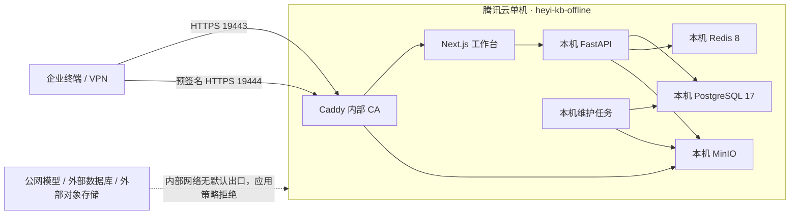

# 腾讯云 8 核 16G 离线企业部署

本方案用于在一台 **8 vCPU、16 GB RAM、300 GB SSD** 的腾讯云服务器上模拟企业内网知识库。PostgreSQL、Redis、MinIO、FastAPI、Next.js 与 Caddy 全部运行在同一台主机的独立 Docker Compose 项目中；数据库、缓存和文件对象不连接 Supabase、Upstash、腾讯 COS 或其他公网托管服务。

> [!IMPORTANT]
> 300 GB SSD 只能用于功能验证、小规模内部上线和容量压测，不能承载项目目标中的 10 TB 数据。正式生产必须增加加密数据盘或企业内网对象存储，并准备位于另一块介质上的离线备份。单盘上的副本不是备份。

## 隔离拓扑



Compose 使用两个 `internal: true` 网络。PostgreSQL、Redis、MinIO 控制台和 FastAPI 均不发布宿主机端口；宿主机只发布工作台 `19443/tcp` 与对象直传 `19444/tcp`。即使管理员在数据库中误存 DeepSeek、Qwen 或 MiniMax 密钥，`KB_EXTERNAL_LLM_ENABLED=false` 仍会让模型客户端失败关闭。

## 与现有应用的隔离

| 资源 | 离线模拟环境 | 现有腾讯云环境 |
|---|---|---|
| Compose 项目 | `heyi-kb-offline` | `heyi-kb-prod` 及其他项目 |
| 发布目录 | `/srv/heyi-knowledgebases-offline` | 不修改 |
| 工作台端口 | `19443/tcp` | `18443/tcp` 不修改 |
| 对象端口 | `19444/tcp` | 不占用 |
| 数据目录 | `/srv/heyi-knowledgebases-offline/data` | 不复用任何现有卷 |
| 停止/删除范围 | 只允许显式指定 `heyi-kb-offline` | 禁止操作其他项目 |

严禁执行全局 `docker system prune`、未指定项目名的 `docker compose down`，以及任何 `down -v`。离线环境使用 bind mount，删除 Compose 项目不会自动删除数据目录，但仍必须先做备份和路径核验。

## 资源规划

| 服务 | CPU 上限 | 内存上限 | 说明 |
|---|---:|---:|---|
| PostgreSQL | 2.0 | 4 GB | `shared_buffers=2GB`，100 连接上限 |
| Redis | 0.75 | 1.5 GB | AOF，每秒刷盘，1 GB `noeviction` |
| MinIO | 1.25 | 2 GB | 本机私有对象存储 |
| FastAPI | 2.0 | 2 GB | API、检索、签名与 RBAC |
| Next.js | 1.0 | 1 GB | 登录、聊天与管理后台 |
| 维护/迁移任务 | 共享 | 约 1.5 GB | 不应与大批量导入同时运行 |
| Caddy | 0.25 | 256 MB | 两个 TLS 入口 |

建议磁盘告警阈值：70% 预警、80% 停止批量上传、90% 自动拒绝新上传。300 GB 系统盘至少预留 60 GB 给系统、Docker 镜像、日志和升级回滚；对象数据建议在 180 GB 前停止扩容测试，剩余空间留给 PostgreSQL、临时 Multipart、WAL 与维护操作。

## 文件与变量

- 编排：[compose.offline.yml](../deploy/tencent/compose.offline.yml)
- TLS 反向代理：[Caddyfile.offline](../deploy/tencent/Caddyfile.offline)
- 环境变量模板：[offline.env.example](../deploy/tencent/offline.env.example)
- 上线前检查：[preflight-offline.sh](../deploy/tencent/preflight-offline.sh)

生产环境变量必须放在发布目录以外，例如：

```text
/srv/heyi-knowledgebases-offline/
├── releases/<git-sha>/
├── shared/offline.env        # root:root 0600
└── data/
    ├── postgres/
    ├── redis/
    ├── minio/
    ├── caddy-data/
    └── caddy-config/
```

密码使用 URL-safe 随机字符串，避免数据库 URL 编码错误。不得把 `.env`、数据库地址、访问密钥或管理员密码提交到 Git、聊天记录或工单截图。

## 镜像离线准备

严格断网后无法执行 `docker pull`、`npm ci` 或 `uv sync`。应在受控构建机完成构建和漏洞扫描，再把镜像保存为离线包：

```bash
docker save \
  heyi-kb-offline-api:<git-sha> \
  heyi-kb-offline-web:<git-sha> \
  postgres:17.5-bookworm \
  redis:8.0.3-bookworm \
  quay.io/minio/minio:RELEASE.2025-04-22T22-12-26Z \
  quay.io/minio/mc:RELEASE.2025-04-16T18-13-26Z \
  caddy:2.10.2-alpine \
  -o heyi-kb-offline-images.tar
sha256sum heyi-kb-offline-images.tar > heyi-kb-offline-images.tar.sha256
```

通过企业批准的介质或内网制品库传输，在服务器验证 SHA-256 后执行 `docker load`。启动前确认环境文件中的 `KB_API_IMAGE` 与 `KB_WEB_IMAGE` 使用不可变 Git SHA 标签。

## 首次模拟部署

以下命令只操作 `heyi-kb-offline`：

```bash
export RELEASE=/srv/heyi-knowledgebases-offline/releases/<git-sha>
export ENV_FILE=/srv/heyi-knowledgebases-offline/shared/offline.env
export COMPOSE_FILE=$RELEASE/deploy/tencent/compose.offline.yml

sudo chmod 0600 "$ENV_FILE"
sudo sh "$RELEASE/deploy/tencent/preflight-offline.sh" "$ENV_FILE"

sudo docker compose \
  --project-name heyi-kb-offline \
  --env-file "$ENV_FILE" \
  --file "$COMPOSE_FILE" \
  --profile ops run --rm migrate

sudo docker compose \
  --project-name heyi-kb-offline \
  --env-file "$ENV_FILE" \
  --file "$COMPOSE_FILE" \
  --profile ops run --rm bootstrap

sudo docker compose \
  --project-name heyi-kb-offline \
  --env-file "$ENV_FILE" \
  --file "$COMPOSE_FILE" \
  up -d postgres redis minio minio-init minio-multipart-gc api maintenance web proxy
```

管理员创建成功后，立即从 `offline.env` 清空 `KB_BOOTSTRAP_ADMIN_PASSWORD`；以后正常重启不运行 `bootstrap`。升级时先备份，再使用新版本镜像执行一次 `migrate`，最后只对本项目执行 `up -d`。

## 验收

```bash
sudo docker compose \
  --project-name heyi-kb-offline \
  --env-file "$ENV_FILE" \
  --file "$COMPOSE_FILE" ps

curl --fail --insecure "https://${KB_PUBLIC_HOST}:19443/login"

# API 容器应无法建立公网连接；失败是正确结果。
sudo docker compose \
  --project-name heyi-kb-offline \
  --env-file "$ENV_FILE" \
  --file "$COMPOSE_FILE" \
  exec api python -c "import socket; socket.create_connection(('1.1.1.1', 443), 3)"
```

验收还必须包括：登录、角色权限、知识库 ACL、上传、审批、对象下载、来源引用、服务重启后数据仍存在、PostgreSQL 逻辑备份恢复、MinIO 文件恢复，以及断网状态下聊天不会调用公网模型。

## 网络与主机控制

- 腾讯云安全组只允许企业固定出口/VPN 网段访问 `19443`、`19444`；SSH 只允许堡垒机或管理网段。
- 镜像预装完成后，安全组与主机防火墙默认拒绝公网出站；只放行企业内网 DNS、NTP、日志和备份目的地。
- Docker `internal` 网络是应用层第二道防线，不能替代安全组、主机防火墙和腾讯云账号权限控制。
- Caddy 当前使用内部 CA。企业终端必须通过受控方式安装根证书；正式域名证书应由企业内部 PKI 签发，不依赖公网 ACME。
- 服务器启用磁盘加密、自动安全更新窗口、审计日志和最小权限 SSH；Docker 组等同 root 权限，不授予普通业务用户。

## 本地模型边界

8 核 16G 的无 GPU 主机可以试运行小型量化模型，但不适合高并发企业推理。当前离线配置选择安全优先：禁用外部 LLM，问答使用授权检索和确定性来源回答。后续若接入 Ollama、vLLM 或 llama.cpp，必须作为内部服务加入 `internal` 网络，模型权重通过离线校验导入，并新增本地 provider、性能基准和回答审核测试后才能启用。
