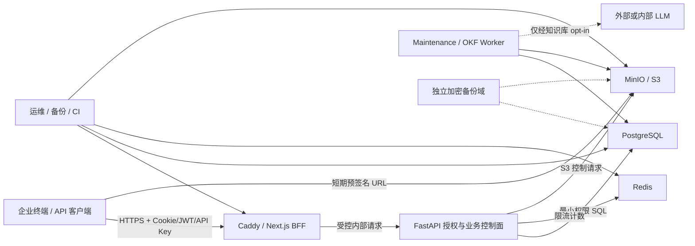

# 企业知识库威胁模型

> 文档性质：仓库级安全设计与审查基线
>
> 数据级别：企业内网敏感文档、账号权限、审计记录和模型调用数据
>
> 重要说明：本文来自仓库代码与配置的威胁建模，不代表已经完成 Codex Security 插件深度扫描、渗透测试、云环境核查或合规认证。

## Overview

本仓库实现企业知识库的登录工作台、动态 RBAC、知识库访问等级、文件上传/审批/下载、OKF 转换、知识检索、带来源回答、模型供应商管理和 API Key 管理。主要运行组件是 Next.js BFF、FastAPI、PostgreSQL、Redis、S3 兼容对象存储、maintenance worker 与 Caddy。

系统保护的主要资产包括：

- 企业原始文档、解析文本、OKF 条目和检索片段；
- 用户身份、角色、权限、知识库授权与资源限额；
- access/refresh token、API Key、模型密钥、JWT/BFF 密钥、数据库与对象存储凭据；
- 预签名上传/下载 URL、对象 key、Multipart upload ID；
- 审计日志、request ID、模型 token/费用和安全事件；
- PostgreSQL 元数据、Redis 限流状态、MinIO 对象、WAL、AOF、备份和 Caddy CA；
- 构建产物、容器镜像、依赖锁文件、部署清单和迁移脚本。

最高安全目标是：未经授权的主体不能读取、修改、删除或推断其他用户/知识库的数据；文件、模型输出和供应链内容均按不可信输入处理；离线模式不产生未经批准的外部数据流；所有高风险操作可追溯且可恢复。

## Threat Model, Trust Boundaries, and Assumptions

### 1. 参与者

| 参与者 | 权限与可信度 |
|---|---|
| 普通企业用户 | 已认证但不完全可信；只能访问被授予的知识库和能力 |
| 知识编辑/文件上传者 | 可提交恶意、损坏或超大内容；文件与元数据始终不可信 |
| 知识库 Manager | 可授权角色、审批文件和允许外部模型处理；属于高权限业务主体 |
| 系统管理员 | 可管理账号、角色、API Key 和 Provider；账号被盗可导致全局影响 |
| API Key 持有者 | 非交互服务主体；凭据可能泄露、过期或被越权使用 |
| 外部攻击者 | 可到达公开或内网入口时尝试认证滥用、DoS、注入和凭据攻击 |
| 恶意内部人员 | 具有合法网络或账号访问，但试图跨知识库、批量导出或抹除证据 |
| 运维人员 | 控制主机、Docker、环境密钥、备份与恢复；属于特权可信主体 |
| 开发者/供应链维护者 | 控制源码、依赖、镜像和 CI；其账号或依赖被攻破可影响所有部署 |
| LLM/模型运行方 | 在允许外部处理时接收检索片段；不得被假设为企业内部可信组件 |

### 2. 信任边界

边界说明：

1. **终端到边缘**：浏览器、脚本和代理头均不可信；必须验证来源、会话、请求体大小和客户端 IP 信任链。
2. **边缘到 API**：BFF 共享密钥、Cookie、JWT 与转发路径构成服务身份边界；不能允许任意路径代理或伪造内部头。
3. **API 到数据层**：PostgreSQL 是授权和状态事实源，Redis 只保存可重建的限流状态，对象存储只保存字节；不得从对象 key 推断权限。
4. **客户端到对象存储**：预签名 URL 是短期 bearer capability；完整 URL、查询串和 upload ID 属于敏感凭据。
5. **文件到解析/检索**：文件内容、文件名、MIME、压缩结构、宏、PDF 脚本和 OKF 内容均不可信。
6. **检索上下文到 LLM**：问题、标题、文档片段和模型输出均可能包含提示注入；知识库 opt-in 不能替代数据分类和最小披露。
7. **运行环境到供应链**：源码、锁文件、基础镜像、包仓库、离线镜像包和 CI 凭据构成构建信任链。
8. **主数据到备份域**：备份只有在独立故障域、加密、最小权限且实际恢复成功时才可信。

### 3. 输入控制分类

**攻击者可控输入**：登录凭据、HTTP header/body/query、文件名、扩展名、MIME、文件字节、Multipart part/ETag、知识库名称与元数据、聊天问题、文档内容、API Key 请求、模型响应和可能被污染的依赖内容。

**管理员/运维可控输入**：角色权限、限额、知识库授权、外部处理开关、模型 base URL/模型名/密钥、环境变量、Compose 参数、证书、备份目的地和恢复选择。

**开发者可控输入**：源码、迁移、依赖版本、容器构建、测试夹具、CI 工作流和发布清单。开发者输入不能绕过 secret scanning、代码审查、签名和制品校验。

### 4. 核心安全不变量

- 每次资源访问均重新解析有效账号、角色、权限、知识库访问等级和限额；前端隐藏按钮不构成授权。
- 用户不能通过 ID 枚举、错误差异、搜索结果、引用、预签名 URL 或日志获知未授权知识库内容。
- 系统角色、超管权限和更高优先级角色不能由低权限管理员授予自己或他人。
- API Key 明文只显示一次，服务端只保存不可逆摘要；撤销、过期、scope、知识库范围和账号状态每次都生效。
- 原始文件在扫描、类型验证、解析和审批完成前不得进入可下载或可检索状态。
- LLM 只接收当前用户获准访问且知识库明确允许处理的最小上下文；模型输出必须经过引用与语义审核，失败时 fail closed 到确定性检索。
- 离线配置不能访问外部 DB、Redis、对象存储或 LLM；Compose `internal` 网络不能替代宿主防火墙和安全组。
- 预签名 URL 只授权单一 bucket/key/方法/短时间，不得记录或跨用户复用。
- 审计日志必须覆盖高风险状态变化并防止普通业务角色修改或删除；审计本身不得泄漏密钥和文档内容。
- 数据库备份和对象备份共享恢复点语义；恢复后必须处理“元数据无对象”和“对象无元数据”两类孤儿。

### 5. 关键假设与限制

- 企业终端通过受管网络、VPN 或受限安全组访问，公网暴露不是默认假设；若实际公开到互联网，认证滥用和 DoS 严重度上调。
- 主机 root、Docker 组、数据库 owner、备份管理员和 CI 发布密钥被视为特权边界；这些身份被完全攻破后，应用层 RBAC 不能提供隔离。
- 8C16G/300G 是当前正式单机部署基线，面向小规模内网使用且不具备节点级高可用；它不是 10TB 或每天 50 亿 token 的容量认证，单机故障与磁盘故障必须由独立备份域恢复。
- 当前文档不是合规意见；等保、数据出境、隐私、员工数据和软件许可需由责任人签署结论。

## Attack Surface, Mitigations, and Attacker Stories

### 1. 登录、会话和 BFF

| 攻击面 | 现实攻击故事 | 已有缓解 | 仍需验证或建设 |
|---|---|---|---|
| 登录与 refresh | 攻击者撞库、爆破、重放被盗 refresh token | IP/账号限流、短 access token、refresh 轮换、令牌族重放封锁、token version | MFA、真实 PostgreSQL 并发双花验证、设备/风险信号、预认证容量测试 |
| Cookie/BFF | 跨站请求诱导用户执行管理操作，或伪造内部共享头 | SameSite/HttpOnly 会话设计、same-origin 检查、BFF shared secret | 真实浏览器 CSRF/E2E、代理头信任配置、密钥轮换演练 |
| JWT | 使用错误算法、issuer、audience 或 token type 绕过验证 | 固定算法并验证 issuer/audience/type/version | 密钥轮换、时钟偏差、撤销和异常 token 监控 |

攻击者故事：攻击者与真实管理员并行使用被盗 refresh token 时，系统必须只允许一次合法轮换，并在检测重放后封锁整个令牌族和现有 access token。当前已实现族级封锁与 token version 递增，但真实 PostgreSQL 并发双花和安全事件告警仍需验收；若该控制失效，攻击者可创建 API Key、扩展角色和批量下载，影响可达到 Critical。

### 2. RBAC、知识库 ACL 与限额

- 横向越权：用户修改 knowledge base/file/user UUID，尝试读取其他知识库。
- 纵向越权：低优先级管理员创建更高角色、修改系统角色、授予自身不存在的权限或无限额度。
- TOCTOU：角色在请求进行中撤销，但长事务、预签名 URL 或缓存仍继续有效。
- 限额绕过：创建多个 API Key、并发上传、重复完成、时区边界或 quota reservation 竞争。

已有控制包括后端动态权限解析、知识库 reader/editor/manager、行锁和 quota reservation、用户与 API Key 双层限流。必须通过真实 PostgreSQL 并发测试、资源枚举测试和角色矩阵 E2E 证明不存在跨库泄漏。

### 3. API Key 与模型凭据

API Key、Provider 密钥和 BFF/JWT 密钥属于高价值资产。威胁包括明文回显、日志泄漏、弱随机、数据库密文可替换、撤销不生效、scope 过宽和合法凭据导致成本失控。

已有控制包括 API Key 摘要、一次性明文返回、Provider 凭据加密和 base URL allowlist。仍需：密钥托管与轮换、KMS/HSM 或等价控制、token/费用/并发多维预算、异常用量告警，以及凭据扫描结果为零。

### 4. 文件上传、对象存储与解析

现实攻击包括：

- 伪造扩展名/MIME、宏 Office、PDF JavaScript、恶意旧版 Office、EICAR；
- zip bomb、超深压缩层、畸形文档、解析器 RCE、路径穿越；
- Multipart part 篡改、重放 ETag、声明大小与实际大小不一致、未完成 part 占满磁盘；
- 预签名 URL 泄漏后上传或下载指定对象；
- 先完成对象、后数据库提交失败产生孤儿，或反向产生缺失对象。

已有控制：扩展 allowlist、文件名规范化、大小和 quota、私有 bucket、精确 key、短期预签名 URL、对象大小检查、单 PUT checksum、Multipart 清理和人工审批状态。

关键缺口：自动恶意软件扫描、魔数/MIME 验证、隔离解析沙箱、解压比/页数/CPU/内存/时间限制、Multipart 全对象 SHA-256、对象版本/复制和全量 reconciliation。人工审批不能替代扫描。

### 5. 检索、RAG、提示注入与数据外传

攻击者可把指令写入上传文档，例如要求模型忽略系统提示、输出其他引用、泄漏密钥或调用外部 URL。用户问题和文档片段必须始终作为数据而非指令。

已有控制：结构化 JSON payload、知识库访问检查、引用编号验证、每段引用要求、第二次语义审核、审核失败降级到确定性检索、知识库级外部处理 opt-in、Provider host allowlist。

必须继续防御：

- 检索结果跨知识库或跨角色污染；
- 提示注入诱导模型回显不可见上下文、系统提示或其他用户数据；
- 模型供应商保留、训练或跨境处理企业片段；
- 审核模型与生成模型同源失败，导致共同错误；
- 超长问题/片段造成 token 成本和拒绝服务；
- 外部 Provider 429/超时造成队列积压和资源耗尽。

外部处理只有在数据分类、供应商条款、驻留位置、保留策略、最小披露和责任人批准后才能启用。完全离线模式必须从网络层证明无法出站，而不只是依赖布尔开关。

### 6. 数据库、Redis 与资源耗尽

- SQL 使用 ORM 参数化，但复杂搜索、offset 深分页和多词 `ILIKE` 仍可能被合法用户用于放大 CPU/IO；
- quota 行锁和角色替换可能被并发请求制造锁竞争；
- Redis `noeviction` 内存耗尽会让限流 fail closed 为 503，可被攻击者放大为可用性故障；
- 数据库连接池、线程池、S3 连接池和 LLM 调用缺少统一 backpressure 时可能级联耗尽。

需设置查询、锁、空闲事务和连接等待超时；建立 per-user/per-key/per-KB/per-provider 并发预算；监控连接池、慢 SQL、锁、Redis 内存、队列深度和磁盘水位。

### 7. 边缘代理、日志与审计

Caddy、Next.js 与 FastAPI 必须保留受控 request ID，但不能信任任意客户端提供的代理 IP 或内部身份头。预签名查询串、Authorization、Cookie、refresh token、文件内容和模型密钥不得进入日志。

审计威胁包括：高权限行为未记录、攻击者删除或修改审计、日志轮转覆盖证据、request ID 无法跨代理关联、审计 details 被注入超大或敏感内容。需要 append-only 或远端防篡改归档、访问权限分离、脱敏扫描、留存策略和告警闭环。

### 8. 供应链与发布

攻击路径包括 PyPI/npm/容器镜像投毒、依赖接管、恶意构建脚本、CI token 泄漏、浮动镜像标签、离线镜像包被替换和未审查迁移。

要求：

- 锁定并校验直接与传递依赖，生成 CycloneDX/SPDX SBOM；
- 基础镜像和生产镜像使用 digest，离线包附 SHA-256 和签名；
- 构建机与生产机分离，生产只加载已批准不可变制品；
- 运行 SAST、secret scan、依赖漏洞和许可证扫描；
- 高风险迁移双人审查并在克隆数据上演练；
- THIRD-PARTY-NOTICES 与许可证结论由责任人复核。

### 9. 备份、恢复和勒索

攻击者或误操作可能删除数据库、对象、Caddy CA 与环境密钥；若备份和主数据同盘，勒索、磁盘损坏或错误清理会同时破坏两者。

安全备份必须：独立故障域、静态与传输加密、最小权限、不可变/防删除、包含 PostgreSQL 恢复点与对象版本映射，并通过全新主机恢复验证。恢复后至少抽检 1,000 对象的大小与 SHA-256，并处理双向孤儿。未验证的备份不视为控制措施。

### 10. 代表性攻击链

1. **恶意上传链**：上传者提交畸形 Office → 未经扫描即人工批准 → 解析器执行恶意内容 → 获取 worker 凭据 → 读取整个 bucket。防线必须包括隔离扫描、沙箱、最小权限和凭据不可达。
2. **提示注入外传链**：攻击者将指令写入文档 → 高权限用户提问命中 → 模型被诱导泄漏其他上下文 → 外部 Provider 留存内容。防线包括知识库隔离、结构化上下文、最小片段、引用审核、外部处理 opt-in 和供应商治理。
3. **管理员会话链**：refresh token 泄漏 → 攻击者创建高 scope API Key → 批量签发下载 URL → 从对象端直传导出。防线包括 MFA、refresh family 重放检测、API Key 告警、下载预算和审计归档。
4. **供应链链**：依赖或基础镜像被替换 → CI 构建含后门镜像 → 离线环境导入 → 后门读取环境密钥与文档。防线包括 digest、SBOM、签名、隔离构建和制品准入。
5. **资源耗尽链**：合法低权限账号制造高复杂度检索、LLM 超时和未完成 Multipart → DB/线程池/磁盘饱和 → Redis 限流也失效为 503。防线包括多维限额、查询预算、bounded queue、磁盘水位和故障注入测试。

### 11. 低现实性或范围外故事

- 完全控制宿主 root、Docker socket、数据库 owner 或 CI 发布密钥后再绕过应用 RBAC，不作为普通应用层授权漏洞，但属于关键特权边界失陷；
- 需要物理接触且企业已部署全盘加密、安全启动和受控机房的冷启动攻击，通常低于远程越权优先级；
- 仅影响开发环境、测试夹具或未部署示例且无法进入发布制品的问题，通常不高于 Low；若能污染生产构建则重新上调；
- 对明确批准的 300GB 正式单机基线报告“不能保存 10TB”不是漏洞，但对外错误宣称已具备 10TB 或每天 50 亿 token 的生产容量属于发布与风险治理缺陷。

## Severity Calibration

严重度同时考虑机密性、完整性、可用性、影响用户数、攻击前置条件、可检测性和恢复难度。涉及企业敏感文档、管理员权限、供应链或备份破坏时，优先按最坏可信影响评定。

### Critical

- 无需高权限即可跨知识库批量读取或下载企业敏感文档；
- 远程代码执行获得 API/worker/主机凭据并访问全部对象；
- 登录或 JWT 绕过取得系统管理员权限；
- 构建或镜像供应链后门影响所有生产部署；
- 可删除主数据和同故障域全部备份，导致不可恢复的大范围数据损失。

### High

- 普通用户通过 IDOR 读取或修改另一个知识库的有限数据；
- API Key scope、撤销或知识库限制失效，可持续批量导出；
- 提示注入导致当前知识库大量敏感上下文未经批准发送到外部 Provider；
- 恶意文件绕过审批进入可检索状态，或解析沙箱逃逸但权限受限；
- 审计可被管理员之外的业务账号篡改，影响重大事件追溯。

### Medium

- 需要有效低权限账号才能触发的持续资源耗尽，影响单服务但可快速恢复；
- 单个预签名 URL 在短有效期内泄漏，且只影响一个对象；
- 缺少安全 header、错误信息或日志字段造成有限信息披露，但不含凭据和文档内容；
- Provider 429/超时处理不当导致局部问答不可用，确定性检索仍可工作。

### Low

- 仅开发或测试环境可触发、不能进入生产制品的问题；
- 不包含敏感值的版本、内部名称或低价值元数据暴露；
- 需要已完全控制主机管理员且不会扩大既有权限的配置缺陷；
- 无法影响授权、数据、审计或可用性的防御纵深建议。

严重度应在验证攻击路径、实际部署暴露面和补偿控制后调整。任何真实客户或员工数据的测试都必须停止，并转入私密漏洞报告流程。

Repository: SuperGokou/knowledgebases
Version: audit baseline 5298801fa311f437545f764f7a6c11874b6cc9ee; includes final-audit remediations documented at report generation time
