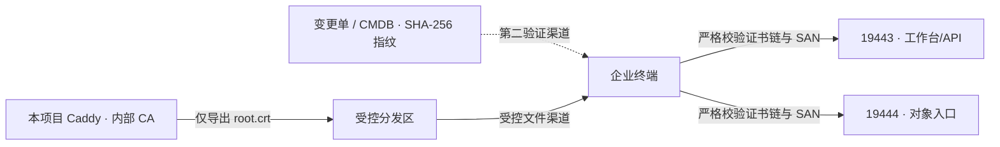

# 内网 TLS 与 Caddy 内部 CA 运维手册

本文用于 `heyi-kb-offline` 离线编排的 TLS 信任交付，覆盖根证书导出、双渠道核验、Windows 信任下发、严格验收、双根轮换与回滚。本文不保存服务器地址、账号、密码、私钥或真实环境变量。

> [!IMPORTANT]
> `19443/19444` 已经使用 TLS。客户端出现证书警告，通常是因为尚未信任 Caddy 内部根 CA；正确处理方式是受控安装根证书，不是关闭 TLS 校验。

> [!CAUTION]
> 只允许分发 `root.crt`。`root.key`、`intermediate.key`、整个 `caddy-data` 目录以及包含这些内容的备份均属于高敏感 PKI 资产，绝不能进入 Git、COS 公共桶、邮件、聊天、截图、工单附件或终端分发包。

## 1. 适用边界

| 项目 | 约束 |
|---|---|
| Compose 项目 | `heyi-kb-offline` |
| 工作台/API | `https://<KB_PUBLIC_HOST>:19443` |
| 对象入口 | `https://<KB_PUBLIC_HOST>:19444` |
| 根证书源 | `/srv/heyi-knowledgebases-offline/data/caddy-data/caddy/pki/authorities/local/root.crt` |
| 根私钥源 | 同级 `root.key`；只允许 Caddy/平台管理员访问，禁止导出 |
| 信任对象 | 企业受管 Windows 终端、受控 Linux 客户端和自动化执行器 |
| 网络边界 | 仅批准的 VPN/办公 CIDR；不占用或修改同机其他应用的 `80/443` |

该主机路径来自 `compose.offline.yml` 的固定映射：`${KB_DATA_ROOT}/caddy-data` 挂载到 Caddy 容器 `/data`，而 Caddy 内部 CA 位于容器 `/data/caddy/pki/authorities/local`。当 `KB_DATA_ROOT=/srv/heyi-knowledgebases-offline/data` 时，唯一正确的主机目录就是 `/srv/heyi-knowledgebases-offline/data/caddy-data/caddy/pki/authorities/local`。旧栈接管必须从受保护的 Caddy bind 自动推导并比对该路径；仅仅“位于数据根之下”不构成有效证明。

旧栈闭合接管的迁移前中止与恢复不得轮换、删除或重新生成该 CA。`offline-pre-migration-abort.py` 只能清理与接管事务精确绑定的目标预检资源，并明确保留 `/srv/heyi-knowledgebases-offline/data`；只有签名 `PRE_MIGRATION_ONLY` 中止收据、资源清零和主机零漂移均复验通过后，旧 proxy 才可按原 `caddy-data` bind 恢复。没有签名中止收据或 `migration_invoked` 已持久化时只能前向修复，不能用恢复旧 CA/旧 proxy 绕过数据库边界。



## 2. 安全边界与职责

- **PKI/平台管理员**：访问 Caddy CA 数据、导出公开根证书、保护私钥和完成换根。
- **终端管理员**：核验两个 SHA-256 值，通过 CurrentUser、LocalMachine、GPO 或 MDM 下发信任。
- **验收人**：使用严格 TLS 完成 OpenSSL、`curl` 与浏览器验收，保存原始输出。
- **业务用户**：只获取公开根证书或由企业策略自动获得信任，不接触 CA 私钥。

根证书不是秘密，但根证书的**真实性**是安全边界。文件分发渠道与指纹发布渠道必须独立；例如文件通过受控软件分发平台下发，两个 SHA-256 值通过已审批 CMDB 变更记录发布。

## 3. 只导出公开根证书

以下命令固定在本项目目录内，拒绝符号链接、重复变更号、意外路径和临近过期证书。它只创建一个名为 `root.crt` 的公开文件，不安装系统信任，也不复制任何私钥。导出或备份路径不得省略 `caddy-data` 层级。

先设置不含空格或路径分隔符的变更单号，再执行完整代码块：

```bash
CHANGE_ID="CHG-YYYYMMDD-NNN"

sudo bash -s -- "$CHANGE_ID" <<'BASH'
set -Eeuo pipefail

CHANGE_ID="${1:?change id is required}"
case "$CHANGE_ID" in
  ""|*[!A-Za-z0-9._-]*)
    echo "拒绝：变更单号只能包含字母、数字、点、下划线和连字符" >&2
    exit 1
    ;;
esac

PROJECT_ROOT="/srv/heyi-knowledgebases-offline"
SOURCE="$PROJECT_ROOT/data/caddy-data/caddy/pki/authorities/local/root.crt"
KEY_DIRECTORY="$PROJECT_ROOT/data/caddy-data/caddy/pki/authorities/local"
EXPORT_BASE="$PROJECT_ROOT/pki-public"
EXPORT_DIR="$EXPORT_BASE/$CHANGE_ID"
TARGET="$EXPORT_DIR/root.crt"

assert_root_owned_directory() {
  local directory="$1"
  local mode
  test -d "$directory"
  test ! -L "$directory"
  test "$(realpath -e -- "$directory")" = "$directory"
  test "$(stat -c '%u' -- "$directory")" -eq 0
  mode="$(stat -c '%a' -- "$directory")"
  (( (8#$mode & 0022) == 0 ))
}

for SECURE_DIRECTORY in \
  "$PROJECT_ROOT" \
  "$PROJECT_ROOT/data" \
  "$PROJECT_ROOT/data/caddy-data" \
  "$PROJECT_ROOT/data/caddy-data/caddy" \
  "$PROJECT_ROOT/data/caddy-data/caddy/pki" \
  "$PROJECT_ROOT/data/caddy-data/caddy/pki/authorities" \
  "$KEY_DIRECTORY"; do
  assert_root_owned_directory "$SECURE_DIRECTORY"
done

test -f "$SOURCE"
test ! -L "$SOURCE"
test "$(realpath -e -- "$SOURCE")" = "$SOURCE"
test "$(stat -c '%u' -- "$SOURCE")" -eq 0
SOURCE_MODE="$(stat -c '%a' -- "$SOURCE")"
(( (8#$SOURCE_MODE & 0022) == 0 ))

for PRIVATE_KEY in "$KEY_DIRECTORY/root.key" "$KEY_DIRECTORY/intermediate.key"; do
  test -f "$PRIVATE_KEY"
  test ! -L "$PRIVATE_KEY"
  test "$(stat -c '%u' -- "$PRIVATE_KEY")" -eq 0
  case "$(stat -c '%a' -- "$PRIVATE_KEY")" in
    400|600) ;;
    *)
      echo "拒绝：CA 私钥存在 group/other 权限：$PRIVATE_KEY" >&2
      exit 1
      ;;
  esac
done

test ! -L "$EXPORT_BASE"
if [ -e "$EXPORT_BASE" ]; then
  test -d "$EXPORT_BASE"
  test ! -L "$EXPORT_BASE"
else
  install -d -o root -g root -m 0750 -- "$EXPORT_BASE"
fi
assert_root_owned_directory "$EXPORT_BASE"

test "$(grep -c '^-----BEGIN CERTIFICATE-----$' "$SOURCE")" -eq 1
test "$(grep -c '^-----END CERTIFICATE-----$' "$SOURCE")" -eq 1
test "$(grep -c '^-----BEGIN ' "$SOURCE")" -eq 1
test "$(grep -c '^-----END ' "$SOURCE")" -eq 1

CANONICAL="$(mktemp "$EXPORT_BASE/.root-crt.XXXXXX")"
trap 'rm -f -- "$CANONICAL"' EXIT
chmod 0600 -- "$CANONICAL"
test -f "$CANONICAL"
test ! -L "$CANONICAL"
test "$(realpath -e -- "$CANONICAL")" = "$CANONICAL"
test "$(stat -c '%u' -- "$CANONICAL")" -eq 0
test "$(stat -c '%a' -- "$CANONICAL")" = "600"
test "$(stat -c '%h' -- "$CANONICAL")" -eq 1
openssl x509 -in "$SOURCE" -outform PEM -out "$CANONICAL"

# Caddy 源文件必须已经是只含一张证书的规范 PEM。任何第二张证书、
# 私钥、注释或非空尾随内容都会导致比较失败，因而不会被导出。
cmp --silent -- "$SOURCE" "$CANONICAL"
openssl x509 -in "$CANONICAL" -noout -checkend 2592000
openssl verify -CAfile "$CANONICAL" "$CANONICAL"

test ! -e "$EXPORT_DIR"
test ! -L "$EXPORT_DIR"
install -d -o root -g root -m 0750 -- "$EXPORT_DIR"
assert_root_owned_directory "$EXPORT_DIR"
install -o root -g root -m 0644 -- "$CANONICAL" "$TARGET"

test -f "$TARGET"
test ! -L "$TARGET"
test "$(stat -c '%u' -- "$TARGET")" -eq 0
test "$(stat -c '%a' -- "$TARGET")" = "644"
test "$(stat -c '%h' -- "$TARGET")" -eq 1
cmp --silent -- "$CANONICAL" "$TARGET"
test "$(find "$EXPORT_DIR" -mindepth 1 -maxdepth 1 -printf '%f\n')" = "root.crt"

echo "PEM 文件 SHA-256："
sha256sum "$TARGET"
echo "X.509 证书信息与 DER SHA-256 指纹："
openssl x509 -in "$TARGET" \
  -noout -subject -issuer -serial -dates -fingerprint -sha256
BASH
```

导出后必须确认：

- 分发目录只有 `root.crt`，不存在 `.key`、`.pfx`、`.p12`、压缩包或其他 CA 文件；
- PEM 文件 SHA-256 和 X.509 DER SHA-256 指纹都已写入审批记录；
- `root.crt` 通过受控文件渠道下发，两个指纹通过另一个已认证渠道发布；
- 未开启 Caddy Admin API，未复制整个 `caddy-data`，未改变 Compose、端口或其他应用。

`sha256sum` 计算的是 PEM 文件字节；`openssl x509 -fingerprint -sha256` 计算的是证书 DER 内容。两者语义不同，必须分别保存和核对。
OpenSSL 展示的证书指纹通常包含冒号；下面的 PowerShell 校验值使用移除冒号后的 64 位十六进制形式，转换时不得改变任何数字或字母。

## 4. 客户端导入前的双重核验

Windows 终端先从受控渠道获得 `root.crt`，再从 CMDB/变更单获得两个预期值。以下代码在任何导入前失败关闭：

```powershell
$CaItem = Get-Item -LiteralPath ".\root.crt" -Force
if (($CaItem.Attributes -band [System.IO.FileAttributes]::ReparsePoint) -ne 0) {
    throw "根证书文件不能是符号链接或 Reparse Point"
}
if ($CaItem.Length -le 0 -or $CaItem.Length -gt 65536) {
    throw "根证书文件大小异常，拒绝导入"
}

$CaPath = $CaItem.FullName
$ExpectedFileSha256 = "<PEM 文件的 64 位 SHA-256>"
$ExpectedCertificateSha256 = "<证书 DER 的 64 位 SHA-256>"

foreach ($Value in @($ExpectedFileSha256, $ExpectedCertificateSha256)) {
    if ($Value -notmatch '^[0-9A-Fa-f]{64}$') {
        throw "预期 SHA-256 格式非法，拒绝导入"
    }
}
$ExpectedFileSha256 = $ExpectedFileSha256.ToUpperInvariant()
$ExpectedCertificateSha256 = $ExpectedCertificateSha256.ToUpperInvariant()

function Get-BytesSha256 {
    param([byte[]]$Bytes)
    $Algorithm = [System.Security.Cryptography.SHA256]::Create()
    try {
        return [System.BitConverter]::ToString(
            $Algorithm.ComputeHash($Bytes)
        ).Replace('-', '')
    }
    finally {
        $Algorithm.Dispose()
    }
}

function Get-CertificateSha256 {
    param([System.Security.Cryptography.X509Certificates.X509Certificate2]$Certificate)
    return Get-BytesSha256 -Bytes $Certificate.RawData
}

$FileBytes = [System.IO.File]::ReadAllBytes($CaPath)
$StrictUtf8 = [System.Text.UTF8Encoding]::new($false, $true)
$PemText = $StrictUtf8.GetString($FileBytes)
$PemPattern = '(?s)\A-----BEGIN CERTIFICATE-----\r?\n(?<Base64>(?:[A-Za-z0-9+/=]+\r?\n)+)-----END CERTIFICATE-----\r?\n?\z'
$PemMatch = [regex]::Match($PemText, $PemPattern)
if (-not $PemMatch.Success) {
    throw "root.crt 必须且只能包含一张 PEM CERTIFICATE，不得包含私钥、第二张证书或尾随内容"
}

$DerBytes = [System.Convert]::FromBase64String(
    ($PemMatch.Groups['Base64'].Value -replace '\s', '')
)
$Certificate = [System.Security.Cryptography.X509Certificates.X509Certificate2]::new($DerBytes)
$ActualFileSha256 = Get-BytesSha256 -Bytes $FileBytes
$ActualCertificateSha256 = Get-CertificateSha256 -Certificate $Certificate

if ($ActualFileSha256 -ne $ExpectedFileSha256) {
    throw "PEM 文件 SHA-256 不匹配，拒绝导入"
}
if ($ActualCertificateSha256 -ne $ExpectedCertificateSha256) {
    throw "X.509 证书 SHA-256 指纹不匹配，拒绝导入"
}
if ($Certificate.HasPrivateKey) {
    throw "根证书对象意外包含私钥，拒绝导入"
}
if ($Certificate.Subject -ne $Certificate.Issuer) {
    throw "证书不是自签名根证书，拒绝导入"
}
if ($Certificate.NotBefore -gt (Get-Date)) {
    throw "根证书尚未生效，拒绝导入"
}
if ($Certificate.NotAfter -le (Get-Date).AddDays(30)) {
    throw "根证书剩余有效期不足 30 天，拒绝导入"
}

$BasicConstraintsExtension = $Certificate.Extensions |
    Where-Object { $_.Oid.Value -eq '2.5.29.19' } |
    Select-Object -First 1
if ($null -eq $BasicConstraintsExtension) {
    throw "证书缺少 Basic Constraints，拒绝导入"
}
$BasicConstraints = [System.Security.Cryptography.X509Certificates.X509BasicConstraintsExtension]::new()
$BasicConstraints.CopyFrom($BasicConstraintsExtension)
if (-not $BasicConstraints.CertificateAuthority) {
    throw "证书未声明 CA 能力，拒绝导入"
}

$KeyUsageExtension = $Certificate.Extensions |
    Where-Object { $_.Oid.Value -eq '2.5.29.15' } |
    Select-Object -First 1
if ($null -eq $KeyUsageExtension) {
    throw "证书缺少 Key Usage，拒绝导入"
}
$KeyUsage = [System.Security.Cryptography.X509Certificates.X509KeyUsageExtension]::new()
$KeyUsage.CopyFrom($KeyUsageExtension)
if (($KeyUsage.KeyUsages -band [System.Security.Cryptography.X509Certificates.X509KeyUsageFlags]::KeyCertSign) -eq 0) {
    throw "根证书未授权 KeyCertSign，拒绝导入"
}

function Add-VerifiedRootCertificate {
    param(
        [System.Security.Cryptography.X509Certificates.X509Certificate2]$Certificate,
        [string]$ExpectedSha256,
        [System.Security.Cryptography.X509Certificates.StoreLocation]$StoreLocation
    )

    if ((Get-CertificateSha256 -Certificate $Certificate) -ne $ExpectedSha256) {
        throw "内存证书指纹已变化，拒绝写入证书存储"
    }

    $StoreName = [System.Security.Cryptography.X509Certificates.StoreName]::Root
    $ReadOnly = [System.Security.Cryptography.X509Certificates.OpenFlags]::ReadOnly
    $ReadWrite = [System.Security.Cryptography.X509Certificates.OpenFlags]::ReadWrite
    $WasAdded = $false

    $Store = [System.Security.Cryptography.X509Certificates.X509Store]::new($StoreName, $StoreLocation)
    try {
        $Store.Open($ReadOnly)
        $Before = @(
            $Store.Certificates |
                Where-Object { (Get-CertificateSha256 -Certificate $_) -eq $ExpectedSha256 }
        )
    }
    finally {
        $Store.Close()
    }
    if ($Before.Count -gt 1) {
        throw "证书存储中已存在多个相同 DER 指纹，拒绝继续"
    }

    if ($Before.Count -eq 0) {
        try {
            $Store.Open($ReadWrite)
            $Store.Add($Certificate)
            $WasAdded = $true
        }
        finally {
            $Store.Close()
        }
    }

    $VerificationError = $null
    try {
        $Store.Open($ReadOnly)
        $After = @(
            $Store.Certificates |
                Where-Object { (Get-CertificateSha256 -Certificate $_) -eq $ExpectedSha256 }
        )
    }
    catch {
        $VerificationError = $_
    }
    finally {
        $Store.Close()
    }

    if ($null -ne $VerificationError -or $After.Count -ne 1) {
        if ($WasAdded) {
            try {
                $Store.Open($ReadWrite)
                $Store.Remove($Certificate)
            }
            finally {
                $Store.Close()
            }
        }
        if ($null -ne $VerificationError) {
            throw $VerificationError
        }
        throw "写入后未能唯一核验 DER SHA-256；新增证书已精准回收"
    }

    return $After[0]
}

$Certificate | Format-List Subject, Issuer, SerialNumber, NotBefore, NotAfter
"PEM SHA-256:  $ActualFileSha256"
"X509 SHA-256: $ActualCertificateSha256"
```

只有全部核验通过，才可选择一种信任范围。导入必须在**同一个 PowerShell 进程**中直接使用已核验的内存 `$Certificate`；不得重新按文件路径读取。若关闭了该进程，必须从本节开头重新核验。不得仅凭 Windows 的 SHA-1 `Thumbprint` 审批根证书；SHA-1 Thumbprint 仅可作为证书存储路径标识。

## 5. Windows 信任部署

### 5.1 CurrentUser：单用户试点

适合个人测试账户，不会为 Windows 服务、其他用户或计算机账户建立信任：

```powershell
$Imported = Add-VerifiedRootCertificate `
    -Certificate $Certificate `
    -ExpectedSha256 $ExpectedCertificateSha256 `
    -StoreLocation ([System.Security.Cryptography.X509Certificates.StoreLocation]::CurrentUser)

Get-Item -LiteralPath "Cert:\CurrentUser\Root\$($Imported.Thumbprint)" |
    Format-List Subject, Issuer, Thumbprint, NotBefore, NotAfter
```

### 5.2 LocalMachine：受管设备

在管理员 PowerShell 中执行，适合共享终端、Windows 服务以及需要整机信任的 Edge/Chrome：

```powershell
$Imported = Add-VerifiedRootCertificate `
    -Certificate $Certificate `
    -ExpectedSha256 $ExpectedCertificateSha256 `
    -StoreLocation ([System.Security.Cryptography.X509Certificates.StoreLocation]::LocalMachine)

Get-Item -LiteralPath "Cert:\LocalMachine\Root\$($Imported.Thumbprint)" |
    Format-List Subject, Issuer, Thumbprint, NotBefore, NotAfter
```

不要同时向 CurrentUser 与 LocalMachine 重复导入；应根据终端所有权和运行身份选择最小范围。导入后重新启动浏览器或使用新的自动化进程，避免旧进程继续使用缓存的信任状态。

### 5.3 AD GPO / 企业终端管理：正式批量下发

正式域环境优先使用计算机策略：

1. 在隔离试点 OU 新建或编辑专用 GPO，不复用范围不明的全局策略。
2. 打开“计算机配置 → 策略 → Windows 设置 → 安全设置 → 公钥策略 → 受信任的根证书颁发机构”。
3. 只从只读、内容寻址的受控分发包导入已完成双重 SHA-256 核验的 `root.crt`；禁止导入 PFX/P12 或任何私钥。策略保存后应重新导出证书并比对 DER SHA-256。
4. 使用安全筛选和 OU 范围先覆盖试点终端，记录 GPO GUID、版本、变更单和证书 SHA-256。
5. 执行 `gpupdate /force`，用 `gpresult /h` 保存策略应用证据，再检查 `Cert:\LocalMachine\Root`。
6. 严格 TLS 和业务验收通过后再分批扩大范围；失败时保持服务端旧根有效，暂停扩散。

Firefox 是否使用 Windows 根证书取决于企业策略和版本。应通过 Firefox Enterprise Policy 启用企业根信任，或由终端平台单独下发；不得要求用户点击证书警告页继续访问。

## 6. 严格 TLS 验收

所有验收必须在批准的 VPN/内网路径执行。命令中的主机必须与证书 SAN 完全一致。

### 6.1 OpenSSL：证书链、SAN 与端口

私网 IP 入口使用 `-verify_ip`：

```bash
set -Eeuo pipefail

HOST="<KB_PUBLIC_HOST 的私网 IP>"
CA_FILE="./root.crt"
EVIDENCE_DIR="./tls-evidence-<change-id>"
VERIFY_ARGS=(-verify_ip "$HOST")
EXPECTED_PEM_SHA256="<审批记录中的 64 位 PEM SHA-256>"
EXPECTED_CERT_SHA256="<审批记录中的 64 位 DER SHA-256>"

[[ "$EXPECTED_PEM_SHA256" =~ ^[0-9A-Fa-f]{64}$ ]]
[[ "$EXPECTED_CERT_SHA256" =~ ^[0-9A-Fa-f]{64}$ ]]
EXPECTED_PEM_SHA256="${EXPECTED_PEM_SHA256^^}"
EXPECTED_CERT_SHA256="${EXPECTED_CERT_SHA256^^}"
test -f "$CA_FILE"
test ! -L "$CA_FILE"
ACTUAL_PEM_SHA256="$(sha256sum -- "$CA_FILE" | awk '{print toupper($1)}')"
ACTUAL_CERT_SHA256="$(openssl x509 -in "$CA_FILE" -outform DER | sha256sum | awk '{print toupper($1)}')"
test "$ACTUAL_PEM_SHA256" = "$EXPECTED_PEM_SHA256"
test "$ACTUAL_CERT_SHA256" = "$EXPECTED_CERT_SHA256"

test ! -e "$EVIDENCE_DIR"
test ! -L "$EVIDENCE_DIR"
install -d -m 0700 -- "$EVIDENCE_DIR"

for PORT in 19443 19444; do
  OUTPUT_FILE="$EVIDENCE_DIR/openssl-${PORT}.txt"
  if ! timeout --signal=TERM 20s openssl s_client \
    -connect "${HOST}:${PORT}" \
    -servername "$HOST" \
    -CAfile "$CA_FILE" \
    -verify_return_error \
    "${VERIFY_ARGS[@]}" </dev/null >"$OUTPUT_FILE" 2>&1; then
    cat "$OUTPUT_FILE"
    exit 1
  fi
  cat "$OUTPUT_FILE"
  grep -Fq 'Verify return code: 0 (ok)' "$OUTPUT_FILE"
done

timeout --signal=TERM 20s openssl s_client \
  -connect "${HOST}:19443" \
  -servername "$HOST" \
  -CAfile "$CA_FILE" \
  -verify_return_error \
  "${VERIFY_ARGS[@]}" \
  -showcerts </dev/null |
openssl x509 -noout \
  -subject -issuer -serial -dates -ext subjectAltName -fingerprint -sha256 |
tee "$EVIDENCE_DIR/leaf-details.txt"
```

内部 DNS 入口改用 `-verify_hostname`：

```bash
set -Eeuo pipefail

HOST="<证书 SAN 中的内部 DNS 名称>"
CA_FILE="./root.crt"
EVIDENCE_DIR="./tls-evidence-<change-id>"
VERIFY_ARGS=(-verify_hostname "$HOST")
EXPECTED_PEM_SHA256="<审批记录中的 64 位 PEM SHA-256>"
EXPECTED_CERT_SHA256="<审批记录中的 64 位 DER SHA-256>"

[[ "$EXPECTED_PEM_SHA256" =~ ^[0-9A-Fa-f]{64}$ ]]
[[ "$EXPECTED_CERT_SHA256" =~ ^[0-9A-Fa-f]{64}$ ]]
EXPECTED_PEM_SHA256="${EXPECTED_PEM_SHA256^^}"
EXPECTED_CERT_SHA256="${EXPECTED_CERT_SHA256^^}"
test -f "$CA_FILE"
test ! -L "$CA_FILE"
ACTUAL_PEM_SHA256="$(sha256sum -- "$CA_FILE" | awk '{print toupper($1)}')"
ACTUAL_CERT_SHA256="$(openssl x509 -in "$CA_FILE" -outform DER | sha256sum | awk '{print toupper($1)}')"
test "$ACTUAL_PEM_SHA256" = "$EXPECTED_PEM_SHA256"
test "$ACTUAL_CERT_SHA256" = "$EXPECTED_CERT_SHA256"

test ! -e "$EVIDENCE_DIR"
test ! -L "$EVIDENCE_DIR"
install -d -m 0700 -- "$EVIDENCE_DIR"

for PORT in 19443 19444; do
  OUTPUT_FILE="$EVIDENCE_DIR/openssl-${PORT}.txt"
  if ! timeout --signal=TERM 20s openssl s_client \
    -connect "${HOST}:${PORT}" \
    -servername "$HOST" \
    -CAfile "$CA_FILE" \
    -verify_return_error \
    "${VERIFY_ARGS[@]}" </dev/null >"$OUTPUT_FILE" 2>&1; then
    cat "$OUTPUT_FILE"
    exit 1
  fi
  cat "$OUTPUT_FILE"
  grep -Fq 'Verify return code: 0 (ok)' "$OUTPUT_FILE"
done

timeout --signal=TERM 20s openssl s_client \
  -connect "${HOST}:19443" \
  -servername "$HOST" \
  -CAfile "$CA_FILE" \
  -verify_return_error \
  "${VERIFY_ARGS[@]}" \
  -showcerts </dev/null |
openssl x509 -noout \
  -subject -issuer -serial -dates -ext subjectAltName -fingerprint -sha256 |
tee "$EVIDENCE_DIR/leaf-details.txt"
```

两个端口都必须独立返回退出码 0，且原始输出必须包含 `Verify return code: 0 (ok)`。任一端口失败都会立即中止；叶证书采集再次执行相同的 IP/DNS SAN 校验，并在启用 `pipefail` 的条件下保存结果。

### 6.2 curl：应用与对象入口

显式 CA 文件验收：

```bash
set -Eeuo pipefail

: "${HOST:?HOST must be set by the OpenSSL acceptance step}"
: "${CA_FILE:?CA_FILE must be set by the OpenSSL acceptance step}"
: "${EXPECTED_PEM_SHA256:?approved PEM SHA-256 must be set}"
: "${EXPECTED_CERT_SHA256:?approved DER SHA-256 must be set}"

ACTUAL_PEM_SHA256="$(sha256sum -- "$CA_FILE" | awk '{print toupper($1)}')"
ACTUAL_CERT_SHA256="$(openssl x509 -in "$CA_FILE" -outform DER | sha256sum | awk '{print toupper($1)}')"
test "$ACTUAL_PEM_SHA256" = "$EXPECTED_PEM_SHA256"
test "$ACTUAL_CERT_SHA256" = "$EXPECTED_CERT_SHA256"

curl --fail --show-error --silent \
  --connect-timeout 5 --max-time 15 \
  --cacert "$CA_FILE" \
  "https://${HOST}:19443/health/ready"

curl --fail --show-error --silent \
  --connect-timeout 5 --max-time 15 \
  --cacert "$CA_FILE" \
  "https://${HOST}:19444/minio/health/ready"
```

Windows 已导入系统信任后，还应在**不传 `--cacert`** 的新 PowerShell 进程中验证系统信任链：

```powershell
$HostName = "<KB_PUBLIC_HOST>"
$CurlVersion = & curl.exe --version
if ($LASTEXITCODE -ne 0 -or (($CurlVersion -join "`n") -notmatch 'Schannel')) {
    throw "curl.exe 未使用 Windows Schannel，不能作为系统 Root Store 信任证据"
}

foreach ($Uri in @(
    "https://${HostName}:19443/health/ready",
    "https://${HostName}:19444/minio/health/ready"
)) {
    & curl.exe --fail --show-error --silent --connect-timeout 5 --max-time 15 $Uri
    if ($LASTEXITCODE -ne 0) {
        throw "严格 TLS 请求失败：$Uri"
    }
}
```

若企业发行版的 `curl.exe` 使用 OpenSSL 后端，应配置其受管 CA bundle 并重新严格测试，不能以 `--insecure` 替代系统信任。

### 6.3 浏览器

- Edge/Chrome 打开 `https://<KB_PUBLIC_HOST>:19443/login`，不得出现证书警告或“继续访问”步骤。
- 开发者工具 Security 面板必须显示受信任链，证书 SAN 必须匹配当前 IP/DNS。
- 控制台执行 `window.isSecureContext` 必须返回 `true`。
- 页面不得出现 mixed content、证书链错误或对象入口 TLS 错误。
- Firefox 必须在企业策略生效后单独复测，不能以 Chromium 结果代替。
- 自动化浏览器不得设置 `ignoreHTTPSErrors: true` 或 `--ignore-certificate-errors`。

### 6.4 持久性与监听边界

维护窗口重启当前生效的**本项目 TLS 终结器**（正常模式为 `proxy`，维护模式为 `maintenance-page`）后，重新计算根证书 PEM SHA-256 和 X.509 指纹；两个值必须保持不变。两个服务不能同时占用 `19443`，但必须使用同一套受审 CA 数据。禁止删除 CA 目录后让 Caddy 临时重建根证书。

服务器监听证据必须证明只有本项目批准的私网地址和 `19443/19444` 对外提供入口；安全组与主机防火墙只允许批准的 VPN/办公 CIDR。不得为了 TLS 验收修改同机其他应用、Docker 守护进程或全局防火墙。

## 7. 双根轮换

叶证书和中间证书可由 Caddy 自动续期；根 CA 轮换属于独立 PKI 变更，必须采用 **CA-A + CA-B 双根重叠**，不能就地删除旧目录后自动生成。

> [!WARNING]
> 当前 `compose.offline.yml` 把 `${KB_DATA_ROOT}/caddy-data` 固定挂载到 `proxy` 和 `maintenance-page`，而 `KB_DATA_ROOT` 同时承载 PostgreSQL、Redis、MinIO 等数据。**当前发布不具备可独立执行的根 CA 切换能力。**不得为了换根修改 `KB_DATA_ROOT`，否则可能让整套数据层切到错误目录。只有补齐下述 CA 专用绑定或不可变 Overlay 制品并完成隔离演练后，根轮换才从 `BLOCKED` 变为可执行。

### 7.1 两种方案的共同准备

1. **冻结 CA-A**：记录两个 SHA-256、私钥权限、客户端覆盖率、当前叶证书 SAN 和本项目其他容器 ID/配置哈希；对 CA-A 数据做加密、访问受控的恢复副本。
2. **先部署客户端双信任**：只下发 CA-B 的公开根证书，按本文双渠道核验；终端在观察期内同时信任 CA-A 与 CA-B。
3. **验证覆盖率**：试点、业务终端、自动化执行器和服务账户均须证明已信任 CA-B；未达到审批阈值不得切换服务端。
4. **保存不可变回退制品**：CA-A 的 Caddy 配置、专用数据绑定、镜像摘要和严格 TLS 结果必须可重放；禁止把当前可变目录当作唯一回退点。

### 7.2 方案 A：Caddy 内部 CA-B

该方案的 CA-B 根私钥只能位于独立、root-owned 的 Caddy data root，不能导出到客户端。`proxy` 与 `maintenance-page` 都是 TLS 终结器；虽然运行时只有一个服务占用 `19443`，两者的发布配置必须同步指向同一 CA-A 或 CA-B。上线前必须由单独受审发布补齐以下任一机制：

- 专供两个 TLS 终结器 `/data` 使用的 `KB_CADDY_DATA_ROOT`，以及在需要隔离配置状态时对应的 `KB_CADDY_CONFIG_ROOT`；不得复用控制全体数据服务的 `KB_DATA_ROOT`；或
- 两份不可变 Compose Overlay，分别把 `proxy` 与 `maintenance-page` 的 `/data`（以及对应 `/config`）同步绑定到固定 CA-A/CA-B 目录。

变更门禁必须证明：

- CA-A 与 CA-B 目录不重叠、不是符号链接，均在本项目根目录内且私钥无 group/other 权限；
- CA-B 由不发布宿主机端口的隔离 Caddy 实例生成，未覆盖 CA-A；
- `docker compose config` 的 A/B 安全差异只能是 `proxy` 与 `maintenance-page` 同步使用的 CA `/data`/`/config` bind；不得把包含秘密的完整渲染结果写入普通工件；
- PostgreSQL、Redis、MinIO、ClamAV、API、Maintenance 和 Web 的镜像、环境、网络、挂载、容器 ID 和配置哈希在切换前后保持不变；只有当前生效的 TLS 终结器允许按审批重建；
- 切换命令显式使用项目名、环境文件、基础 Compose、受审 Overlay，并且只对当前生效的 `proxy` 或 `maintenance-page` 执行项目限定的 `up -d --no-deps --pull never --no-build`；
- CA-A Overlay 已在同一环境完成回滚演练。

当前仓库未提供上述 CA-A/CA-B Overlay 或专用变量，因此本手册不会给出可直接复制的切换命令。制品缺失、两个 TLS 终结器未同步、差异超出允许的 Caddy bind 或非 TLS 容器指纹变化时必须失败关闭，不得手工替换 `caddy-data` 内的密钥。

### 7.3 方案 B：企业 PKI

企业 PKI 路径与 Caddy data 换根互斥，不能混用：

- 企业根 CA 私钥永远留在 HSM/企业 PKI 边界，绝不能复制到应用服务器；
- PKI 为实际内网 IP/DNS SAN 签发服务器叶证书和中间链，应用主机只接收叶证书、链和受保护的**叶私钥**；
- `Caddyfile.offline` 与维护入口配置必须同步使用受审的证书/密钥配置或企业私有 ACME issuer，不通过替换内部 `caddy-data` 模拟企业 PKI；
- 服务端切换仍只允许重建当前生效的本项目 TLS 终结器，并证明非 TLS 容器指纹不变；
- 回滚制品是上一版 Caddy TLS 配置、叶证书链和受保护叶私钥，不是企业根私钥。

若企业根已经通过 GPO/MDM 受信任，应复用现有 PKI 生命周期；若确需企业根 A/B 轮换，由企业 PKI 流程负责双根下发、吊销和审计，本项目只验证叶证书链与 SAN。

### 7.4 切换后观察

无论采用哪种方案，切换后都要重新执行 OpenSSL、`curl`、浏览器、登录、上传/下载和 API 验收，并保存 CA-B 链和 SAN 证据。在已审批观察期内继续保留 CA-A 信任和回退制品；确认所有旧叶证书退出服务，且完成其他应用/策略依赖清点后，才可精确移除 CA-A。

任何阶段发现 `root.key` 疑似泄露，应立即按安全事件处理，不再依赖常规观察期。Caddy 内部 CA 不提供完整 CRL/OCSP；需要集中吊销能力时必须迁移到企业 PKI。

## 8. 回滚与精准移除

### 8.1 服务端切换前失败

保持 CA-A 继续签发和提供服务，不改变服务端。暂停 CA-B 扩散，查明指纹、GPO 范围或客户端兼容问题；需要撤回时只移除 CA-B，不触碰 CA-A。

### 8.2 服务端切换后失败

在维护入口保持启用的情况下，按所选方案恢复预先验证的 CA-A 制品：方案 A 使用同步覆盖 `proxy` 与 `maintenance-page` 的 CA-A 专用 bind/Overlay，方案 B 使用两个入口一致的上一版 Caddy TLS 配置和叶证书链。运行时只重建当前占用入口的**本项目 TLS 终结器**，并再次证明非 TLS 容器 ID 与配置哈希未变化。随后重新执行严格 TLS 和业务验收。若没有可重放的 CA-A 制品，则不得开始服务端切换。

回滚不得：

- 执行数据库 downgrade、删除卷或重建数据层；
- 使用 `docker compose down -v`、`docker system prune` 或重启 Docker daemon；
- 删除当前 CA 目录后等待 Caddy 生成“新旧不明”的根；
- 临时打开 HTTP 或关闭客户端证书校验。

### 8.3 Windows 精准移除旧根

移除前必须按 CA-A DER SHA-256 在 CMDB、GPO/MDM、反向代理、其他应用和服务账户中完成依赖清点。只要有其他应用仍由 CA-A 签发或依赖该信任，就必须阻断移除，不能以“本项目已切换”为由影响共享主机或企业终端。

依赖清点通过后，使用证书 DER SHA-256 找到唯一目标，再以 `-WhatIf` 预演。以下示例中的 StorePath 必须与原部署范围一致；默认 `$ExecuteRemoval = $false`，不会真正删除：

```powershell
$ExpectedCertificateSha256 = "<待移除旧根的 64 位 SHA-256>".ToUpperInvariant()
$StorePath = "Cert:\CurrentUser\Root"  # 或 Cert:\LocalMachine\Root
$ExecuteRemoval = $false

if ($ExpectedCertificateSha256 -notmatch '^[0-9A-F]{64}$') {
    throw "待移除证书的 SHA-256 格式非法"
}
if ($StorePath -notin @("Cert:\CurrentUser\Root", "Cert:\LocalMachine\Root")) {
    throw "只允许从明确的 CurrentUser/LocalMachine Root Store 精准移除"
}

function Get-CertificateSha256 {
    param([System.Security.Cryptography.X509Certificates.X509Certificate2]$Certificate)
    $Algorithm = [System.Security.Cryptography.SHA256]::Create()
    try {
        return [System.BitConverter]::ToString(
            $Algorithm.ComputeHash($Certificate.RawData)
        ).Replace('-', '')
    }
    finally {
        $Algorithm.Dispose()
    }
}

$Matches = @(
    Get-ChildItem -Path $StorePath |
        Where-Object { (Get-CertificateSha256 $_) -eq $ExpectedCertificateSha256 }
)
if ($Matches.Count -ne 1) {
    throw "必须精确匹配一个旧根证书；当前匹配数：$($Matches.Count)"
}

$TargetPath = Join-Path $StorePath $Matches[0].Thumbprint
if (-not $ExecuteRemoval) {
    Remove-Item -LiteralPath $TargetPath -WhatIf
    throw "当前仅完成预演；双人复核后将 ExecuteRemoval 显式改为 true"
}

Remove-Item -LiteralPath $TargetPath
$Remaining = @(
    Get-ChildItem -Path $StorePath |
        Where-Object { (Get-CertificateSha256 $_) -eq $ExpectedCertificateSha256 }
)
if ($Remaining.Count -ne 0) {
    throw "旧根移除后仍有同指纹证书，停止后续变更"
}
"旧根已按 DER SHA-256 精准移除，存储中剩余匹配数：0"
```

双人复核 SHA-256、StorePath、`-WhatIf` 输出、依赖清单和变更单后，才可在审批窗口把 `$ExecuteRemoval` 改为 `$true` 执行一次。删除后必须重新执行 CA-B 严格 TLS 与业务验收。GPO/MDM 场景应从原策略中精确删除同一 SHA-256 的证书，分批验证传播和零匹配，再复测 CA-B；禁止清空 Trusted Root Store 或只删除本地副本而保留会重新下发旧根的策略。

## 9. 明确禁止的绕过方式

以下任一项都会使 TLS 验收判定失败：

- `curl -k`、`curl --insecure`；
- Python `verify=False`；
- Node.js `NODE_TLS_REJECT_UNAUTHORIZED=0`；
- SDK/客户端 `ignoreTLS=true`、`rejectUnauthorized=false` 或同义配置；
- Playwright `ignoreHTTPSErrors: true`；
- Chromium `--ignore-certificate-errors`；
- 关闭主机名/IP SAN 校验；
- 点击浏览器“继续访问不安全网站”；
- 将 `root.crt` 与 `root.key` 一起打包或传输；
- 使用公开对象存储、临时 HTTP 链接或聊天工具传输 CA 资产；
- 清空系统根证书存储、删除整个 Caddy CA 目录或让 Caddy 未经审批自动换根。

## 10. 交付证据清单

- [ ] 变更单号、操作者、复核人、时间和目标环境已记录。
- [ ] 导出目录只有 `root.crt`；不存在任何私钥或归档。
- [ ] PEM 文件 SHA-256 与 X.509 DER SHA-256 指纹经独立渠道核对。
- [ ] 证书 Subject、Issuer、Serial、NotBefore、NotAfter 已归档。
- [ ] `root.key`/`intermediate.key` 未导出，服务端权限无 group/other 访问。
- [ ] CurrentUser、LocalMachine、GPO/MDM 的实际选择和覆盖范围已记录。
- [ ] OpenSSL/curl 使用的 CA 文件已重新比对审批记录中的 PEM 与 DER SHA-256。
- [ ] OpenSSL 对 `19443/19444` 均返回 `Verify return code: 0 (ok)`。
- [ ] `curl` 对工作台 readiness 与 MinIO readiness 均成功，未使用 insecure 参数。
- [ ] Edge/Chrome 与 Firefox（如纳入支持矩阵）无警告、SAN 匹配且 Secure Context 为真。
- [ ] 自动化测试未启用任何 TLS 忽略选项。
- [ ] 仅批准的 VPN/办公 CIDR 可访问入口；同机其他应用指纹未变化。
- [ ] 重启当前生效的本项目 TLS 终结器后根指纹保持不变。
- [ ] 换根制品同步覆盖 `proxy`/`maintenance-page`，CA-A/CA-B 双根、非 TLS 容器不变、回退和精准移除证据完整。

## 11. 相关文档

- [腾讯云隔离部署运行手册](../deploy/tencent/README.md)
- [腾讯云 8 核 16G 离线企业部署](./TENCENT_OFFLINE_ENTERPRISE_DEPLOYMENT.zh-CN.md)
- [旧版离线栈安全接管与恢复证明](./LEGACY_OFFLINE_ADOPTION.zh-CN.md)
- [腾讯云共享服务器应用部署基线](./TENCENT_SHARED_HOST_DEPLOYMENT_BASELINE.zh-CN.md)
- [企业验收标准](./ENTERPRISE_ACCEPTANCE_STANDARD.zh-CN.md)

---

公开根证书可受控分发；CA 私钥永不离开 PKI 边界。信任必须先验证，切换必须可回滚，验收必须严格校验证书链和 SAN。
